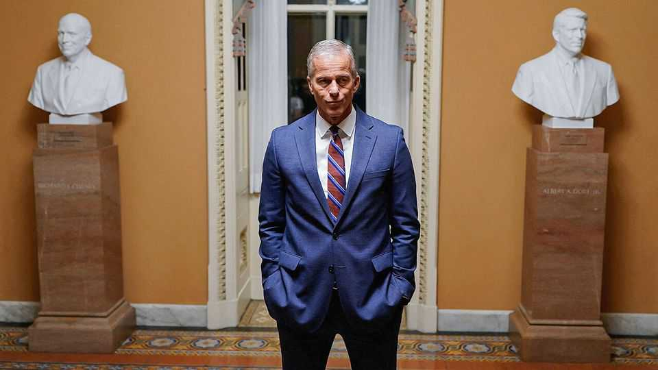

United States | A pointless quarantine
Democrats collapsed in the shutdown fight
They have little to show for a 40-day stand-off
November 13th 2025

Editor’s note: On November 12th Donald Trump signed a spending bill that ended the government shutdown, which had lasted a record 43 days. IN THE DEMOCRATIC PARTY jubilation and despair are rarely more than a week apart. On November 4th Democrats did even better than expected in off-year elections held in New Jersey and Virginia. Striking a blow against President Donald Trump after a year of introspection gave them some momentum heading into next year’s midterms. Days later the newfound optimism was evaporating. Seven Democratic senators, and an independent who caucuses with them, broke ranks to side with Republicans on a short- term funding bill to end the longest government shutdown on record.

The Democrats have little to show for the 40-day stand-off. The stopgap bill, which also passed the House of Representatives and was signed by Mr Trump on November 12th, keeps the government open until January 30th. The deal requires federal agencies to rehire workers laid off during the shutdown and guarantee all employees back-pay for that period.

Yet the bill fails to deal with what Democrats repeated was their main demand: an extension to health-care tax credits that expire at the end of the year. In a concession to Democrats, John Thune, the Republican Senate majority leader, promised a vote on extending the tax credits next month. But opposition to such an extension in the House means that a vote will probably fail—if one is held at all.

America is the only Western democracy that closes its government with such frequency. Shutdowns were even more frequent in the 1980s, but they lasted only a day or two. Since the mid-1990s they have become longer and more damaging. Why the parties persist in this game of chicken may be a question best left to psychologists. In this case, Democrats demanded that their elected representatives do something, and the shutdown was something.

The calculus shifted for the splinter group of eight Democrats as the shutdown began to inflict economic pain and disruption. The government had ordered flights to be cut back at airports on grounds of safety, leading to huge delays that are set to worsen in the run-up to Thanksgiving. Elsewhere, Mr Trump repeatedly tried to cut off funding for the Supplemental Nutrition Assistance Programme, more commonly known as food stamps, which provides over 40m people with food aid. The administration also engaged in a game of budgetary twister, probably illegally, to undercut Democratic strategy and leverage. Members of the armed forces, for example, continued to receive their pay cheques, while billions in funding for Democrat-run cities, districts and states was cut off.

“Standing up to Donald Trump didn’t work,” Angus King, an independent senator from Maine who led negotiations to end the shutdown, told Fox News. “It actually gave him more power.” Polls mostly showed that the public blamed Republicans more than Democrats for the deadlock. Mr Trump seemed to admit as much when he blamed the Republicans’ drubbing in recent elections on the shutdown. Yet Republicans stuck to their strategy

of peeling-off enough moderate Democratic senators as the shutdown took its toll, says a senior Republican aide. Besides, the breakaway senators had little to lose: none of them is up for re-election next year, and two will be retiring.

The demands from activists for the party’s elected leaders to thwart the president, even though they are in the minority in both houses of Congress, resemble the Tea Party attacks on Republican leaders more than a decade ago. Some have called for Chuck Schumer, the Democrats’ leader in the Senate, to resign even though he voted against ending the shutdown. “Senator Schumer is no longer effective and should be replaced,” Ro Khanna, a Democratic congressman from California, posted on social media. Some moderates have voiced their revulsion at the capitulation, too. “Pathetic” was how Gavin Newsom, the governor of California, described it.

For now, Mr Schumer seems to maintain the support of most of his caucus. But, once again, it seems that before they can battle the president, Democrats are condemned to fight one another. ■

Stay on top of American politics with The US in brief, our daily newsletter with fast analysis of the most important political news, and Checks and Balance, a weekly note from our Lexington columnist that examines the state of American democracy and the issues that matter to voters.

This article was downloaded by zlibrary from https://www.economist.com//united-states/2025/11/11/democrats-collapsed-in-the- shutdown-fight