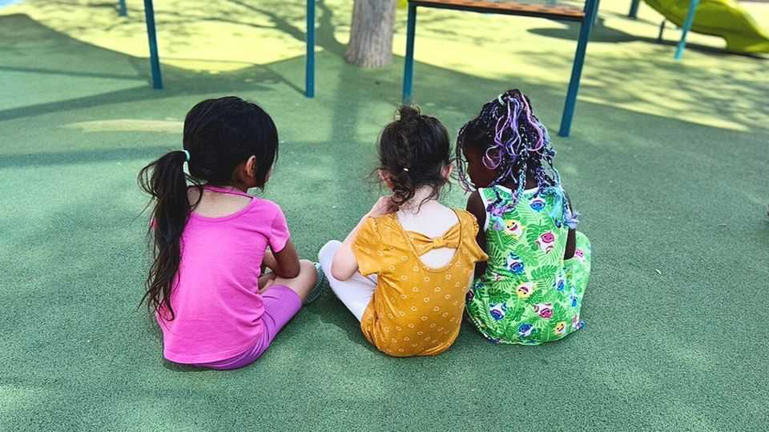

United States | Norway in the desert
One of the poorest states in America introduces free child care
Can New Mexico’s experiment work where others have failed?
November 13th 2025

BY THE EARLY afternoon, Little Flower Learning Centre in Albuquerque is a hive of activity. An industrial-sized delivery of milk arrives. Inside, a small menagerie of birds and guinea pigs draws attention as children settle in for afternoon biscuits. As of November, their care is free for all families. Some will be safer, says Robin Goodnight, the director of Little Flower. “We used to find a lot of needles outside, and a lot of the kids being raised by grandparents because of addictions.” Universal free child care is a popular policy on the American left these days. Zohran Mamdani, New York’s Democratic Socialist mayor-elect, made it a signature of his successful campaign. New Mexico got there first, following

a ballot measure in 2022 where 70% of voters endorsed more spending on care for children.

The programme meets serious needs. New Mexico has long been at the bottom of rankings for childhood well-being. Excluding government support, one in four children live in poverty and a higher share of families receive food stamps than in any other state in America. On November 1st all of the state’s families became eligible for subsidised care. But for the programme to work, places like Little Flower will have to be replicated across the state.

New Mexico is the first state to attempt such a wide-ranging policy. As long as their parents are in school or working, all children from six weeks to adolescence can now get support for a spot in private child care, paid for by the state. Bureaucrats estimate the benefit is worth $12,800 a year. The hard part will be expanding the number of centres across New Mexico, one of the least densely populated states in the country, to cash in those subsidies, while not repeating the mistakes of other universal child-care schemes, where low quality has been found to harm children.

Michelle Lujan Grisham, New Mexico’s governor, has championed an educational “moonshot” as a solution to the state’s social problems. The subsidies come from oil-and-gas revenues, which have quadrupled since 2018. These are placed in a trust fund, allowing New Mexico to create a quasi-Nordic welfare state in the desert. (As befits a good Nordic, Ms Grisham was unavailable for an interview as she attended the UN’s annual climate summit.)

On November 1st all families became eligible for this scheme. There are already hints of what the impact could be. Between 2010 and 2022, as the state increased child-care provision, workforce participation by mothers with young children grew by 12 percentage points to surpass the national average. Most providers reported using the subsidies to improve facilities and the quality of care.

But, so far, children have not been better prepared for school. A significant shortage of care remains, with 32 spaces available for every 100 children

under two. As more middle-class families signed up, the number of very poor families enrolled fell.

To increase the number of places, though, New Mexico first has to build the workforce. This is happening, according to Dana Bell, who leads the University of New Mexico’s child-care-research programme. The state government reckons it needs another 5,000 workers to look after 12,000 children, and is offering free tuition and stipends to study child care. Since 2020, 15% more child-care students have graduated. “We had 1,000 people come through our background-check unit last month,” says Elizabeth Groginsky, New Mexico’s cabinet secretary for early-childhood education, up from 300 last year.

The government also has to work out how much to pay. “Most of the country goes off of a market rate, meaning that you have to charge what parents can afford,” explains Barbara Tedrow of the New Mexico Early Childhood Association, a business group. But instead the state asked “how much does high-quality care truly cost?” she says. New Mexico now judges its rates are higher than parents were paying before. Providers are predictably pleased.

The challenge is stopping those costs from growing over time. The child- care budget is currently funded only until the end of 2026. The programme “is sustainable, as long as [the administration] controls their expenses”, says George Muñoz, chairman of New Mexico’s senate finance committee. But he warns that the trust fund is not infinite: “You either get less quality or you have to change your investment strategy completely, or you have to put more money in.”

Because the money comes from oil and gas, there are limits to how much New Mexico can teach places like New York and Connecticut, which are also looking to flesh out their own universal-child-care plans. According to the Fiscal Policy Institute, a progressive think-tank, were New York to spend as much per child as New Mexico, the state would have to more than double its current spending to $4.6bn annually. Given New York’s higher costs, the final equivalent bill could hit $7bn, half of what it spends on transport.

Whereas other states may lack New Mexico’s fossil-fuel windfall, the policies to expand the supply of child-care staff could be a model, if they work. At Santa Fe Community College, an apprenticeship programme launched in 2023 guides students through classes where dozens of tykes crawl through a model school of light-filled, spacious classrooms. There are tiny binoculars at the windows for toddlers to gaze at mountain views. The centre is limited by space from accepting more children: there is a waiting list of 630. ■

Stay on top of American politics with The US in brief, our daily newsletter with fast analysis of the most important political news, and Checks and Balance, a weekly note from our Lexington columnist that examines the state of American democracy and the issues that matter to voters.

This article was downloaded by zlibrary from https://www.economist.com//united-states/2025/11/13/one-of-the-poorest-states-in- america-introduces-free-child-care