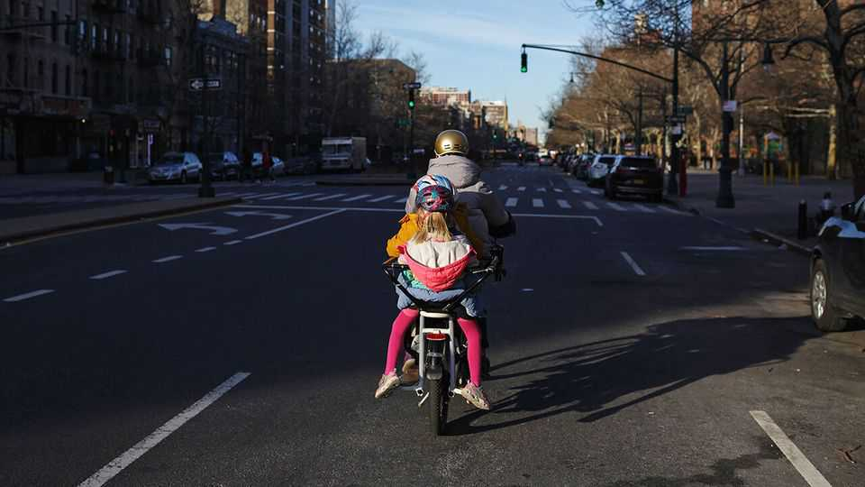

United States | Zippy-de-doo-Dad
Parents on e-bikes are transforming the school run
They’re smug, snug and often faster than drivers
November 13th 2025

Some men, on getting divorced, buy a sports car. Rory Barton, a 44-year-old advertising executive from Oak Park, a suburb of Chicago, went one better. On separating from his wife last June, he bought an Urban Arrow—a low- slung sort of bike, with a large box at the front for children. It cost him $4,500 second-hand, a steal, since they retail for thousands of dollars more. Mr Barton uses it to take his two children, nine and seven years old, to school. In bad weather, occasionally he calls a taxi, but he has not felt any need to buy a car. “I’ve got a raincoat”, he says. “I do it year round.” After a pandemic boom, the sale of bicycles in general has slowed in America. But sales of the sort that carry children seem to be defying the trend. Brett Thurber, the owner of The New Wheel, a small chain of bike

stores in the San Francisco Bay area, says that over the past decade sales of family e-bikes have gone from nothing to a majority of his business, and continue to rise. The most popular brand Mr Thurber sells is Tern, a Taiwanese firm which makes bikes that can carry up to three children on the back. Like the Urban Arrows, these can cost several thousand dollars.

Convenience, more than, say, environmentalism, is driving the boom. Speak to the growing number of e-bike parents (a large majority, it seems, fathers) and they universally mention skipping car traffic, wasting less time coaxing recalcitrant children into car seats and never worrying about parking. Car drivers, they say, are suckers. “We have friends who won’t go to the beach because of parking,” says Chris Toman, a 42-year-old father in Seattle. That is not a problem on a bike. The fanciest sorts of e-bikes can transport plenty of beach gear, as well as children.

What e-bikes are replacing is generally not the family car but the second runaround. Few parents are giving up driving completely, but a lot of shuttling children around comprises journeys of one to three miles (1.6- 4.8km)—too far for a toddler to walk, fiddly by public transport, but efficient on a bike. “We bike him to soccer practice, to swim lessons, to his paediatrician; we bike to birthday parties and to the park,” says Molly Fleck, a software engineer in Chicago, of her five-year-old.

Rising car traffic is one of the reasons why e-bikes are becoming popular. The share of children driven to school by their parents has risen continuously since the 1960s, according to data from the National Household Travel Survey. This is now true of the majority. Driver shortages and budget constraints mean traditional yellow school buses are less common than they were. The result is punishing traffic—in parts of the country, snaking drop-off queues can take hours to clear. One survey of parents found that a majority think their careers have suffered because of having to drive children to school.

The biggest note of concern is safety—bike infrastructure in American cities often leaves much to be desired. In places without protected bike lanes, not many parents are likely to replace the car with a bike. But e-bike parents do not consider that a permanent problem. “They say home ownership makes you much more invested in municipal government,” remarks Howard Carter,

a 32-year-old father in Denver, Colorado, who cycles his daughter to kindergarten. “I haven’t found that. Biking has.” He recently called up the city engineer to praise a plan to narrow an arterial road near his house. Revolutions begin with a push of the pedal.■

Stay on top of American politics with The US in brief, our daily newsletter with fast analysis of the most important political news, and Checks and Balance, a weekly note from our Lexington columnist that examines the state of American democracy and the issues that matter to voters.

This article was downloaded by zlibrary from https://www.economist.com//united-states/2025/11/13/parents-on-e-bikes-are- transforming-the-school-run