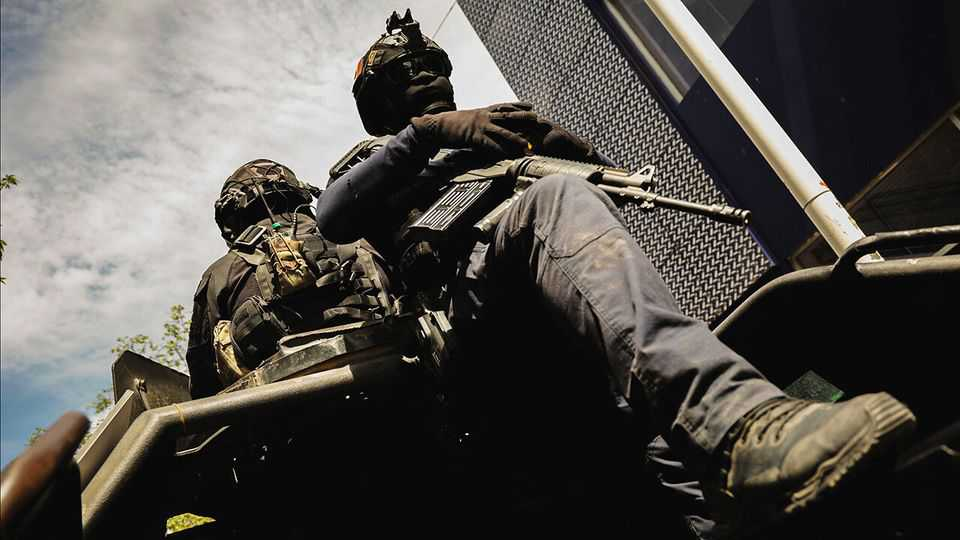
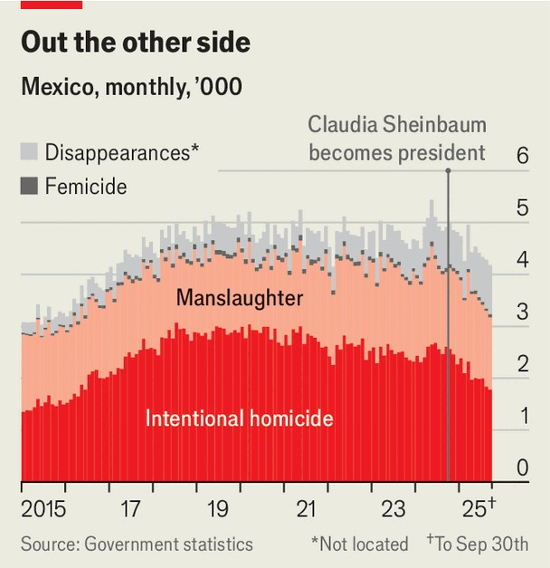
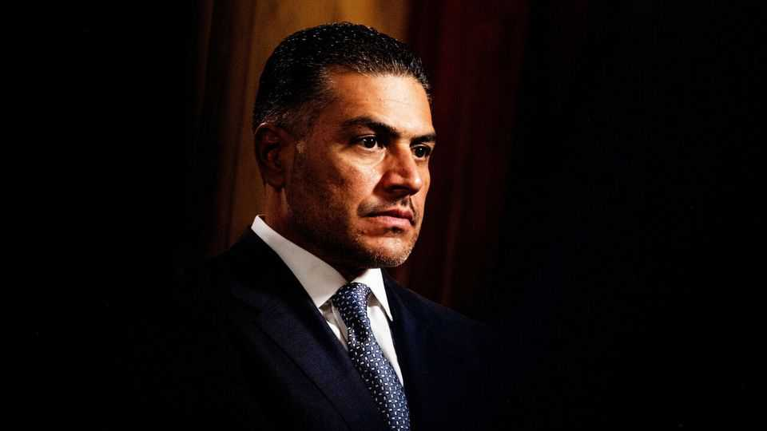
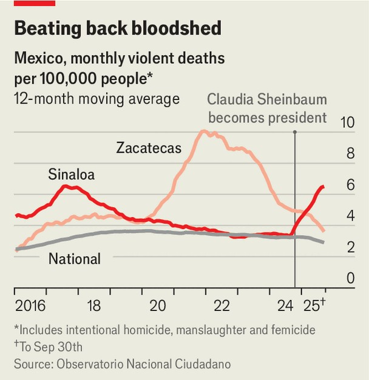
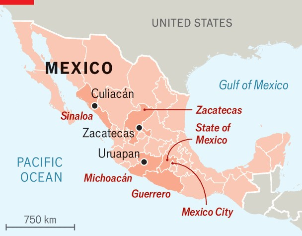

The Americas | Curbing violence
Making Mexico less of a gangster’s paradise
Murders have fallen under a steely new crime tsar
November 13th 2025

Stickers declaring that “#ElBuenoEsHarfuch” (“Harfuch is the one”) still adorn car windows in Mexico City. The slogan dates from Omar García Harfuch’s mayoral bid in 2023. During his four-year stint as the city’s security chief under the then mayor, Claudia Sheinbaum, the murder rate fell by about 40%, one of the biggest drops in the country. This made him wildly popular. He was nominated in a landslide to lead the Morena party, but stood aside for the female runner-up so it could meet its gender quota. Instead he followed Ms Sheinbaum to the National Palace in October 2024 as her security minister, to apply his intelligence-led approach to tackling Mexico’s drug gangs on a national scale. Many Mexicans believe he is their best hope of stemming the violence that has plagued their country for years.

Early evidence suggests they are right. Ms Sheinbaum’s government says Mexico’s murder rate has come down by 32% in the year since she became president. Analysis by The Economist confirms that the rate has fallen, though by a significantly smaller margin, 14%. Counting homicides alone misses an important part of the picture, namely the thousands of people who disappear in Mexico every year, many of whom are killed and buried in unmarked graves. A broader view of deadly crime that includes manslaughter, femicide and two-thirds of disappearances (the data for which are shaky), shows a more modest decline of 6% (see chart).

Still, Mexico is on track for about 24,300 murders this year, horribly high, but well below the recent annual average of slightly over 30,000. Ms Sheinbaum is the first Mexican leader in years to push violent crime in the right direction.

How have she and Mr Harfuch done this? Though Ms Sheinbaum has kept up the rhetoric of her predecessor and mentor, Andrés Manuel López Obrador, about tackling poverty as the root cause of crime and violence, her policy has taken a different tack, starting with her security team. Mr Harfuch’s staff is overtly data-driven. Ms Sheinbaum has handed him new and broad powers over co-ordination and intelligence. His allies have been put in charge of key institutions, including the financial-intelligence unit that traces dirty money. Mr Harfuch’s own commitment to the cause is unquestionable: in 2020 he survived an assassination attempt in which gunmen fired more than 400 bullets into his convoy, killing two of his bodyguards.

Arrests are at record levels and, as a security analyst, Eduardo Guerrero, notes, they are “smarter”. Mr Harfuch targets the most violent gangsters, rather than the kingpins, as well as those involved in logistics such as money-laundering. Firearms seizures have more than doubled, too.

Zacatecas, once Mexico’s most violent state, offers a hopeful tale of what can be achieved (state and federal governments share responsibility for public safety). The murder rate has been falling since a turf war for a migrant-and-drug route peaked in 2021, but over the past year it has fallen more steeply than any other state’s.

Zacatecas has been purging corrupt officers, hiring new ones from other parts of Mexico who are less afraid that gangs will go after their families. It has created two special-forces units and imposed a unified command over its most violent municipalities. Confidence is up. Ginés Jaime Ruiz García, the state’s under-secretary for security, says citizens have started reporting crimes again. Federal help and closer intelligence-sharing under Mr Harfuch have been crucial, says Rodrigo Reyes, the state governor’s chief of staff.

But go to Culiacán in Sinaloa to see the limits of even the most clear-headed approach. An internecine war has raged within the Sinaloa drug-gang since late 2024. The more than 11,000 federal troops stationed across the state have been unable to stop the violence. The murder rate has tripled since the conflict began. Even with armoured convoys and night-vision drones, all the security forces in Sinaloa can manage is to secure the roads and key infrastructure. They have failed to wrest control of the state from the gangsters.

Sinaloa illustrates the huge obstacles Ms Sheinbaum inherited. The criminal group that controls the state is sprawling, rich and entrenched; the Jalisco drug-gang is similarly well established nationally. Roughly two-thirds of Mexico’s murders are linked to organised crime, according to Mr Guerrero. Extortion is rising. States including Michoacán, Guerrero and México are riddled with criminal groups.

By contrast local police are often either weak or non-existent—around 400 of Mexico’s 2,469 municipalities lack a local force altogether. The National Guard that Mr López Obrador created to replace the federal police is controlled by the army. Mr Harfuch’s new federal police corps has recruited only 1,500 officers so far. “There’s no doubt he’s doing all he can within the limits, but it’s the soldiers who carry out Mexico’s security policy,” says

Lisa Sánchez of Mexico United Against Crime, a think-tank in Mexico City. The government has urged the states to agree that they will employ 25% more police officers by 2029, and 30% more prosecutors.

Sinaloa exposes problems of Ms Sheinbaum’s own making, too. She has allocated less than 1% of the 2026 budget to the security ministry, whose funding will fall by roughly 18% from 2025. That raises questions about how serious the government is, says Francisco Rivas, head of the National Citizen Observatory, another think-tank in Mexico City. Zacatecas has raised police pay to 16,000 pesos ($870) a month. Elsewhere municipal officers still earn as little as a third of that, making them easy for criminal gangs to corrupt.

Political complicity also endures. Ms Sheinbaum recently went after a fuel- theft ring that had been operating under military protection. Fourteen people, including a vice-admiral, have been arrested. Yet she has done nothing publicly to investigate Morena’s Rubén Rocha Moya, Sinaloa’s governor, despite credible allegations that he has ties to gangs (which he denies).

Donald Trump has called Mexican politicians’ ties with criminal gangs “intolerable”. He has also labelled major gangs as terrorist entities in order to justify military action. On November 3rd NBC News reported that the

United States is drawing up plans for operations inside Mexico to target gang leaders. Such sabre-rattling creates tensions, but may also give Ms Sheinbaum cover to be bold.

No amount of boldness will rebuild Mexico’s hollowed-out security institutions and break the gangs’ grip during the single six-year term that the constitution affords Ms Sheinbaum. More complete success will be for her successor. Mr Harfuch denies any presidential ambitions, but he has popular support. His approval rating already hovers near 70%. If he can keep chipping away at the violence plaguing Mexico, those stickers may well come into their own in 2029. ■

Editor’s note: To hear a dispatch from Culiacán, listen to this week’s episode of The Weekend Intelligence.

Sign up to El Boletín, our subscriber-only newsletter on Latin America, to understand the forces shaping a fascinating and complex region.

This article was downloaded by zlibrary from https://www.economist.com//the-americas/2025/11/10/making-mexico-less-of-a- gangsters-paradise