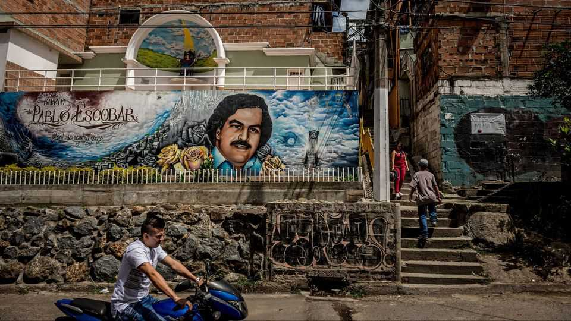
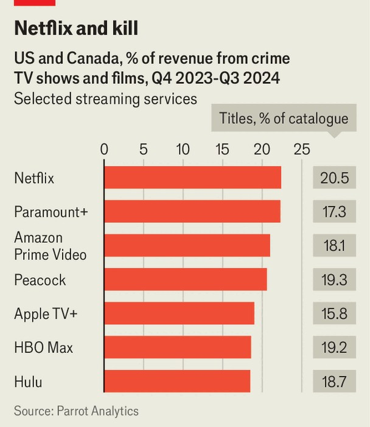

The Americas | The rose-tinted gangsters
Racy fictional depictions of gangs irk people in Latin America
The success of “Narcos” and follow-on programmes has sparked a debate
November 13th 2025

Crime has long figured heavily in Latin American literature, television and music. The release in 2015 of “Narcos”, a Netflix series about the Colombian drug lord Pablo Escobar, brought this trend into the streaming age. Produced by three Americans, it launched a whole new genre of drug- related fiction. “Narcos” and follow-up shows now account for 40% of Netflix’s revenue from Latin American crime titles, according to Parrot Analytics, a data firm. “Emilia Pérez”, a film about a transgender Mexican gangster, got 13 Oscar nominations. The boom in crime content bothers many in Latin America. Some 86% of Colombians think shows about their country focus too much on drug-

trafficking, according to a survey by Datexco, a market-research company. In Medellín, once one of the world’s most violent cities and the centre of Escobar’s empire, tourists now sport T-shirts emblazoned with his face. “It’s tasteless. He was an assassin,” says a local tour guide.

Anabel Hernández García, a Mexican journalist who has reported extensively on its murderous gangs, believes these portrayals normalise and romanticise drug-trafficking, and that this makes it harder to tackle the problem. “They are presented as sexy narcos,” she says. “I have never seen a narco like that—they’re fat and ugly.”

Others are less critical. An agent of the US Drug Enforcement Administration who was involved in the capture of Joaquín “El Chapo” Guzmán Loera, a notorious Mexican drug baron, says that about 80% of “Narcos” is realistic.

Ms Hernández says the rising popularity of narco-fiction coincided with the policy in Mexico of the then president, Andrés Manuel López Obrador, who avoided confronting criminal gangs. This led to “the total normalisation [of criminal gangs] by the government”, she says. Meanwhile, a new generation of drug-traffickers started posting photos online, showing off their impunity.

Some are trying to fight content with content. Rodrigo Guerrero of AG Studios Colombia, a television-production company, is working with Mario Mendoza, an acclaimed Colombian author, on programmes that explore other types of crime common in Latin America like gender violence, the abuse of children, and crimes committed by state actors.

Without this expansion, Mr Mendoza says, the focus on drug-trafficking would end up “making other types of violence invisible” even though they are more universal and common.■

Sign up to El Boletín, our subscriber-only newsletter on Latin America, to understand the forces shaping a fascinating and complex region.

This article was downloaded by zlibrary from https://www.economist.com//the-americas/2025/11/13/racy-fictional-depictions-of- gangs-irk-people-in-latin-america