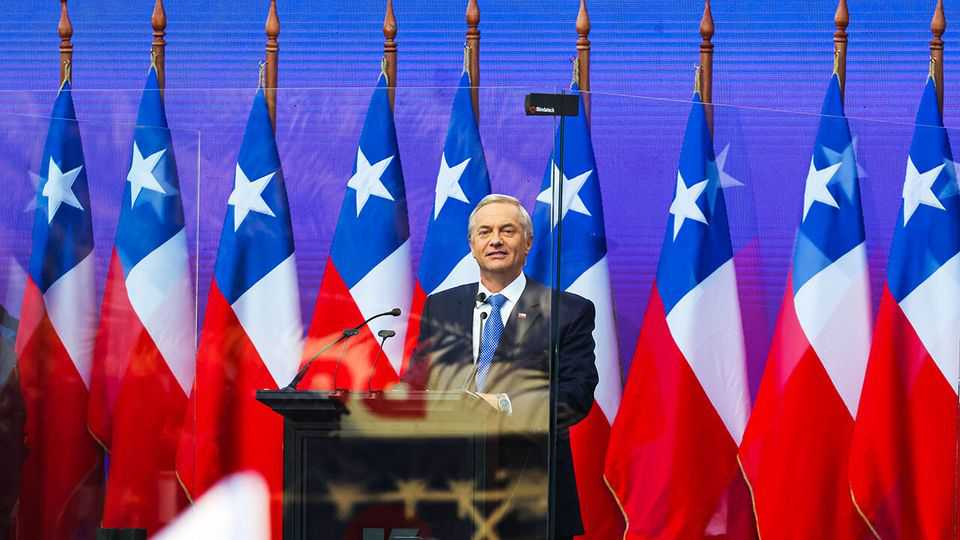
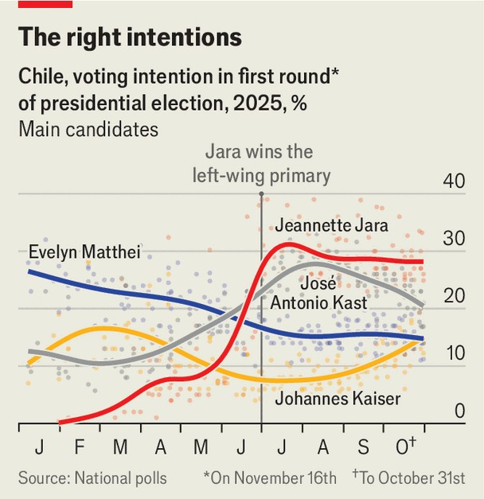

The Americas | Crime and punishment
Chile heads for a sharp right turn
Insecurity and immigration dominate the presidential campaign
November 13th 2025

“They used to steal your phone—now they cut off your arm for it,” says Nur Faride, a young Chilean in Santiago, the capital. Crime and violence is the top concern for her compatriots, with a whopping 63% of them saying they worry about it. That is the second-highest share of crime-worriers in 30 countries surveyed by Ipsos, a pollster, higher than in murder hotspots such as Mexico, South Africa and Colombia. Many blame recent immigrants for violent crime and unemployment. Chilean lanzas (pickpockets) lost their jobs to Venezuelan gangs, runs a popular quip. Chileans vote in the first round of presidential elections on November 16th. They will also choose new representatives for the entire lower chamber and half of the Senate. Security and immigration have dominated the campaign.

Right-wing hopefuls compete to sound tough. The constitution bars Gabriel Boric, the young left-wing president, from a consecutive term. The left, which held a primary in June, is instead represented by Jeannette Jara of the Communist Party. As the only leftist in the field, Ms Jara looks set to win the first round (see chart). Yet she is unlikely to reach the 50% of the vote she needs to win outright, and will probably struggle in a run-off on December 14th against the most popular right-winger.

This is a stark change from 2021, when Mr Boric won by promising radical reform after huge protests against inequality and the establishment. Yet the process of constitutional change was botched, the protests are now remembered for lawlessness, and the economy has grown by less than 2% a year since then. To widen her appeal, Ms Jara has played down both her stint as a minister in Mr Boric’s unpopular government and her ties to the Communist Party. Her platform, which focuses on increasing lithium output and raising the minimum wage, is not exactly communist. She hopes to win the first round handily and capitalise on that momentum.

Her most likely rival in the second round is José Antonio Kast, an ultraconservative former congressman who lost in the run-off to Mr Boric in 2021. Mr Kast (pictured), who has nine children, has long opposed abortion even in cases of rape and is against same-sex marriage. Yet in this campaign

he has downplayed his social beliefs and focused on security and immigration, which he blames for Chile’s crime woes. Of Chile’s 20m people, nearly 2m were born outside the country. Perhaps 340,000 of those migrants are undocumented; almost all of those arrived after 2018, many fleeing economic disaster in Venezuela.

Mr Kast promises an “emergency government”. He says he will shut the border to illegal immigration using ditches, walls and drones. Undocumented migrants will be nabbed, held in special detention centres and deported. “Kast does not like migrants, but I will vote for him,” says David, a Bolivian migrant who now has papers and can vote in Chile. He fears the country becoming communist.

Mr Kast talks up a “war against organised crime” and promises new maximum-security prisons. Last year he toured the new mega-prison of Nayib Bukele, El Salvador’s authoritarian president. “What interests us is precisely learning and understanding how they did it in terms of the security model,” explains Arturo Squella, the president of Mr Kast’s Republican Party, who has also visited El Salvador. Given that over 70% of Chileans have a positive view of Mr Bukele, such moves play well.

Crime is certainly a big problem. Last year kidnappings were the highest in a decade. Between 2022 and 2023 violence related to organised crime jumped by 37%. Well-heeled Chileans fear portonazos, violent carjackings, as they pull into their homes. The murder rate climbed from 4.5 per 100,000 people in 2018 to 6.7 in 2022. Yet the bleakness can be overdone. The rate has been falling since 2022. Last year it was 6.0, similar to the United States. This year it is on track to be about 5.0. Studies also show that on average those born abroad commit less crime than Chileans, though in 2022 they were slightly over-represented for murders. These facts do little to temper the media or politicians. Mr Kast recently promised to confront the “narcos that are taking over our schools”, as if drug gangs regularly roam the halls.

This is the first presidential election since voting was made obligatory, raising the possibility that another candidate could spring a surprise. Among them is Evelyn Matthei, a centre-right former mayor and senator favoured by business. She long led the polls, but was recently overtaken by Mr Kast, who is seen as stronger on crime. She is the moderate, establishment option

at a time when more Chileans than ever identify as right-wing and voters prefer radical outsiders.

Perhaps more likely to surprise is Johannes Kaiser, who is to the right of even Mr Kast. A congressman and former YouTuber, Mr Kaiser has seized on the culture-war issues that Mr Kast has avoided. He wants to bring back the death penalty and has said that if Chile becomes as socialist as it was in the 1970s, when Augusto Pinochet seized power in a coup, he would support another putsch. He has proposed freeing many of those convicted of torturing political opponents under Pinochet’s dictatorship. Both he and Mr Kast promise to slash public spending, saying it will reinvigorate the economy.

Polls suggest that either Mr Kast or Ms Matthei would easily beat Ms Jara in a run-off. If Mr Kaiser gets through, anything could happen. For the first time since Chile’s return to democracy in 1990, right-wing parties could have a majority, albeit a fractious one, in both chambers. If Mr Kast, or any other right-winger, triumphs in December they may have an opportunity to take Chile in a new direction. ■

Sign up to El Boletín, our subscriber-only newsletter on Latin America, to understand the forces shaping a fascinating and complex region.

This article was downloaded by zlibrary from https://www.economist.com//the-americas/2025/11/13/chile-heads-for-a-sharp-right- turn

Asia

Which is India’s superstar state? A bombing in Delhi raises tensions in the region South Korea’s new president is fixing relations with America, Japan and China Japanese women are wrestling with sumo’s boundaries Asia’s most treacherous sailing season Kerala can teach India a thing or two about social welfare