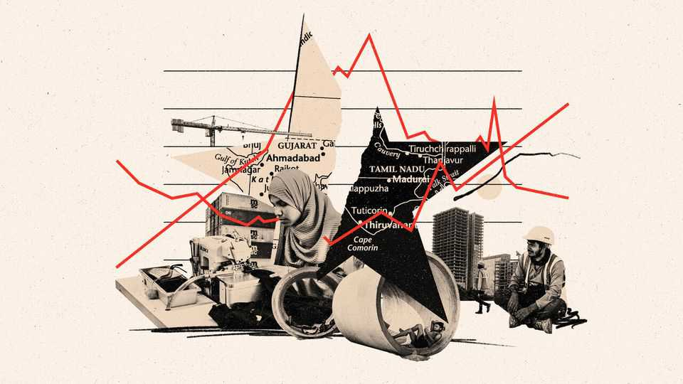
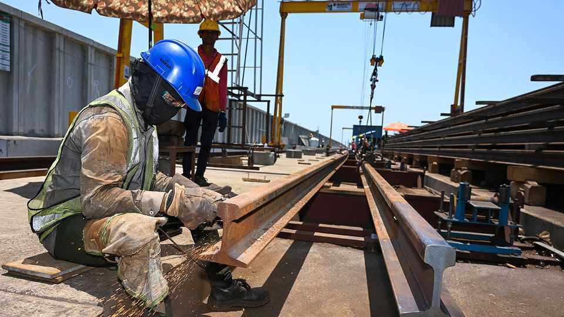
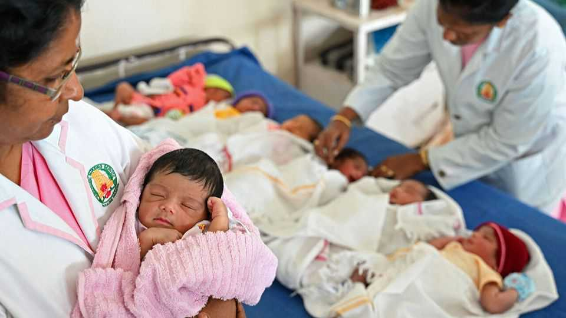
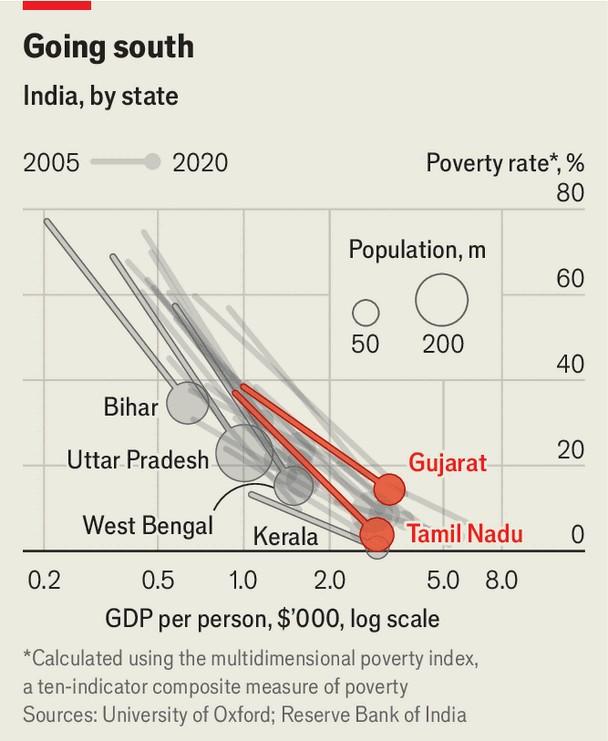

Asia | Sigma Octantis
Which is India’s superstar state?
We pit two heavyweights against each other
November 13th 2025

HOW FAST should India grow? Narendra Modi, the prime minister, wants it to gain “rich-country” status by 2047, the centenary of its independence. A back-of-the-envelope calculation suggests that will require its economy to expand by around 8% annually, up from roughly 6% on average over the past 25 years. Only a few big states reliably post such numbers. Two places in particular are held up as exemplars. One is Gujarat, a heavily industrialised western state that Mr Modi ran for more than a decade before he became prime minister in 2014. The other is Tamil Nadu in the south- east, which is growing by double digits, making it India’s top performer last year among the states that have reported figures. Which offers the better model to their poorer neighbours?

Start in Gujarat, a socially conservative state with as many people as Britain (but much better food). Gujarat is home to about 5% of India’s population but produces more than 8% of GDP and accounts for more than a quarter of exports. In the decade to 2022-23, the last financial year for which Gujarat has published data, its economy expanded at an annual rate of around 8% at constant prices. Income per person is 60% above the national average.

For generations Gujarat has prospered as a manufacturer of textiles, polisher of diamonds and hub for shipping. More recently it has sold itself as a home for capital-intensive megaprojects, such as in pharmaceuticals and petrochemicals. It is now attempting to grow in financial services and to break into chipmaking.

The state won business in part through big investments in infrastructure, note Christophe Jaffrelot, Vignesh Rajahmani and Neal Bharadwaj in a paper for the Institut Montaigne, a French think-tank. Over roughly 20 years Gujarat boosted its power-generating capacity five-fold; it also earned a reputation for an ever-expanding network of high-quality roads. Yet its success comes with a big caveat. Too many ordinary Gujaratis have seen too little benefit from the state’s riches. Nearly 12% of them live in “multidimensional poverty”, a composite measure of 12 indicators. That is five times more than Tamil Nadu and about the same as West Bengal, a much poorer state.

One explanation is that Gujarat’s megafactories can turn large profits without creating all that many jobs. But poor education is another. Less than half of Gujarat’s youngsters study to high-school level, according to data compiled by the Reserve Bank of India—below India’s national average of 58%. The state has “nice roads and nice infrastructure”, says Indira Hirway, an economist in Ahmedabad. “What it needs is investment in human beings.”

Two hours south by flight is Tamil Nadu, another littoral state that is roughly as rich and as populous. Last year its economy expanded by 11%. The spurt has a lot to do with the growth of electronics manufacturing—and, in particular, Apple’s decision to increase the number of devices it makes in India. Tamil Nadu exported around $15bn of electronics last year (about 40% of India’s total), up three-fold from 2022-23. But the state is also a big maker of cars, motorbikes and lorries. And it has managed to pick up some of the tech-services and other back-office work that are usually associated with places like Bangalore and Hyderabad.

Tamil Nadu lags Gujarat in many telling ways. The electricity grid “is atrocious” by comparison, says Richard Rossow at the Centre for Strategic and International Studies, a think-tank in Washington. It has invested less in humongous highways. It spurns incentives on the scale found in Gujarat. Yet

when it comes to creating a healthy and well-educated workforce, Tamil Nadu outstrips most peers. Its primary-health centres have about 60% more doctors than Gujarat’s; its public hospitals have more than twice as many beds (and the most, in absolute terms, of any state). Over 80% of its youngsters stay in school for the maximum period. Around half of young adults go on to college or university (the national average is 28%).

Improving health and brainpower has helped ensure the spoils of growth in Tamil Nadu are widely spread. The state has far fewer very poor people than Gujarat, even though its GDP per person is similar. Part of the reason the state has excelled in providing public goods, even as Gujarat—and much of India—focuses on hard infrastructure, is that Tamil Nadu started social reforms a century ago. Many other states remain “feudal bastions”, says J. Jeyaranjan of the State Planning Commission.

Success in social policy in turn boosts industry. A.R. Unnikrishnan, the chairman of the local branch of the Confederation of Indian Industry, says the state’s many engineering colleges produce a striking amount of talent. Another reason that Tamil Nadu has won so much electronics manufacturing is that it offers a well-educated female workforce. (Assembly companies say they prefer women for their smaller hands.) About 40% of all the women who work in manufacturing in India are employed in Tamil Nadu.

What can India learn from all this? Its states are wildly diverse (see chart). If the country is to grow as fast as policymakers hope, each one will have to play to its own strengths. Gujarat and Tamil Nadu have benefited from their coastal locations. They have business-friendly cultures and big foreign diasporas. These are not things that less fortunate states can quickly acquire, no matter how wise their leaders.

The pair offer lessons nonetheless. All across India politicians find it easier and more appealing to seek growth by laying concrete than by pumping up skills. New roads and bridges make for good front pages and bring immediate benefits. The fruits from improving schooling, by contrast, come much slower. Yet unleashing the power of India’s young and massive population will require investment in health and education. It will also mean fighting obstacles, such as sexism, caste and environmental degradation that keep people from fulfilling their potential. This is far from easy work. But, as Tamil Nadu shows, it would pay off in spades.■

Stay on top of our India coverage by signing up to Essential India, our free weekly newsletter.

This article was downloaded by zlibrary from [https://www.economist.com//asia/2025/11/13/which-is-indias-superstar-state](https://www.economist.com//asia/2025/11/13/which-is-indias-superstar-state)

