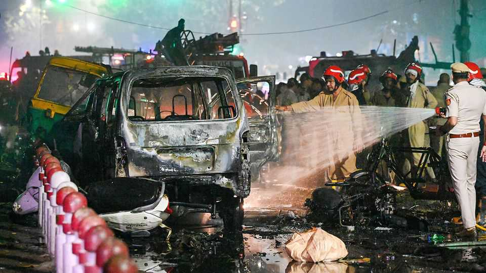

Asia | One and done?
A bombing in Delhi raises tensions in the region
But India’s restrained response suggests that is little immediate risk of hostilities with Pakistan
November 13th 2025

IN MAY, AS a brief India-Pakistan air war wound down, Narendra Modi, India’s prime minister, announced a new counter-terrorism doctrine— automatic retaliation. “If there is a terrorist attack on India,” he warned, “a fitting reply will be given.” So when a car exploded outside the Red Fort in old Delhi on November 10th, killing at least eight people and injuring 20 others, the region took a sharp breath. But for now, the risk of another war remains low. The blast appears to be linked to a plot that was broken up by Indian police earlier that day in Faridabad, near Delhi. Police discovered weapons, ammunition and huge quantities of material for making explosives. Seven

men were arrested. Police in Jammu & Kashmir, an Indian territory, said they were part of an “interstate and transnational terror module” with links to Jaish-e-Mohammad (JeM), a Pakistan-backed militant group, and Ansar Ghazwatul-Hind, an al-Qaeda-linked outfit in Kashmir. The car that exploded in Delhi was traced to Umar un-Nabi, a doctor, who is reported to have escaped those raids.

Some Indian authorities have privately briefed journalists that the plotters were “acting at the behest of Pakistan-backed handlers”. But Indian leaders have not repeated that charge in public. Notably, in contrast with a massacre in Kashmir in April, which precipitated the May skirmishes, the attackers appear to be Indian citizens rather than Pakistani infiltrators.

One Indian expert, who asked to remain anonymous owing to the sensitivity of the topic, says he is dubious about the plotters’ alleged links to both al- Qaeda and JeM, two very different groups. The former has been “non- existent for a long time” in India, he says, and in any case JeM sees al- Qaeda as a competitor rather than collaborator. The Indian Mujahideen, a domestic outfit that was active in the 2010s, has been dormant, with its supporters ebbing away to more informal networks.

Terrorism against major Indian cities has been rare over the past decade. A bombing linked to Islamic State at a café in Bangalore last year was the first such attack in years. The last major attack on Delhi was in 2011, when a briefcase bomb killed 15 people. Ajai Sahni, director of the South Asia Terrorism Portal, a website that tracks violence in India, argues that would- be terrorists might find it easier to operate outside Kashmir, where they face intense pressure from law enforcement and intelligence agencies.

Mr Sahni dismisses the notion that the Delhi blast could mark the start of another wave of terrorist violence of the sort India faced in the 1990s and 2000s. At the time, he says, militant groups were strong and the state was weak. Now the situation is reversed. The fact that police were able to unearth and dismantle the Faridabad cell is itself a sign of the state’s “good handle” on the problem, he says.

The provenance of the plotters, the fact that their plans were thwarted, and Mr Modi’s decision to press ahead with a scheduled trip to Bhutan all

suggest that there is little risk that India chooses to launch air strikes on Pakistan, as it did after a terrorist attack in 2019 and again, more forcefully, this summer, barring new evidence that points to direction from abroad.

Nonetheless, relations with Pakistan remain rocky. On November 11th a suicide-bombing in Islamabad, Pakistan’s capital, killed at least 12 people. The Pakistani Taliban, a jihadist group, claimed responsibility. More than 1,600 Pakistani civilians and soldiers have died in attacks this year, the worst toll in a decade. Pakistani leaders blamed the latest attack on “Indian state terrorism”. That claim, retorts India, is the product of “an obviously delirious Pakistani leadership”.■

Stay on top of our India coverage by signing up to Essential India, our free weekly newsletter.

This article was downloaded by zlibrary from https://www.economist.com//asia/2025/11/13/a-bombing-in-delhi-raises-tensions-in- the-region