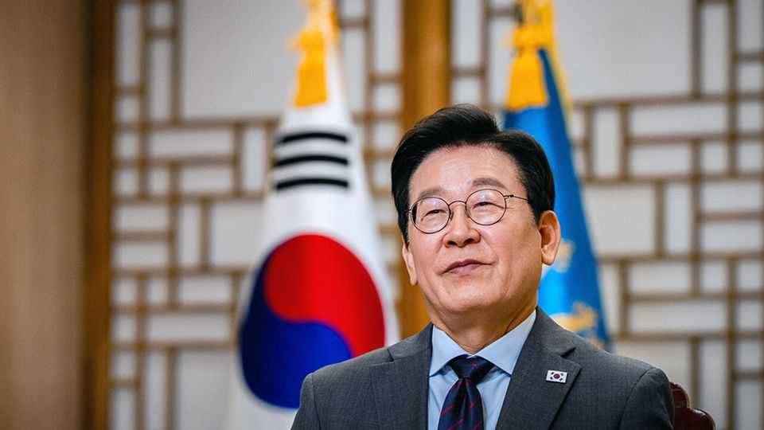

Asia | Air-traffic control
South Korea’s new president is fixing relations with America, Japan and China
A refreshing burst of pragmatism after a turbulent time
November 13th 2025

SHIN WOO-SEOK is known for directing flashy music videos. His latest clip opens with G-Dragon, a K-pop heart-throb, marching through a traditional Korean restaurant, where he finds a football star, a movie director and a top DJ. Then comes an unusual turn: South Korea’s new president, Lee Jae Myung, makes a cameo helping guide planes to a runway. The slick video, commissioned to promote the annual gathering of the Asia-Pacific Economic Co-operation (APEC) forum that South Korea recently hosted, concludes with a message: “The world comes to Korea.” The president intends the video to symbolise his country’s diplomatic re- emergence after a rough patch. Mr Lee won a snap election in June after his

predecessor, Yoon Suk Yeol, was impeached for declaring martial law. He took office facing myriad challenges, from trade tensions with America to North Korea’s deeper ties with Russia and China. He has proved an effective champion for his country’s interests.

As leader, in opposition, of the left-wing Democratic Party (DP), Mr Lee hewed to familiar foreign-policy positions for his side, including openness to North Korea and wariness of Japan, the former imperial overlord. But as a presidential candidate he preached pragmatism. Mr Lee has largely practised it, working to improve relations with America and Japan—as well as with China. In keeping with DP orthodoxy, however, he has tried outreach to the North, to little avail.

Mr Lee’s most urgent task has been to land a tariff-relief deal with Donald Trump. South Korea and America signed a free-trade agreement in 2012. That did not stop the American president from slapping a 25% duty on the country this year. In July Mr Trump agreed to lower the rate to 15% for many goods, but not for cars. That put South Korean carmakers at a disadvantage to competitors with lower rates.

Mr Lee’s meeting with Mr Trump on the sidelines of the APEC summit was his best chance of sealing a better deal. Their final agreement saw South Korea promise to invest $350bn in America, in exchange for tariffs on most of its goods—including cars—coming down to 15%.

South Korea also pledged to take more responsibility for its own security; in return, Mr Trump blessed its plan to acquire nuclear-powered submarines, a capability that America has long resisted allowing it to obtain. The two countries also apparently agreed to renegotiate a pact governing nuclear co- operation. South Korea wants to be able to enrich and reprocess nuclear fuel. This will let its nuclear-power plants depend less on imported fuel and help reduce nuclear waste.

But renegotiating the pact brings another—unspoken—benefit. It would be easier, should South Korea choose, to assemble a nuclear weapon. That is why proliferation-wary Americans have long opposed the pact’s revision. Mr Trump either did not understand the implications, or did not care. South

Korea’s moves towards an insurance policy betray deep unease about its alliance with America.

South Korea shares such unease with Japan. Yet under the last DP president, Moon Jae-in, who left office in 2022, relations between the neighbours plummeted over issues relating to their colonial past. As opposition leader, Mr Lee led a hunger strike in part to protest against Mr Yoon’s conciliatory stance toward Japan. Here, too, he has grown pragmatic. During the APEC meeting he held a chummy first summit with Takaichi Sanae, Japan’s new right-wing prime minister. South Korean diplomats now speak of Japan as their best friend in the neighbourhood, in large part because both face similar threats.

South Korea has less room for manoeuvre in its relations with China, its largest trading partner and America’s biggest rival. “We are clearly in the Western camp,” says a South Korean official. China recently placed sanctions on South Korean firms helping America’s shipbuilding industry. Mr Lee wants to contain the fallout. Xi Jinping’s appearance at APEC marked the Chinese leader’s first official visit to South Korea for more than a decade. The two smiled and bantered when they met. Following their meeting—and Mr Xi’s trade truce with Mr Trump—China temporarily suspended the sanctions.

For South Korea, China is not just a crucial economic partner, but also key to restarting dialogue with North Korea. Overtures towards Kim Jong Un, the North Korean dictator, from both Mr Lee and Mr Trump appear to be going nowhere. Mr Kim is getting economic, diplomatic and even military support from both Russia and China; he has made clear that he wants recognition of North Korea’s nuclear status in order to talk.

However well it went for Mr Lee, APEC was only a preview of the tests he will face during his term. Differences over what was actually agreed with Mr Trump have already emerged. Meanwhile, conflicts over history between South Korea and Japan have a nasty habit of resurfacing. “What’s the resilience in the relationship when rainy days come?” asks one South Korean official. “Because we will have rainy days.”■

This article was downloaded by zlibrary from https://www.economist.com//asia/2025/11/09/south-koreas-new-president-is-fixing- relations-with-america-japan-and-china