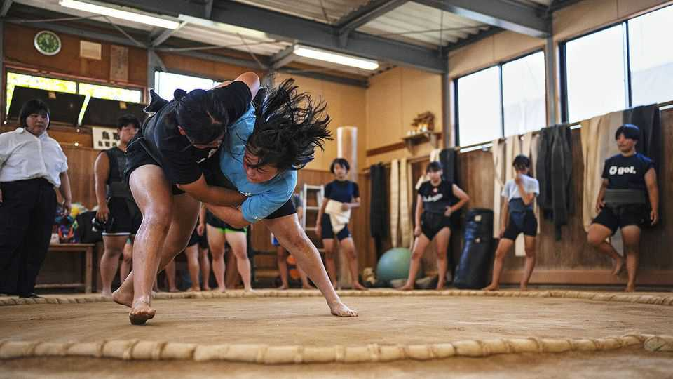

Asia | A bout time
Japanese women are wrestling with sumo’s boundaries
Might a female prime minister break a long-standing taboo on entering the ring? Don’t count on it
November 13th 2025

THE TWO young contenders grab at each other’s loincloths. A referee keeps up the shout of “nokotta nokotta”, indicating that the wrestlers are still in the game. Suddenly one lunges forward, sending the other tumbling over the straw bales that mark the ring’s boundary. The crowd roars. A version of this scene repeated itself all day in Kyoto last month as 300 wrestlers went at it in bout after bout. This was no ordinary tournament. Taking the place of girthy Japanese men in the ring were women of all ages. They were there to participate in the All Japan Women’s Sumo Championships.

Women are an unusual sight in a sport that abhors change. Though the first edition of the ladies’ championship took place 28 years ago, and has contributed to the growing popularity of the sport among women, there is still no professional structure for females. Nor can there be. Grand Sumo, the official tournaments that stretch back to the 17th-century Edo period, ban women from entering the dohyo, the sacred sumo ring, because they are considered ritually polluting. Though some 1,000 women practise sumo in Japan today, mostly through school and university clubs, the lack of a professional path means that many give up after graduation.

The exclusion of women from the ring is part of a broader societal affliction. Japan ranks 118th out of 148 in the World Economic Forum’s gender-gap index. That is better than Saudi Arabia but worse than Bahrain. Other spheres of life have long been off limits to women on similarly ritual grounds. Women were long prohibited from tunnel construction sites, owing to the belief that their presence would make the female mountain god jealous and bring misfortune; that prohibition began to ease in the 2000s, as more women entered the workforce. But they are still banned from climbing some sacred mountains.

Sumo remains a great bastion of conservatism. Some hope that the elevation of Takaichi Sanae, who last month became the country’s first female prime minister, might herald change. An ongoing Grand Sumo tournament provides the opportunity. It is the prime minister’s job to award the championship cup at the close. But to do so she must step onto the dohyo. Will Ms Takaichi break the taboo and do so?

Not if the Japan Sumo Association can help it. It “intends to continue preserving the traditional culture of Grand Sumo,” says a spokesman. Ms Takaichi is also unlikely to press the issue. The new prime minister is a social conservative who opposes allowing married women to keep separate surnames or letting one ascend to the imperial throne. The young wrestlers in Kyoto have a longer time horizon. “If women’s sumo continues to grow,” says Yamashiro Hanna, a 16-year-old enthusiast, then “maybe things will change.”■

This article was downloaded by zlibrary from https://www.economist.com//asia/2025/11/13/japanese-women-are-wrestling-with-sumos- boundaries