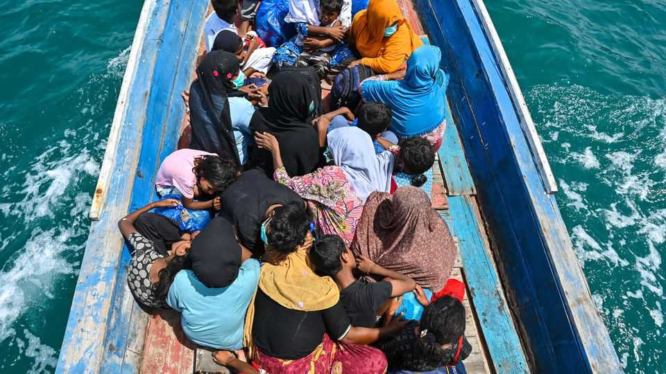

Asia | Desperate times
Asia’s most treacherous sailing season
Rohingya refugees are risking their lives in perilous sea crossings. Some do not make it
November 13th 2025

OCTOBER MARKS the start of what people smugglers call “sailing season” in the Andaman Sea, after the south-west monsoon dies down and waters become calmer. For 15,000 Malaysian ringgit ($3,600) per person, criminal networks promise safe passage by sea from the borderlands between Bangladesh and Myanmar down the coast to Malaysia. But the week-long journey is perilous. Some boats sink before they can reach the shore. On November 8th a Filipino cargo vessel fished three survivors out of the water just off the Malaysian resort island of Langkawi. At some point in the days before, smugglers had moved them from a big mother ship onto a

smaller one as they approached the Malaysian coast. That smaller vessel, teeming with somewhere between 70 and 100 people, later capsized. Eleven more survivors have been pulled out of the water in the days since. So have the bodies of 27 who died, including four children.

Members of the long-persecuted, mostly Muslim Rohingya ethnic minority in Myanmar know the risks of these journeys, says Hafsar Tameesuddin, a Rohingya refugee and activist now living in New Zealand. Few migrants can pay their way upfront. Those who make it to Malaysia often work for years to pay off their debt to people-smugglers. They also risk arrest and indefinite detention by Malaysian immigration authorities. But every year thousands choose to try anyway, because conditions back home are so dire.

In Rakhine State in western Myanmar, where the Rohingya are from and hundreds of thousands still live, they have been caught up in the brutal fighting between Myanmar’s military junta and the Arakan Army (AA), an insurgent group fighting to establish a homeland for another (mostly Buddhist) ethnic group, the Rakhine. At least 100,000 are confined to displaced-person camps. The junta is run by an army that UN experts say staged a genocide against the Rohingya in 2017. But Rohingya say that the AA, which burned down the mostly Rohingya town of Buthidaung last year, is now committing atrocities, too.

Across the border in Bangladesh, over a million Rohingya live in the world’s largest refugee camp, near Cox’s Bazar (see map). The government bans Rohingya from putting up dwellings made of anything sturdier than bamboo and tarp, in a bid to encourage them to go back to Myanmar. That policy has not had the desired effect, but has succeeded in making the camps vulnerable to fire and landslides. Worse, Bangladesh also limits access to education and employment. “There is nothing for them there,” says Ms Hafsar.

This year, sailing season began early. Observers are expecting more Rohingya to attempt the journey than ever before. Chris Lewa, who has tracked the people-smuggling business in the Andaman Sea for nearly a quarter of a century, says that at least 16 boats, carrying between 2,000 and 3,000 people in all, have left Bangladesh and Myanmar since September.

She and other analysts point to one factor in particular that is driving the boom in people smuggling: Rohingya are worried that America will soon stop paying for food in the camps. The Trump administration cut the budget for food aid earlier this year, before later signing off on a series of short-term stopgap measures. But because the packages last only several months at a time, aid agencies continue to warn that food may soon run out. That has made many Rohingya anxious enough to book passage to Malaysia. The situation is even worse in Myanmar, where the conflict has made the distribution of food assistance, when funded, even more difficult.

There is one small reason to hope that things could soon improve. In September American officials appeared to tie further food assistance to Bangladesh allowing Rohingya refugees to work. That would make life in the camps much more tolerable, and lessen the Rohingya’s dependence on strapped foreign-aid budgets.

Even American pressure, however, may not force quick changes on the ground. Allowing Rohingya to work would be unpopular in Bangladesh, which goes to the polls in February. Change, if it comes, would be unlikely before then. Sailing season in the Andaman Sea lasts until May. If the last few weeks’ numbers are any indication, it is going to be a busy one.■

This article was downloaded by zlibrary from [https://www.economist.com//asia/2025/11/13/asias-most-treacherous-sailing-season](https://www.economist.com//asia/2025/11/13/asias-most-treacherous-sailing-season)