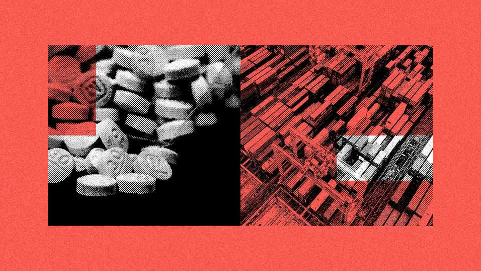

China | Calibrating co-operation
America and China share a dangerous addiction
Fentanyl is hard to kick. Particularly as a source of leverage
November 13th 2025

THE FIGHT against fentanyl, a synthetic opioid, is at the heart of America and China’s uneasy trade-war truce. The drug has killed more than 300,000 Americans since 2020 and related overdoses are the leading cause of death for Americans aged 18-44. Shortly after starting his second term in office, President Donald Trump slapped a 20% tariff on Chinese goods for the country’s role in manufacturing the drug. But last month, as part of a wide- ranging deal with his Chinese counterpart, Xi Jinping, he agreed to halve the tariff. Mr Xi “is going to work very hard to stop the death”, Mr Trump told journalists. China has promised “significant” measures, according to the White House.

China has offered tough action before. But this time momentum seems greater and the stakes higher. Admittedly a recent visit to Beijing by Kash Patel, the director of the Federal Bureau of Investigation, appeared grim at points. On the evening of November 8th the MAGA die-hard was slumped unceremoniously in a drab hotel lobby. Yet meetings proved productive. On November 10th officials from China’s powerful public-security ministry, among other agencies, released a list of 13 chemical “precursors” (used to make fentanyl) which will require extra approvals before they can be sold to customers in America, Canada and Mexico. The same day China’s counter- narcotics authority issued a notice “reminding” exporters of the “legal risks” involved with selling precursors and drug-making equipment to the three countries. A bilateral working group is being set up.

China has a year before the truce is reassessed. How it chooses to use that time will affect the stability of the relationship between the world’s two most powerful countries. The question is whether China wants the co-operation to last that long. “China sees action against fentanyl as leverage,” says Henrietta Levin, a former director for China on President Joe Biden’s National Security Council who is now at the Centre for Strategic and International Studies, a think-tank in Washington, DC. “They don’t intend to do more than what is politically advantageous to them at any particular moment.”

Broadly two features explain why fentanyl has flourished in China. The first is the country’s massive chemicals industry, which accounts for about 40% of global chemicals production. Its loosely regulated factories can easily manufacture both the drug (which is also used for legitimate medical purposes) and the ingredients needed to make it. That has helped fuel a synthetic opioid epidemic in America (meanwhile China seems not to have a big domestic problem with such drugs). The second feature is China’s underground financial networks, which help to launder money for gangs. More than $150bn in illicit proceeds moves through China each year, according to American officials.

In 2019, under pressure from Mr Trump’s first administration, a Chinese crackdown on illegal production disrupted fentanyl supplies. The street price of the drug in America rose for several months, according to a study published earlier this year by the Peterson Institute for International

Economics, a think-tank in Washington. As a result 20-25% fewer people died of overdoses in that period, the study estimates. The shadowy industry adapted, however. Chinese factories largely stopped making illegal fentanyl but continued to churn out precursors. They are typically sent to Mexico (and, to a much lesser extent, Canada) to be turned into the final product by gangs before being smuggled over the border.

America has repeatedly asked China to tackle the trade in precursors; these are hard to track because many are also used perfectly legally. China’s record has been mixed. It has tightened controls on more chemicals (or “scheduled” them, as this process is known). It has also shut down certain companies, made arrests and, according to officials, blocked or removed over 140,000 illegal advertisements. Officials have helped crack some money-laundering cases, too. Even so, a report by America’s State Department in September stated that China “continued to fall short of the decisive measures needed”. Online platforms were openly selling precursors to criminals, it found.

Why so? Because China tends to ease up whenever the relationship sours. In 2020 it dialled back its co-operation when America imposed sanctions on a government forensic-science institute for alleged links with the repression of the Uyghurs, an ethnic minority (China denies any such repression has ever taken place). In 2022 China stopped helping entirely after Nancy Pelosi, then the speaker of the House of Representatives, visited Taiwan. Joint work did not restart until Mr Biden agreed to lift sanctions on the institute at a meeting with Mr Xi in late 2023. Efforts were interrupted once again after Mr Trump announced new tariffs on China this year.

There is much more China can do over the next year, says Vanda Felbab- Brown of the Brookings Institution, another American think-tank. One big loophole, she says, relates to precursors. Some are used for so many legal purposes that it is not practical to schedule them. American law still allows those who sell them to criminals to be prosecuted, but Chinese law is fuzzier. Officials could also force chemical companies to collect more information on their customers. At the moment some claim to be ignorant of the illicit purposes for which their products are used. Whatever changes on paper, the enforcement of laws remains the critical issue.

It will help China’s case that fentanyl deaths in America are declining. Some 42,000 Americans died of overdoses from synthetic opioids in the 12 months to April (excluding methadone). That is down from a peak of about 78,000 deaths in the 12 months to August 2023, according to data published by the Centres for Disease Control and Prevention, a government agency. There are many reasons behind the trend, such as the greater availability of injection kits which can reverse an overdose. But diminishing supply—perhaps as a result of China’s past actions—is an important factor too, argues Jonathan Caulkins of Carnegie Mellon University in Pittsburgh.

Precedent suggests China will loosen controls again if (or when) the relationship with America deteriorates. “It can stop prosecuting people, it can stop taking down websites, it can stop passing intelligence,” fears Ms Felbab-Brown. China may already be giving itself some wriggle room. The commerce ministry’s readout of a meeting between negotiators from both countries, which was held shortly before Messrs Xi and Trump’s encounter, merely said a “consensus” was reached on fentanyl co-operation, with no further details. The foreign ministry’s readout of the leaders’ talks did not mention fentanyl at all. Chinese diplomats typically blame America for its drug problems and say China has already done plenty to help.

Ideally fentanyl controls could be dealt with separately from other trade wranglings. It is one of the few areas where both countries’ interests could perhaps align: Mr Trump likes to be tough on drugs, and China hates being painted as the source of the opioid scourge (it is keen to be removed from an American government list of major drug-producing countries). That said, officials obviously appreciate the leverage the drug provides them. Giving that up would be very difficult indeed. ■

Subscribers can sign up to Drum Tower, our new weekly newsletter, to understand what the world makes of China—and what China makes of the world.

This article was downloaded by zlibrary from https://www.economist.com//china/2025/11/12/america-and-china-share-a-dangerous- addiction