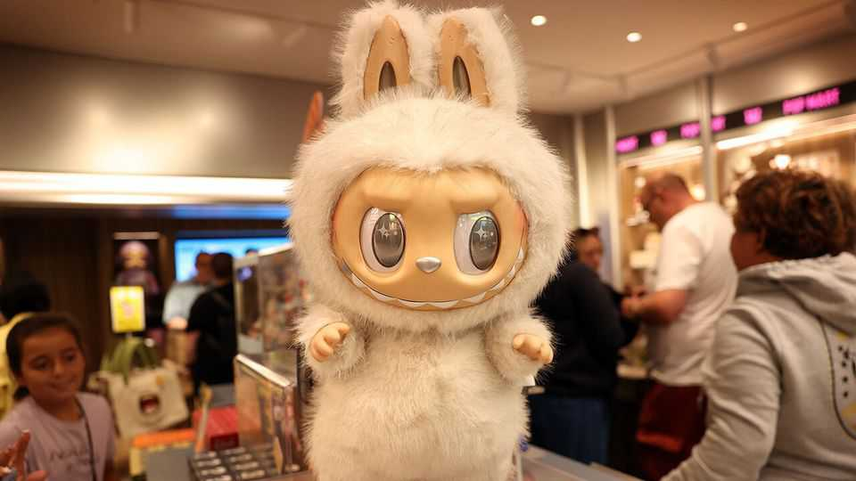
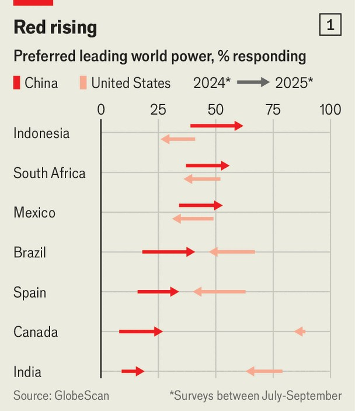
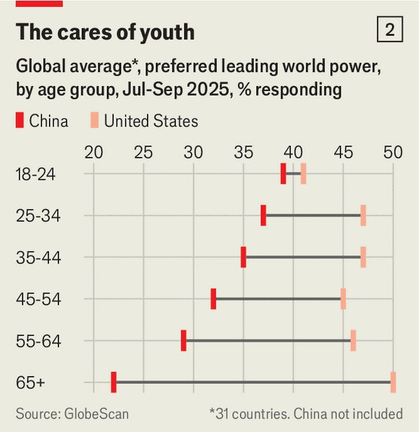

China | Ugly-cute contest
China’s growing global fan club
Our new poll shows global opinion is swinging its way
November 13th 2025

CHINA APPEARS “increasingly cool,” declared Jin Lian, a spokesperson for China’s foreign ministry, earlier this year. To make his case he pointed to consumer-product sensations and cutting-edge technology. After all, this year China has celebrated the success of the “ugly-cute” Labubu toy and DeepSeek, and experimented with flying cars. “Foreign friends”, Mr Jin purred, were “breaking through their cognitive cocoons”. Soft-power victories matter both to China and to its president, Xi Jinping, in the country’s bid to be a superpower. And President Donald Trump is handing other successes to his Chinese counterpart. His chaotic policymaking means many now see China as a stabilising presence. In the

eyes of the world, China seems to be growing into an awesome rival to America.

To test this thesis, The Economist, working with GlobeScan, a consulting and polling firm, asked 32,000 people in 32 countries for their views on China and America between July and September. The results are startling. Since we last asked the question a year ago, China has made big gains as the world’s preferred “leading power” (see chart 1). The share of respondents favouring China jumped by 11 percentage points to an average of 33%. Meanwhile, support for America slipped below a global majority to 46%.

China wants to be seen as America’s peer. Preference for China as the world’s leading power has risen in every place sampled by GlobeScan. Perhaps most surprisingly, that includes America, where support for Chinese leadership doubled to (a still low) 6%. Meanwhile, two in every five Americans thought that China’s influence in the world was “mainly positive”, up from a quarter during Mr Trump’s first term.

Preference for China strongly correlates with age: the younger the respondent, the more likely they are to welcome Chinese leadership (see chart 2). Among 18- to 24-year-olds America and China are nearly tied for support at 41% and 39% respectively. Among those over 65 years old,

America has a commanding 30-point lead. Many youngsters use Chinese products and services, like the video-sharing sensation TikTok, or follow social-media influencers who have visited China. (Earlier this year, state media were found offering expenses-paid trips to China to such types.)

When it comes to picking China as the leading power, the largest regional increases were in Latin America and Europe. In Brazil, Canada, Mexico, South Africa and Spain, preferences for China rose (and support for America fell) by about 20 percentage points. The single largest increase was in Indonesia, where support for China leapt by 23 percentage points to 62% to make it the second-most pro-China country, behind Egypt. There were only fractional rises in China’s neighbours. Security concerns dominate views of China in Japan and South Korea, where no more than 5% of respondents preferred China.

For perhaps the first time, more than half of respondents in Africa and the Middle East opted for China. Many already liked the country anyway, which may be partly thanks to China’s Belt and Road Initiative. In the past decade the scheme has seen tens of billions of dollars invested in those regions. Still, this most recent bump of nine points takes China over the majority mark, so lends some credibility to China’s claims to lead the global south.

Overall preference for China is only part of the story. China’s list of supporters also reads as a roll call of America’s discontents. Mr Trump has picked fights with South Africa over false claims of a “white genocide” and Brazil for prosecuting its former president and MAGA-ally, Jair Bolsanaro. America’s neighbours, Canada and Mexico, have both been hit with tariffs and threats of invasion. America’s star tends to dim under Republican presidents and sparkle under Democrats, but what is new is that the fall in affection for America is so clearly to the benefit of its biggest rival. ■

Subscribers can sign up to Drum Tower, our new weekly newsletter, to understand what the world makes of China—and what China makes of the world.

This article was downloaded by zlibrary from [https://www.economist.com//china/2025/11/13/chinas-growing-global-fan-club](https://www.economist.com//china/2025/11/13/chinas-growing-global-fan-club)