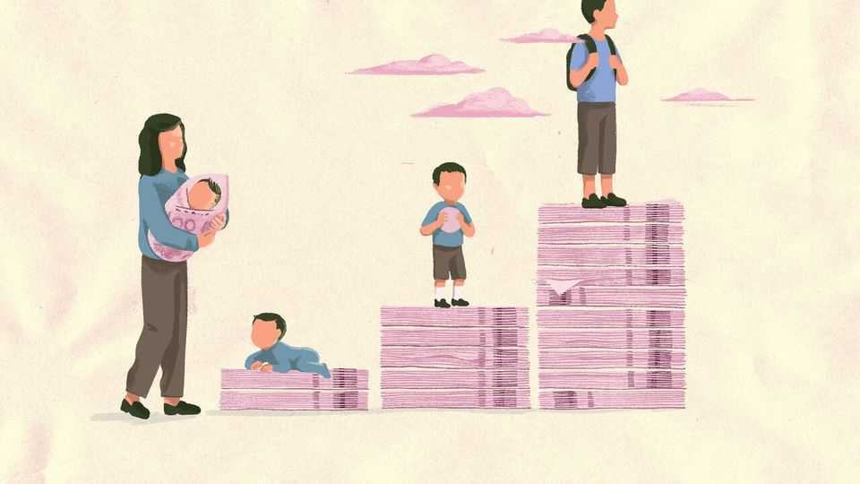

China | Chaguan
Tianmen is China’s test site for baby-boosting policies
A visit to the city offering more than $40,000 for second children
November 13th 2025

FOR DECADES the ideal for the Chinese family involved two parents doting on their single, precious child. At the maternity hospital in Tianmen, a city in the central province of Hubei, it does not take long to detect how the ideal is now changing. Outside the hospital’s front doors, a statue depicts parents holding hands with their three young children next to a slogan: “More people, more blessings”. A dot-matrix sign over the entrance carries exhortations such as “Joy is plain as can be—babies one, two, three.” And throughout the hospital cheery posters show families with multiple children swimming, skating and flying kites.

The government is well aware that this sort of messaging will only get it so far in its campaign to persuade people to procreate. Its bigger effort is financial. In what state media have described as the “Tianmen experience”, local officials have put together an array of cash allowances and incentives for new parents that are among the most generous now available in China. Families having a second child can receive up to 287,188 yuan ($40,300), while those having a third can get 355,988 yuan—mostly in the form of housing subsidies. These are staggering sums in a province where annual disposable income is barely 40,000 yuan per resident.

Several other cities around China have started to offer cash for families with second and third children, though not quite as much as in Tianmen, a city with a hard-driving local leadership. In January the central government also introduced an annual baby bonus of 3,600 yuan for the first three years of a child’s life. For a country that generally shuns “welfarism”, fearing that handouts will breed laziness, the cash given to families stands out as an exception.

This unusual largesse speaks to a rising panic on the part of officials. When China belatedly relaxed its one-child policy in 2016, it hoped for a rebound in births. Instead, its fertility rate has continued to decline, falling to roughly one child per woman, among the lowest in the world. On its current trajectory, according to projections from the UN, China’s population will halve in size by 2100, which is rather inconvenient for its superpower ambitions.

Tianmen thus offers a test case for the rest of the country, as the government searches for ways to reverse the tide of declining births. In late 2023 it started offering a hotch-potch of subsidies, which have grown to include: 60,000 yuan to couples registering there for marriage, and double that for rural-to-urban migrants; a birth bonus; maternity-leave payments; and a monthly child-care allowance. Implementation is impressive. One grandfather reports that bureaucrats showed up unprompted after his grandson’s birth. Subsidies hit the family’s account within three days.

Tianmen has earned national attention not just because of its policies but also because of its claims that they are working. In 2024 its newborn population rose by 17% to 7,217, the first increase in eight years and well

above the national 6% rise (which experts attributed to one-off factors including a post-covid rebound). More than 100 local governments have come to Tianmen to study its approach, says Ji Daoqing, the city’s Communist Party leader.

Yet there are plenty of reasons for scepticism about long-term effectiveness. Some of the uptick in births, according to Chinese press reporting, reflects parents from other areas shifting their residency to Tianmen to take advantage of its subsidies. Because the policy only applies to children born before May 2027, people may also be rushing to take advantage of it. And Tianmen is falling short on one critical metric: there has been a continued decline in the number of locals getting married.

Ultimately, Tianmen is likely to illustrate that cash handouts are no panacea. In a store near the maternity hospital, a mother of one child says that she has no interest in the subsidies. “They are like a trap,” she says. Although the handouts ease the financial burden of a child’s early years, it is the cost of their full education that is prohibitively high. Chinese demographers have calculated that, relative to GDP per person, education costs are about 50% higher in China than in America. Parents must also spend ages guiding their children through a ruthlessly competitive examination system. That is tough enough with one child and much harder with more. Another mother says she is reluctant to have a second child because it would derail her career in the retail industry—a real threat given scant employment protection for parents on leave.

Officials in Tianmen know that more is needed than money alone. The city is expanding free day care for two-year-olds and is building a centre next to the hospital that will provide help for families with infants. It is also running matchmaking services, trying to pair up young folk. As one administrator in the Tianmen hospital says, they want to make it a “friendly city” for child- rearing.

Some fear that China will eventually resort to more invasive tactics. The national health commission is working to cut back abortions that are not medically necessary. Some cities, including Tianmen, provide maternal health checks to women as soon as they register for marriages, making clear, in effect, what the state expects of them. Officials in many cities have also

started to call women of childbearing age, asking about their plans to have babies. Yet these efforts can verge on the absurd. To reach more women by phone, some cities have started using AI robocalls—not typically known for putting people in the mood for love.

In that sense the Tianmen experiment may end up revealing the limits of social control in today’s China. Injunctions against specific behaviours are potent. Officials can block protests, ban media or, as in the past, cut “excess” childbirth. But when it comes to inducements—persuading people to marry, to move or to have babies—the state is far weaker. It is easier to turn people off than it is to turn them on.■

Subscribers to The Economist can sign up to our Opinion newsletter, which brings together the best of our leaders, columns, guest essays and reader correspondence.

This article was downloaded by zlibrary from https://www.economist.com//china/2025/11/12/tianmen-is-chinas-test-site-for-baby- boosting-policies

Middle East & Africa

Gaza’s zombie ceasefire The dangers beneath Gaza’s rubble Syria’s ex-jihadist president, now Donald Trump’s new bestie Ethiopia is perilously close to another war