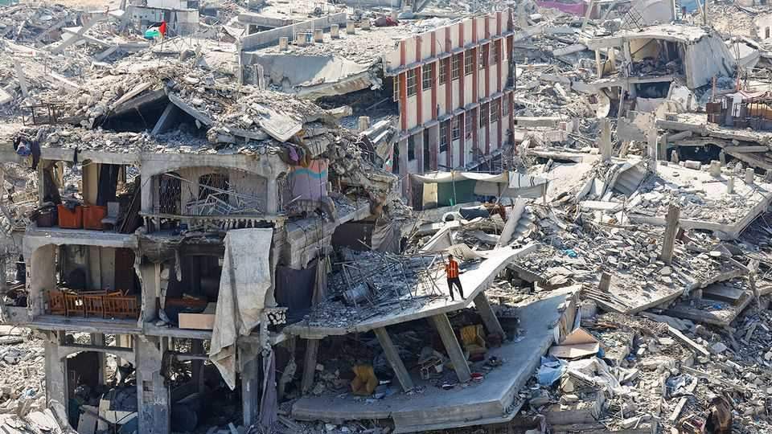
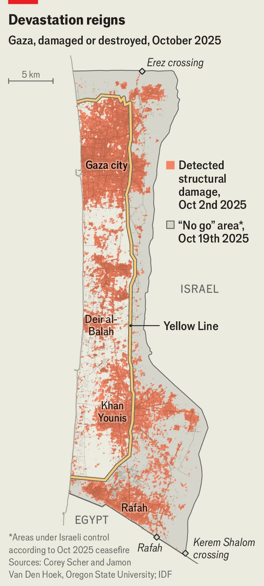

Middle East & Africa | Where to begin?
Gaza’s zombie ceasefire
Neither an Arab reconstruction plan nor an American one have much chance of success
November 13th 2025

The temporary has a way of becoming permanent in the Middle East. The Israeli occupation of the West Bank has endured for half a century. The Palestinian Authority (PA) was meant to be a five-year interim body; it turned 30 last year. A month after the ceasefire took hold in Gaza, its 2m inhabitants are starting to wonder if their despair will be permanent, too. Nothing has been done to rebuild a territory flattened by two years of war. Arab states have drafted a reconstruction plan, but it is unlikely to start unless Hamas, a Palestinian militant group, agrees to disarm. It refuses.

With Hamas intransigent, some American and Israeli officials have begun promoting an alternative: they hope to rebuild on the other side of the “yellow line”, the boundary between the half of Gaza controlled by Hamas and the half occupied by Israel (see map). But almost no Palestinians live there and Arab states oppose the scheme. Gazans are in dire need of homes, jobs and services—yet no workable plans exist to provide them.

The scale of the damage is unprecedented. Start with housing. The UN estimated in August that over 320,000 homes had been destroyed or damaged, 18 times more than during the 2014 war between Israel and Hamas, the longest and deadliest until this one. Around 1.2m people—60% of Gaza’s population—are homeless. Even tents are hard to find: aid groups say fewer than 20,000 have been allowed into Gaza since the ceasefire began.

Shelter is the most urgent need, but not the only one. Around 85% of businesses are in ruins. Nearly 90% of both farmland and agricultural wells have been damaged. Two-thirds of Gaza’s arable land is on the Israeli- controlled side of the yellow line. Some 77% of roads have been bombed or torn up by Israeli tanks. The list goes on.

There is no shortage of ideas, however unrealistic, for rebuilding. Mr Trump famously proposed turning Gaza into a beach resort. Some Israeli businessmen have pitched a fanciful plan to build Tesla factories and AI data centres on the ruins. The PA has drafted its own reconstruction programme; so have local officials in Gaza. The proposal with the widest support is an Egyptian initiative that Arab states endorsed in March. It envisages rebuilding Gaza in several phases.

The first would focus on clearing the estimated 60m tonnes of rubble heaped across the territory. Some of it could be repurposed: after the 2014 war between Israel and Hamas, contractors used debris from bombed buildings as substrate to repave the coastal motorway. Egypt hopes to mix rubble with sand and use it to reclaim land off Gaza’s coast, which could host a port and other infrastructure. The second phase would last four and a half years and focus on rebuilding.

With almost everyone in Gaza unemployed, the plan could draw from an ample labour force. Egypt would supply the expertise and deliver raw materials; it hopes to enlist developers from Gulf countries. But engineers say the timeline is unrealistic—that clearing the rubble will take closer to six years than six months. Materials would need to flow through the Rafah crossing between Gaza and Egypt, where Israel holds a veto. One big developer in the Gulf has told Western officials that he does not want to get involved because he sees little hope of a return on investment.

Indeed, money is the biggest obstacle. The Egyptian plan puts the cost of reconstruction at $53bn; the UN estimates it at $70bn. Donors do not want to foot the bill unless they know the war is truly over. That requires disarming Hamas. The ceasefire calls for an international peacekeeping force to do the job. Donald Trump is urging the UN Security Council to give the force a two-year mandate.

Yet no one in the Arab world is eager to join. Anwar Gargash, a diplomatic adviser to the president of the United Arab Emirates (UAE), says the concept is still too vague. Unless that changes, his country “will probably not participate”. Saudi Arabia has ruled out sending troops. So has Jordan: “We’re too close to the issue,” says Ayman Safadi, the foreign minister. Mr

Trump hopes to convince non-Arab countries to contribute the bulk of the force, but they have yet to commit.

Hence the talk of an alternative. Instead of rebuilding Gaza’s existing cities, which are near the coast, some Americans and Israelis hope to start reconstruction on Israeli-controlled territory. They would probably begin near Rafah, in southern Gaza, where Israel holds the largest chunk of land. The idea is to build a string of modular towns: each would house thousands of Palestinians and include clinics, schools and other services.

The scheme has echoes of failed initiatives tried in other counter- insurgencies, from Afghanistan in the 2000s to Vietnam in the 1960s. It seems unlikely to work in Gaza either. Only a few thousand Palestinians live on the Israeli side of the line (many are members of Israeli-backed militias). Even if others could be convinced to move, Israel would have to vet them; it is unclear if they would then be allowed to return, or to move freely on the Israeli side.

Arab states fear the yellow line would become a permanent border. “We cannot have a fragmentation of Gaza,” says Mr Safadi. Officials in Cairo also worry that pushing Gazans towards Rafah might end up with them being displaced to Egypt, as some Israelis threatened throughout the war. American businessmen close to the Trump administration have pitched the scheme to at least one Gulf government, hoping to secure a financial commitment. They were rebuffed.

For now, then, the focus will probably be on providing a bare minimum of aid. “It will be rehabilitation, not reconstruction,” says one Western diplomat. In August, for example, the UAE finished a programme to supply southern Gaza with 8m litres of desalinated water a day. The desalination plant itself is located in Egypt, and a pipeline carries the water across the border.

Diplomats are pressing Israel to allow more temporary shelters into Gaza (thousands are stuck in neighbouring countries awaiting approval). The Gaza Humanitarian Foundation, a shadowy outfit that ran a disastrous food- distribution programme earlier this year, is pushing a plan to set up 16 aid

centres along the yellow line. But unless Hamas can be convinced to lay down its arms, ambitious plans for reconstruction will gather dust. ■

Sign up to the Middle East Dispatch, a weekly newsletter that keeps you in the loop on a fascinating, complex and consequential part of the world.

This article was downloaded by zlibrary from [https://www.economist.com//middle-east-and-africa/2025/11/12/gazas-zombie-ceasefire](https://www.economist.com//middle-east-and-africa/2025/11/12/gazas-zombie-ceasefire)