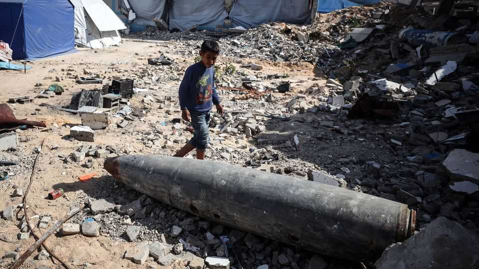

Middle East & Africa | The remnants of war
The dangers beneath Gaza’s rubble
The devastated strip may have more unexploded bombs than anywhere in the world
November 13th 2025

Unexploded ordnance (uxo) is the long tail of conflict, killing and maiming long after the bombs stop falling. A year ago the government media office in Gaza, run by Hamas, estimated there was over 7,000 tonnes in the strip; that would be more per square metre than perhaps anywhere else in the world. For Gaza’s militants, this presents an opportunity. For years they have remade this stuff into new weapons to use again against Israel. For Gazans, they are yet another danger. Smaller munitions—grenades, mortar shells and improvised explosive devices—are in or on the rubble. In October Yahya and Nabila Shorbasi, six-year-old twins, were badly injured after mistaking an explosive for a toy.

Greater danger lies farther down. Israel dropped thousands of bombs on Gaza; some weighed as much as 900kg (2,000lb). Some were fitted with delayed fuses to detonate inside buildings or underground. Concrete cushions the fall of bombs which means they may not detonate on impact but rather tunnel underground.

Disposing of this ordnance safely is length, expensive and dangerous work. Britain has pledged £4m ($5.25m) to the United Nations Mine Action Service (unmas) for de-mining. Eight years after the nine-month campaign to expel Islamic state from Mosul in Iraq, unmas is still clearing uxo. Israel bombed Gaza far more heavily.

In Gaza Israel restricts both the experts and the equipment needed for clearance. Palestinians are not permitted to train in explosives disposal. International specialists are rarely granted entry. Much of the necessary kit appears on Israel’s list of banned “dual-use” items. De-miners are improvising. Old food sacks are filled with sand to use as blast shields.

Even with the right tools, Gaza’s conditions are testing. In Mosul residents are evacuated while explosives are cleared. In Gaza people have nowhere to go. unmas prints warnings about uxo on food-aid packets. But when they find explosives, they can do little more than mark them. Meanwhile, Hamas continues to repurpose those they find to continue its fight.■

Sign up to the Middle East Dispatch, a weekly newsletter that keeps you in the loop on a fascinating, complex and consequential part of the world.

This article was downloaded by zlibrary from https://www.economist.com//middle-east-and-africa/2025/11/13/the-dangers-beneath- gazas-rubble