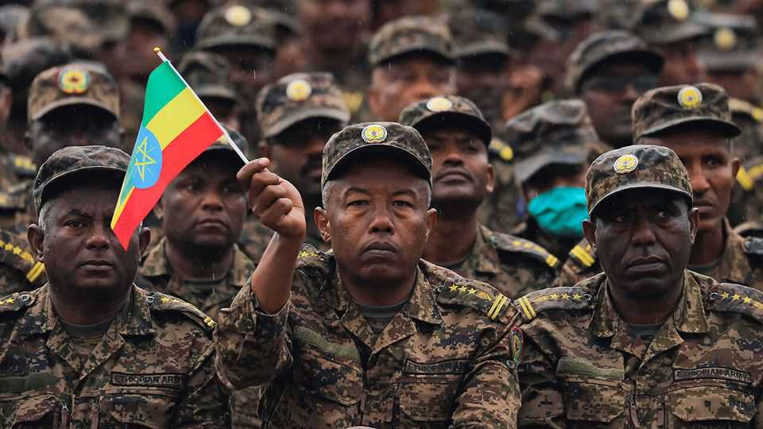
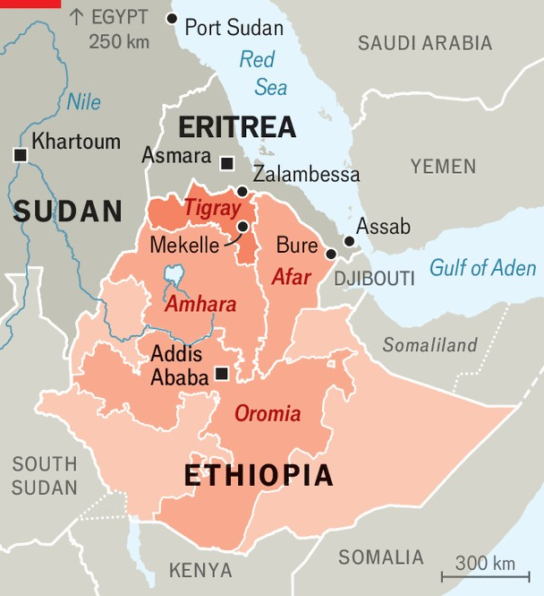

Middle East & Africa | Back on the brink
Ethiopia is perilously close to another war
Conflict in Tigray could balloon into a regional conflagration
November 13th 2025

The silencing of the guns in Tigray, a northern region of Ethiopia in which hundreds of thousands of people may have died in a brutal civil war between 2020 and 2022, was a rare example of peacemaking by America and its allies in the Biden years. In November 2022 Western and African officials, fearful that separatist pressures in Tigray might break apart Africa’s second- most-populous country, forced the Ethiopian government and Tigray’s rulers, the Tigray People’s Liberation Front (TPLF), to come to terms. Three years on, the deal has all but collapsed. On November 7th the TPLF accused the government of Abiy Ahmed, Ethiopia’s prime minister, of “openly breaching” it by launching drone strikes against Tigrayan targets. This followed clashes between Tigrayan forces and militias aligned with the

federal government in neighbouring Afar. Mr Abiy, accusing Tigray’s government of spending scarce resources on troops and arms, has halted federal funding to the region.

Speaking to parliament on October 28th, Mr Abiy insisted that his government had no wish for war with anyone. But should one erupt, he added, there could be no question of the outcome: “No one will stop us.” Ethiopia’s army chief was blunter still, saying that “unless [the TPLF] is eliminated, Ethiopia will not find peace.” Up north, Tigrayan generals boast of their readiness to fight. Residents in Mekelle, Tigray’s capital, report queues outside banks and shops, as people rush to withdraw cash and stockpile provisions.

All this echoes the path to war in 2020. Back then the federal government and the TPLF, which dominated Ethiopian politics for nearly three decades before Mr Abiy took office in 2018, openly prepared for conflict while goading each other to fire the first shots. However, three factors make the situation today different—and even more dangerous.

The first is division among Tigray’s leaders. In March one faction of the TPLF, backed by its armed forces, forcibly removed Tigray’s interim president—a politician they deemed too craven towards Mr Abiy—and put a general in his place. That prompted a group of disaffected Tigrayan soldiers to decamp to Afar, where they formed an anti-TPLF militia with the covert support of Ethiopia’s government. They have frequently skirmished with their former comrades in Tigray in recent months.

Second, relations between Ethiopia and Eritrea, a former province of Ethiopia that seceded in 1993, have broken down. In 2020 Eritrea sent tens of thousands of troops to fight alongside the Ethiopian army in Tigray. But relations soured after Mr Abiy appeared to reconcile with the TPLF, an old foe of Eritrea’s dictator, Isaias Afwerki, in 2022. Each leader now sees the other as his chief adversary in the region.

Moreover, Mr Abiy’s increasingly open ambition to acquire at least one of Eritrea’s ports on the Red Sea is making the situation still more volatile. In 2023 he said that for Ethiopia, a landlocked country with a population of around 130m, lack of direct access to the sea was an “existential” matter. He has also appeared to question the legitimacy of Eritrea’s independence. Though the prime minister insists he would prefer to resolve the issue through diplomacy, his government makes little secret of its preparations for war. On October 21st Ethiopian officials and military officers visited the town of Bure, near the border with Eritrea and 70km from the port of Assab (see map). Satellite images suggest that a drone base nearby was recently expanded.

The threat of conflict between Ethiopia and Eritrea is reconfiguring alliances across the Horn of Africa. Tigray, sandwiched between the two, would almost certainly be a battleground. TPLF officials who see Mr Abiy as the main threat to the region have thus been reaching out to Mr Isaias, despite the many atrocities committed by Eritrean troops during the last war.

Tigrayan and Eritrean commanders are understood to have been in frequent contact for more than a year. On a recent visit to Zalambessa, a border town just inside Tigray, The Economist encountered an Eritrean checkpoint and saw Eritrean soldiers walking freely within sight of Tigrayan militias.

Eritrean bank notes were in circulation at the local market. If large-scale fighting erupts between the TPLF and the Ethiopian government, Eritrea is expected to come to Tigray’s aid.

Other allegiances have shifted, too. In the last war militias from the Amhara region, which borders Tigray to the south, fought alongside Ethiopia and Eritrea against the TPLF. Yet since 2023 those militias, known as the Fano, have been in open revolt against Mr Abiy. In a surprise offensive in late September, the Fano routed government forces in eastern Amhara. The scale of the offensive “sent shock waves through Addis,” says a former Ethiopian official. The Fano probably had help from Eritrea and the TPLF. Commanders from Tigray and Amhara, as well as Eritreans and rebels from Oromia, Mr Abiy’s home region, recently met in Sudan to discuss joint military planning.

The third factor that makes the stand-off over Tigray so worrying is the civil war next door in Sudan, where both Tigrayans and Eritreans are important allies of the Sudanese Armed Forces (SAF), the national army. Eritrea is training SAF units and allied Sudanese rebel groups. Sudanese aircraft have been spotted at the airport in Asmara, Eritrea’s capital. Thousands of Tigrayans have fought alongside the SAF, including earlier this year in Khartoum, Sudan’s capital. If war erupts between Ethiopia and Eritrea, Mr Isaias and the TPLF would be able to count on at least some support from the SAF.

External powers fuelling the war in Sudan also have competing interests in Ethiopia. Mr Abiy’s principal foreign ally is the United Arab Emirates (UAE), which backs the Rapid Support Forces (RSF), a Sudanese paramilitary group fighting the SAF. (The UAE denies backing either side in the war.) It is unclear whether the UAE would restrain Mr Abiy from launching a war against Eritrea, should such a conflict impair Eritrea’s ability to support the SAF. Some diplomats worry it may be egging him on. Egypt, by contrast, backs the SAF, and is feuding with Ethiopia over a recently completed mega-dam on the Nile. It is strengthening ties with Eritrea, and is alleged to have sent weapons to some of Mr Abiy’s opponents in Ethiopia.

What next? For now, less hawkish voices still seem to carry weight in Addis Ababa and Tigray. Western diplomats are trying to talk both sides back from the brink. But a covert proxy war between Ethiopia, Eritrea and their allies has, in effect, already begun. It needs worryingly little to explode into the open. ■

Sign up to the Analysing Africa, a weekly newsletter that keeps you in the loop about the world’s youngest—and least understood—continent.

This article was downloaded by zlibrary from https://www.economist.com//middle-east-and-africa/2025/11/13/ethiopia-is- perilously-close-to-another-war

Europe

Half a century after the death of Franco, Spain is a far better place Georgia is dousing the last embers of democracy Even on Ukraine’s front line there is time, and a need, for beauty How Italy’s mafia uses social media to recruit new blood Europe is cracking down on Russian tourists