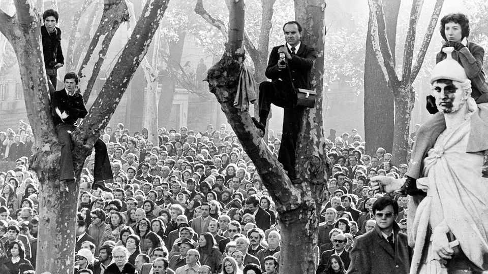
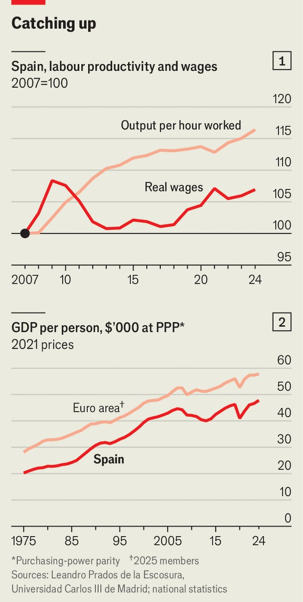
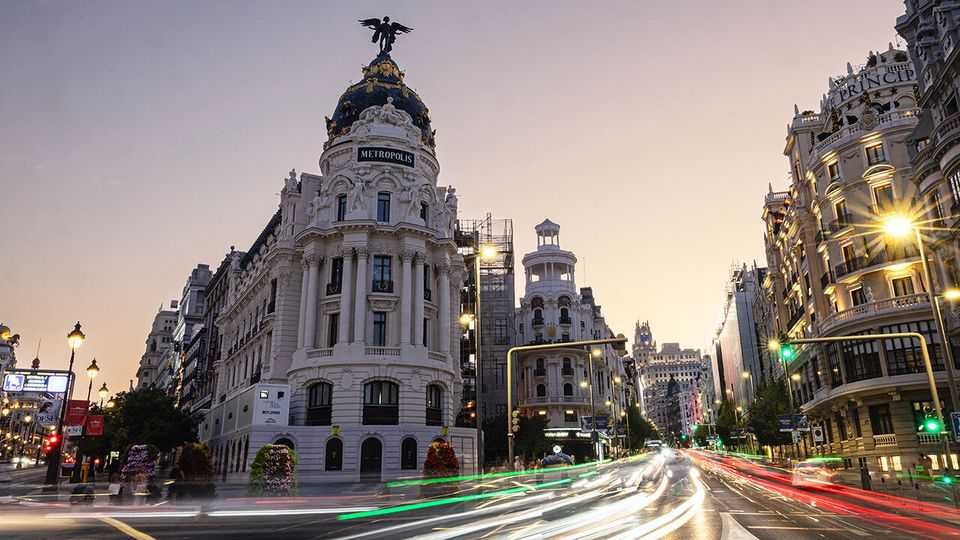

Europe | A country transformed
Half a century after the death of Franco, Spain is a far better place
But new problems risk undermining its success
November 13th 2025

On November 20th 1975 Nicolás Sartorius was in Carabanchel prison, in Madrid’s working-class southern suburbs. He had been arrested three years earlier when police rounded up the leaders of the Workers Commissions, an underground Communist-led trade union movement. With glassless windows, the prison was freezing in winter and sweltering in summer, and there were rats and cockroaches, he says. That morning the prisoners heard that Francisco Franco, Spain’s dictator since his victory in the 1936-39 civil war against the elected Republican government, had died. “We thought everything was possible,” Mr Sartorius recalls.

At first it wasn’t. Franco had died in his bed, his conservative dictatorship undefeated. Under the law of succession he had promulgated, the monarchy was restored in the person of King Juan Carlos. The new king inherited the dictator’s absolute powers. After a hesitant few months, in which he pardoned political prisoners including Mr Sartorius, under pressure of strikes and protests he swiftly proceeded to give all those powers away. Spain became a democracy, erected a welfare state and joined NATO in 1982 and the European Union (EU) in 1986.

Building on strong growth, which had begun in the 1950s when Franco abandoned autarky and appointed technocrats to liberalise the economy, the country became one of only a handful to make the leap to developed status. In 1975 Spain was still scarred by rural misery and urban shanty towns. Life expectancy was 73 years; today it is 84. Real income per person in purchasing power terms has increased two and a half times. In tandem, Spanish society moved from Catholic conformism to become one of the most liberal in the world, with a revolution in women’s rights. In short, Spain became a modern European country, a condition that many of its people had long yearned for.

Its transition to democracy was widely admired for being achieved without conflict. The only exceptions were a bloodless attempted coup in 1981 which Juan Carlos played a crucial role in quashing, and the terrorism of ETA, a Basque group, which was eventually defeated without any political concessions. The transition was based on a pact between reformers in the regime and an opposition moderated by decades of repression. The left accepted the monarchy and the right decentralisation. An amnesty drew a line under the past.

But as elsewhere in Europe, the years since the financial crisis of 2008, which hit Spain especially hard, have been difficult. Austerity bred populisms: first, Podemos, a new radical-left party, threatened to displace the mainstream Socialists, and then Catalan nationalism mutated into identitarian separatism. Its leaders threatened Spain’s unity by staging an unconstitutional independence referendum in 2017. That in turn prompted the rise of Vox, on the populist right. Still, despite some fragmentation, the Socialists and the centre-right People’s Party (PP) still commanded 65% of the vote between them at the most recent election, in 2023.

Pedro Sánchez, the Socialist prime minister, has been obliged to govern in a minority ever since he first came to office in 2018. Dependent on fickle allies, his position has become increasingly precarious. He has failed to approve a budget since 2023. In a now polarised country, he decided to mark the 50th anniversary of Franco’s death with events to commemorate “Spain in liberty”. Many thought that the 1978 constitution, which ushered in democracy, would have been worthier of celebration. “Franco is not just dead but has no importance,” says Javier Gomá, a philosopher. “He’s a ghost, invoked by politicians for ideological reasons.”

Nevertheless, the anniversary is a good moment to underline just how much Spain has changed. It now shares many of the problems that afflict much of the continent: the rise of the populist right, how to handle immigration, rural depopulation and an urban housing shortage, for example. After 50 years, its democratic institutions are showing signs of decay. The disconnect between Spaniards and their politicians is especially acute: according to Eurobarometer, in the EU only Bulgarians, Czechs, Greeks and Slovenians trust their parliament less than Spaniards do.

But Spain still has strengths, and time to tackle the problems. Start with the economy. Since the pandemic dip it has been the envy of Europe, growing at two to three times the euro-area average. That marks a change. Although Spain’s long growth spurt lasted until the financial crisis, the economy became unbalanced, depending on cheap credit after it joined the EU and an unsustainable housing boom. Productivity growth petered out in the mid- 1980s, points out Leandro Prados de la Escosura, an economic historian. When the housing bubble burst in 2008, Spain slumped. Unemployment soared to 26%.

Thanks partly to reforms by Mr Sánchez’s conservative predecessor, sustained growth resumed in 2014. It is more solidly based this time. Spain has had a current-account surplus since 2014. Both labour productivity and real incomes have been creeping up (see chart 1). A tourism boom, large- scale immigration and EU Next Generation funds have all spurred growth. But Carlos Cuerpo, the economy minister, talks, too, of a structural change, with higher-value sectors such as ICT, biotech and pharmaceuticals expanding. Even so, there is ground to make up: income per person in Spain was converging towards the euro area average until 2005 but then fell back a bit (see chart 2).

Younger Spaniards face particular problems. There is less social mobility than in the past. Thanks partly to immigration, each year sees 140,000 new households but only around 80,000 new homes. The difficulty of obtaining a home, plus lifestyle choices by Spanish women, have seen the fertility rate plunge to just 1.2, one of the lowest in the world.

That is one reason Spain has been welcoming to immigrants, who now account for 19% of the population (up from just 2% in 2000). It helps that almost half are Latin American and integrate fairly easily. Nevertheless, there are warning signs. Recent polls show a narrow majority think there are now “too many” immigrants. That is one factor in the rise of Vox.

Another is disillusion with politics. One of the constitution’s central planks, its decentralised quasi-federalism, has proved “more fragile and more contentious than we expected,” says Charles Powell of the Elcano Royal Institute, a think-tank. The Catalan crisis of 2017 showed that. More recently, so too has the mishandling by regional governments of deadly floods in Valencia last year and widespread forest fires this summer. Building more homes requires collaboration between authorities at local, regional and national level. Missing are the duties of co-ordination and reciprocal institutional loyalty that formal federalism would entail.

Even the monarchy was tarnished when Juan Carlos abdicated in 2014 after an affair with a Danish socialite and the subsequent revelation of Swiss bank accounts (he was later cleared of any wrongdoing). His son, King Felipe, has worked hard to restore the monarchy’s credibility in a country with a large republican minority.

The biggest problem is the concentration of unaccountable power in the two main parties, argues Miriam González, a lawyer who is flirting with setting up a new centrist party. She argues that Spain’s judicial system does not comply with EU standards of independence, that thousands of politicians and hangers-on benefit from aforamientos (judicial privileges) and that neither Mr Sánchez nor his predecessors have drawn up a code of ethics

governing conflicts of interest for ministers and their spouses. (Mr Sánchez’s wife and brother are being investigated by judges for influence-peddling, which they deny).

The politicians have colonised supposedly independent institutions. “It’s tacitly accepted that whoever is in power even chooses the hosts of late- night shows on public television,” says Víctor Lapuente, a political scientist. Politicians from both main parties and the Catalan nationalists have faced corruption charges, mainly related to public contracts.

The co-operation of the transition to democracy has given way to remorseless political combat. Each of the two main parties questions the credentials of the other to exercise power. The PP rejects Mr Sánchez’s decision to grant a sweeping amnesty to the Catalan separatist leaders in order to secure their parties’ votes so that he could remain in office in 2023. The Socialists say that the PP’s probable need to rely on Vox to govern disqualifies it.

Despite these problems, life for most Spaniards remains good. The country is a “big success”, says Mr Sartorius. The many foreigners who are choosing to live there bear that out. The task of the politicians is to ensure that it remains so. ■

To stay on top of the biggest European stories, sign up to Café Europa, our weekly subscriber-only newsletter.

This article was downloaded by zlibrary from https://www.economist.com//europe/2025/11/13/half-a-century-after-the-death-of- franco-spain-is-a-far-better-place