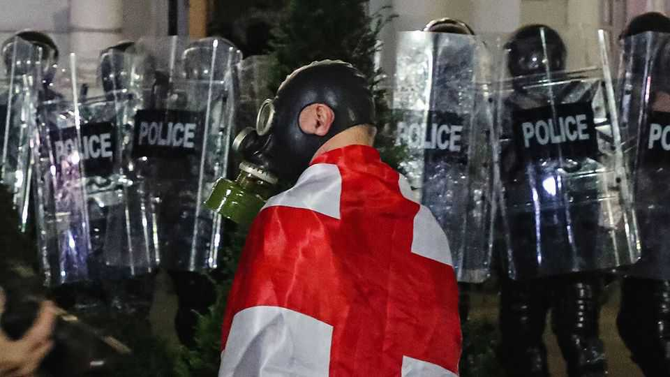
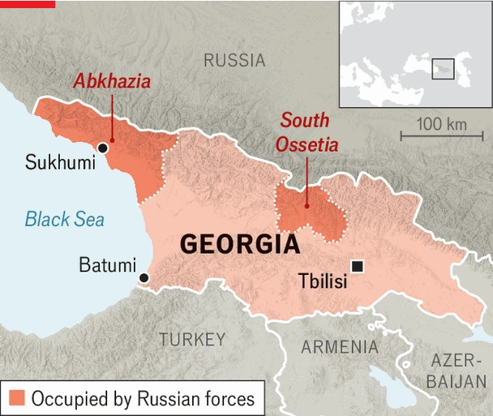

Europe | Goodbye, Europe
Georgia is dousing the last embers of democracy
An oligarchic party outlaws the opposition and turns towards Russia
November 13th 2025

IN MANY FORMERLY democratic countries, the road to one-party rule has been long and winding. Georgia’s ruling Georgian Dream (GD) party seems to have decided to take the expressway. On November 6th prosecutors charged eight of the country’s leading opposition figures, including a former president, Mikheil Saakashvili, with plotting to carry out a coup. They face up to 15 years in prison. Six are already behind bars. A week earlier, GD had asked the country’s constitutional court to outlaw Georgia’s three largest opposition parties. The price of dissent is going up quickly in Georgia, and not only for politicians. In the past month police have arrested dozens of people involved in protests against GD that began in late 2024, when the government decided

to halt accession talks with the European Union. Those who attempted to storm the presidential palace on October 4th, the day of local elections, are being accused of taking part in a coup. Some have been jailed merely for wearing a face mask or blocking traffic. “Last year the fine was 500 lari ($185),” says Inga, a protester outside parliament. “Then it was 5,000 lari, and now it’s 15 days in prison.”

The ban on the opposition parties looks like a foregone conclusion. The judiciary, including the constitutional court, is beholden to GD. Some believe the parties may attempt to reconstitute themselves under new names. Salome Samadashvili of Lelo, one of the parties facing closure, entertains no such illusions. “If we try to register as a new party, the justice ministry will refuse,” she says. “With total control of the state, they can do whatever they want.”

Founded by Bidzina Ivanishvili, Georgia’s richest man, GD came to power in 2012. It initially hewed to the pro-Western course charted by its predecessors, especially Mr Saakashvili. This paid off in 2023, when the EU, galvanised by Russia’s invasion of Ukraine, formally accepted Georgia as a candidate for membership. It had already done so for Ukraine and Moldova, but Georgia was delayed by doubts over its qualifications.

For there were already frictions with the West and signs of democratic rot. GD, once a coalition of parties, had become a vehicle for Mr Ivanishvili’s business interests and ambitions. Officials began to hound LGBT groups, as did the Georgian Orthodox Church. Georgia pledged not to help Russia evade Western sanctions, but refused to impose any of its own.

Since the general election in 2024, which was marred by claims of fraud, the process has gone into overdrive. An opposition boycott of parliament handed GD uncontested control over the chamber. A law on “foreign agents”, coupled with the end of USAID-backed programmes since that agency was dismantled by the Trump administration, has gutted civil society. Opponents have disappeared behind bars. Irakli Kobakhidze, the prime minister, has burned bridges with the EU and accused the West of trying to push Georgia into war with Russia. Human-rights violations are widespread, and the system of checks and balances is as good as gone, the EU concluded in a recent report.

The opposition is weak, divided and in many cases burdened by its own record of abuse and corruption when it was in power. October’s local elections marked a low point. Some opposition parties declared a boycott, some took part in the vote, and others urged supporters to take to the streets. The result was a sweeping victory by GD. “The campaign failed, the boycott failed, and the revolution failed,” says Dimitri Tskitishvili, a former parliamentarian.

EU candidate status was supposed to offer Georgia an incentive to push ahead with democratic reforms. Instead it has had the opposite effect. Mr Ivanishvili sensed that his patronage network was at stake and panicked, analysts say. “He understood that if he passed all these reforms, de- oligarchisation, the rule of law and human rights, he would lose power,” says Kornely Kakachia, head of the Georgian Institute of Politics, a think- tank.

The pivot away from Europe has gone hand in hand with increasing dependence on Russia. Russia now accounts for 45% of Georgia’s oil imports, up from 8% in 2012. In a first, a Georgian refinery on the Black Sea received a shipment of more than 100,000 tonnes of Russian crude in early October. Georgia has also become a key transit hub for cars headed for Russia, according to a report by the Foreign Policy Centre. Analysts speak

of massive, undocumented inflows of money from Russia, helping to power Georgia’s economy. (GDP grew by a blistering 9.4% last year.) Mentioning such things can be dangerous in Tbilisi. The latest charges against Georgia’s opposition include supplying foreign governments with information about the country’s economic relations with Russia.

GD officials say, with a degree of justification, that Georgia cannot afford to pick new fights with Russia, which invaded the country in 2008 and still controls two large enclaves in its territory. Sanctions against Russia “would mean suicide” for Georgia, says Levan Makhashvili, a GD parliamentarian. “We need to be pragmatic,” he says. “We need to manage our expectations, we need to manage our rhetoric.”

On paper, the government remains committed to joining the EU. But it imagines it can somehow do so on its own terms, not Europe’s. GD seems to believe that populist-right leaders will soon win power across the EU, and then roll out the red carpet for Georgia.

In the meantime, Georgia is looking for friends elsewhere. Mr Kobakhidze recently travelled to China (which he called “the world’s only peaceful superpower”) to tout Georgia as a gateway to Europe and a destination for Chinese investment. GD has been courting MAGA as well. This year Mr Kobakhidze has penned at least two letters to Donald Trump, pleading with him to remove sanctions on Georgia that were imposed in 2024 and to team up with GD against the “deep state” and the “Global War Party”. Mr Trump has yet to reply.

Critics have taken to calling GD a Russian proxy. That is misleading. For the party and its billionaire founder, doing business with Russia and China and abandoning integration with Europe are what it takes to safeguard their interests. “They’re not guided by any love of Russia,” says Mr Kakachia. “This is a strategy for regime survival.” ■

To stay on top of the biggest European stories, sign up to Café Europa, our weekly subscriber-only newsletter.

This article was downloaded by zlibrary from https://www.economist.com//europe/2025/11/09/georgia-is-dousing-the-last-embers-of- democracy