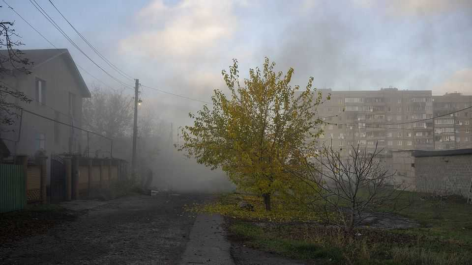
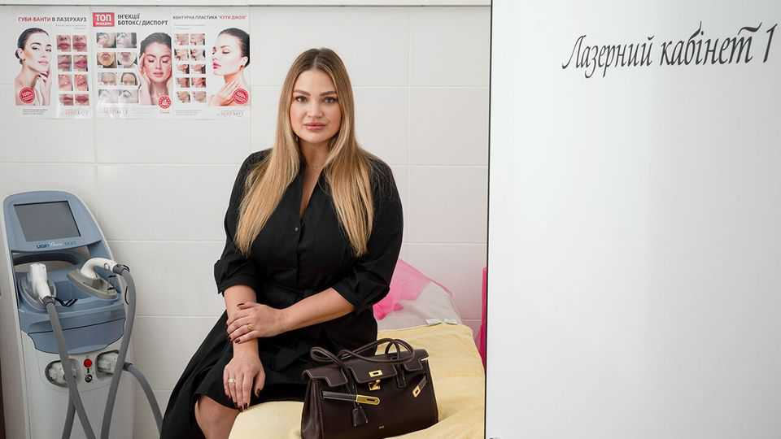

Europe | A new glow
Even on Ukraine’s front line there is time, and a need, for beauty
Maryna Zhegulina risks her life to help soldiers keep their humanity
November 13th 2025

The drill is second nature now. Once a month, Maryna Zhegulina (pictured below) prepares her order—vials, serums, syringes—for courier transfer from Kyiv. Then she studies the latest war maps for her safest commute. The usual route from the beautician’s home in Zaporizhia to her clinic in front- line Kramatorsk has become too dangerous. Russian sabotage and reconnaissance groups now fire on large sections of it. So instead Ms Zhegulina leaves at dawn, and threads her way to Donetsk province along long-forgotten country roads. She says the act of bringing beauty to a place more often associated with death and destruction is well worth the risk. “It becomes a real event for everyone. When I get there, they welcome me like a goddess.”

The demand speaks for itself. Ms Zhegulina’s clinics are fully booked weeks in advance. On the day your correspondent calls, she is seeing 11 patients— all but one of them military personnel—and on some days the number can reach 20. The most common treatments she does are Botox injections to smooth lines, dermal fillers for volume and cell therapy against hair loss. War has left no shortage of customers for such procedures. The beautician makes a point of enfolding each client in a hearty embrace, before leading them into her procedure room. Soon enough, the sound of laughter drifts out. “Emotional connection is key to my work,” the beautician says. “The women talk to me about everything, though the men initially try to mask their fear.” A majority of Ms Zhegulina’s clients are female, but many men come too. Their main concern is premature hair loss. The war is, unsurprisingly, hard on the hairline.

One of the first through the doors is 40-year-old Daria. Just a few hours earlier, the supply sergeant was dodging glide-bombs and shells in sketchy front-line positions east of Kramatorsk. Her shaking hands and the scent of chain-smoking are clues to the fast-deteriorating situation there. But there was no question of her missing the appointment. “Excuse the dark humour, but if I’m to die, I want to be beautiful for it,” she says. “Who knows, maybe a killer drone will see how pretty I am and decide to fly on.” War has not been kind to her. Three months ago she divorced her husband, also a soldier,

after he had become “consumed” by the fighting. “War doesn’t always have to kill you physically, it can also kill you in your soul.” The sessions with Ms Zhegulina are a way of “reclaiming” herself, she says. “It’s when I begin to feel human…and a woman again.”

It does not take long to understand that Ms Zhegulina’s Kramatorsk beauty clinic is much more than a temple to vanity. At times, it resembles a confessional, or a psychologist’s office. Tania, a woman in her 20s, stares ahead as she matter-of-factly says she “lost everything” in Vladimir Putin’s war: her husband, her family home in Luhansk province. It was this loss that pushed her to join the army in July 2022. She remembers life before Russia’s invasion in “rainbow colours.” The steady toll of death since then—of relatives, friends and comrades—changed the palette to “greys and blacks”. Botox, she says, helps remove the marks of sadness and tears from her face. “Somehow, my sorrow disappears, a new glow appears.”

Three and a half years into full-scale war, most Ukrainians are over the initial shock of invasion, and have learned to seize whatever bit of life they can, whenever they can. For soldiers serving on the front lines, Ms Zhegulina’s clinic offers one such window of respite. How long it will remain open is uncertain. Battles rage in nearby Kostyantynivka, Chasiv Yar and Pokrovsk. Throughout the day, the thuds of incoming glide-bombs menaced behind the Hollywood white smiles and sweet floral perfumes of the clinic. A local intelligence officer says Russia’s extended-range drones— often released from “motherships”—are threatening to block all the main arteries leading into Kramatorsk. If before the picture was measured from month to month, he continues, things are now moving week to week: “The bastards block the roads. They ambush. And they glide-bomb anything that looks interesting. It’s really hard.” ■

To stay on top of the biggest European stories, sign up to Café Europa, our weekly subscriber-only newsletter.

This article was downloaded by zlibrary from https://www.economist.com//europe/2025/11/12/even-on-ukraines-front-line-there-is- time-and-a-need-for-beauty