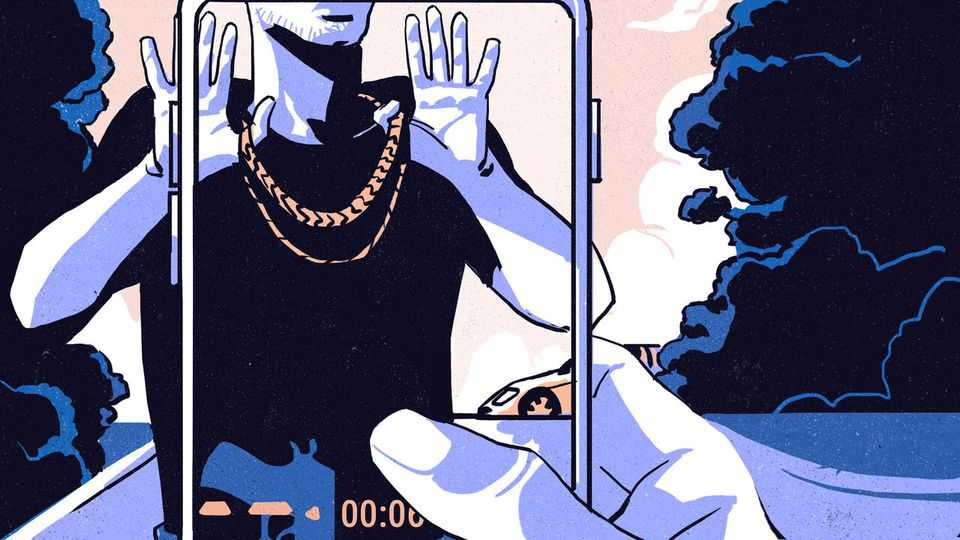

Europe | Mobsters online
How Italy’s mafia uses social media to recruit new blood
TikTok is struggling to contain it
November 13th 2025

In Italy’s mafia underworld, the traditional professions of extortioner, hitman and drug-runner are being supplanted by a less risky occupation: social- media influencer. A new young generation is stepping out of the shadows and into the limelight of TikTok, according to a report by the Fondazione Magna Grecia, an NGO that promotes the development of Italy’s southern Mezzogiorno region. Mobsters are exploiting the social-media app to normalise their image, mythologise their culture and even to launder money, the study, which analysed 6,200 TikTok posts, found. Having long understood that fear is a

blunt instrument, criminal networks are packaging their message in the language of aspirational consumption.

One recent criminal investigation found the Amato-Pagano clan near Naples used content featuring fast cars, glamorous parties and ostentatious wealth to recruit new affiliates, who were then trained in extortion. Naples’ chief prosecutor has warned that mafia outfits recruit young people “by showing them wealth and easy money.”

The designer accessories and alluring backdrops not only help project power and visibility but also act as a smokescreen for violence, helping to overcome moral resistance, according to the report’s editor, Marcello Ravveduto, of the University of Salerno. “You don’t even need to threaten people any more, you just say ‘Look at my Tiktok’,” says Mr Ravveduto. Some bosses have even used TikTok to control their clan from within jail, the researchers reported, using emoticons such as a black flag for mourning, a chain for imprisonment and an hourglass for revenge.

TikTok’s algorithm, based on user interaction, soon subjects casual users to a perpetual torrent of violence, loyalty and ostentation, “including wives of prisoners offering advice, photos of victims of clan wars, young heirs flaunting luxury brands, repentant mafiosi offering commentary…and parades of scooters designed to intimidate”, the report said. This continual exposure to “grief, violence, luxury and prison…has trained audiences to consume criminal imagery as entertainment.”

In July Tiktok signed an agreement with Italy’s anti-Mafia parliamentary commission and has since removed thousands of videos flagged for glorifying violence or gangster life. The company says it now uses algorithms and researchers to remove 99% of unacceptable content ahead of complaints. But the speed and ingenuity of content creation make for a hard time catching up with the latest version of one of Italy’s oldest professions. ■

To stay on top of the biggest European stories, sign up to Café Europa, our weekly subscriber-only newsletter.

This article was downloaded by zlibrary from https://www.economist.com//europe/2025/11/13/how-italys-mafia-uses-social-media-to- recruit-new-blood