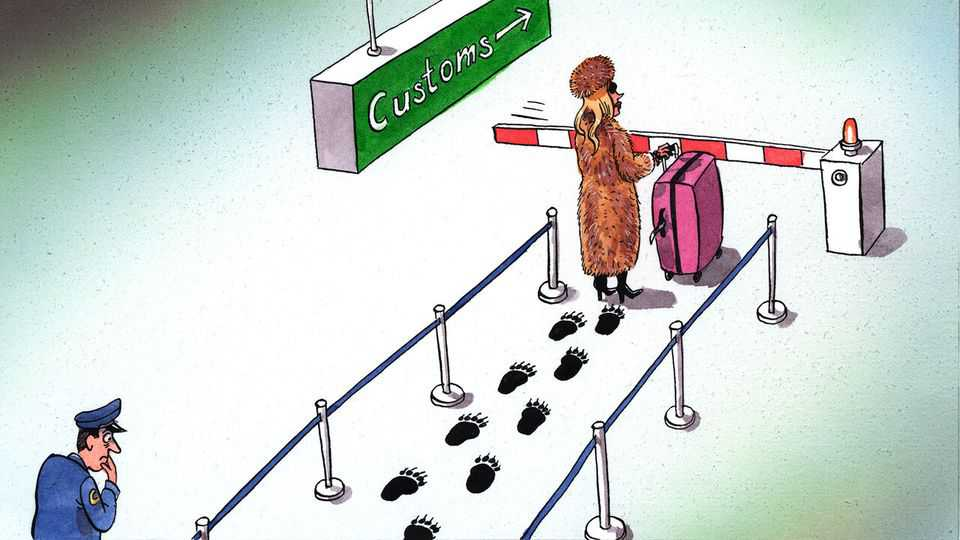

Europe | Charlemagne
Europe is cracking down on Russian tourists
That is partly necessary—and partly alarming
November 13th 2025

Before the age of budget airlines and Instagram wanderlust, Russians journeyed west not for leisure but for enlightenment. In March 1697 Peter the Great set off from Moscow to take in the sights of Amsterdam, London and Vienna, among others. Travelling under a pseudonym, but much recognised thanks to his towering height and posse of over 200 hangers-on, the tsar’s odyssey included the expected museum visits and posh balls. But the point of the trip was to experience something that could not be found in 17th-century Russia: modernity. The incognito emperor spent time working as a ship’s carpenter in Holland, took stock of the latest naval warfare tactics in Portsmouth, then studied democracy in action in Westminster. Alas, news of insurrection back home brought the escapade to a close after a mere 18 months. Having experienced modernity on his sojourn, Peter sought to

impose it on his people. He promptly decreed facial hair to be “superfluous” and imposed a tax on beards. On the rest of Europe he soon imposed a grimmer fate: the Great Northern war, which embroiled bits of Scandinavia and the Baltics for two decades.

Three centuries after Peter’s odyssey, and three years after his wannabe successor Vladimir Putin launched his own protracted war in Ukraine, Russian tourism is still alive and well in Europe. What it lacks in ambition— the grand tour of yesteryear has been replaced by the more modest Mykonos beach jaunt, Milan shopping spree or week’s skiing in Courchevel—it makes up for in numbers. Over 500,000 Russians were granted visas to the European Union’s Schengen zone in 2024, nearly half of which allow for multiple entry over many years. The visitor numbers are down by 90% compared with 2019. But that is still far too many for those Europeans who wonder how citizens from a country whose army is raining missiles on Ukrainian cities can cavort in its beaches and boutiques. On November 7th the EU announced Russians would no longer be granted multiple-entry visas in a bid to get the number nearer to zero. What seems commonsensical to some is decried as deeply misguided by others—including Mr Putin’s foes.

The ostensible cause for the tightening is security. Beyond invading Ukraine, Russia is needling Europe with subtler forms of aggression. Drones circling airports, Baltic ships dredging cables, cyber-attacks and other forms of mischief have set nerves jangling in Europe. Even if security services there struggle to pin such “grey zone” attacks on Russian operators, to them it makes sense to view every visitor from there as a potential spy, saboteur or propagandist. Ending multiple-entry visas is a way to ensure vetting happens before each visit, a sensible precaution.

But the driving force for the visa ban is moral outrage. “Starting a war and expecting to move freely in Europe is hard to justify,” said Kaja Kallas, the hawkish Estonian who serves as the EU’s foreign-policy chief. Along with others hailing from the bloc’s eastern fringe, she has long lobbied for Europeans to equate all Russians with the regime they live under. Whether oligarchs or mere members of the upper-middle classes, those Muscovites who can afford a jolly in Ibiza are tacitly propping up Putinism. They are our enemy, too, unless proved otherwise. Exemptions to the visa ban will be

made for relatives of EU citizens, as well as dissidents and others who can prove their “integrity”.

The security argument seems hard to quibble with, even if GRU goons have plenty of fake Western passports in their double-bottomed attaché cases (and are said to hire locals to do their dirty work, often via social-media platforms). But the all-Russians-are-Putinists argument is trickier. Your columnist has felt the discomfiting “ick” of sharing a Parisian café terrace or Alpine chairlift with Russian visitors, enjoying a carefree interlude before (probably) returning to well-paid jobs back home that will generate tax revenue for Mr Putin’s war. Is this wretched invasion not, at least in part, theirs as well? How dare they enjoy themselves?

But just as discomfiting is to apply the sins of a dictatorship to all 144m citizens who live in it—some of the first victims of Putinism. Not so long ago, Europe promoted the idea that everyday Russians should be separated from the regime that patently does not represent them. Oligarchs and those close to the regime were to be sanctioned, but ordinary Russians were potential allies against Mr Putin. Why not welcome them to Europe? Every rouble spaffed in Milan boutiques drains Russia of resources.

With the war in Ukraine dragging on, a more hawkish line has prevailed. In EU circles it is now expected that Russia’s middle class should somehow “do more” to unseat Mr Putin, and that failure to do so amounts to collaboration. Yet for ordinary Russians to be held collectively responsible for “their” leader’s actions is to assume they have the agency to turf him out. Tell that to the thousands languishing in gulags for even the merest of protests. Indeed, some with intimate experience of gulagdom have opposed the EU’s move. Yulia Navalnaya, whose husband Alexei Navalny died in an Arctic penal colony, has argued the visa ban would isolate Russia from Europe in precisely the way Mr Putin has in mind.

As with sanctions designed to target the regime and not the people, it may be that anti-Putinists end up as collateral damage of an otherwise sensible policy. How could it be otherwise? Europeans are being told to expect a frontal confrontation with Russia, perhaps soon. It is one thing to feel no animus towards ordinary Russians, another to host them for a mini-break just as defence spending in Europe is surging to take on a threat from their

backyard. To curtail Russians visiting Europe may be to lump the oppressed with their oppressor. But with apologies to (some) Russians, any other outcome would make Europeans appear hopelessly naive. Let’s have you all over when the war ends. ■

Subscribers to The Economist can sign up to our Opinion newsletter, which brings together the best of our leaders, columns, guest essays and reader correspondence.

This article was downloaded by zlibrary from https://www.economist.com//europe/2025/11/13/europe-is-cracking-down-on-russian- tourists

Britain

The BBC’s boss quits over a “doctored” Trump speech Labour’s tax-and-spend policy has been dominated by wild gambling British businesses say they are furious with the government Why Britain may have stopped sharing some intelligence with America A slimy scheme to avoid property tax Sir Keir Starmer is a prisoner of the politics he pledged to end