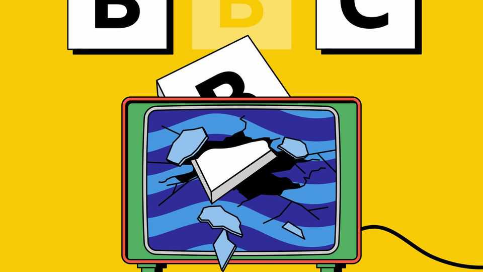
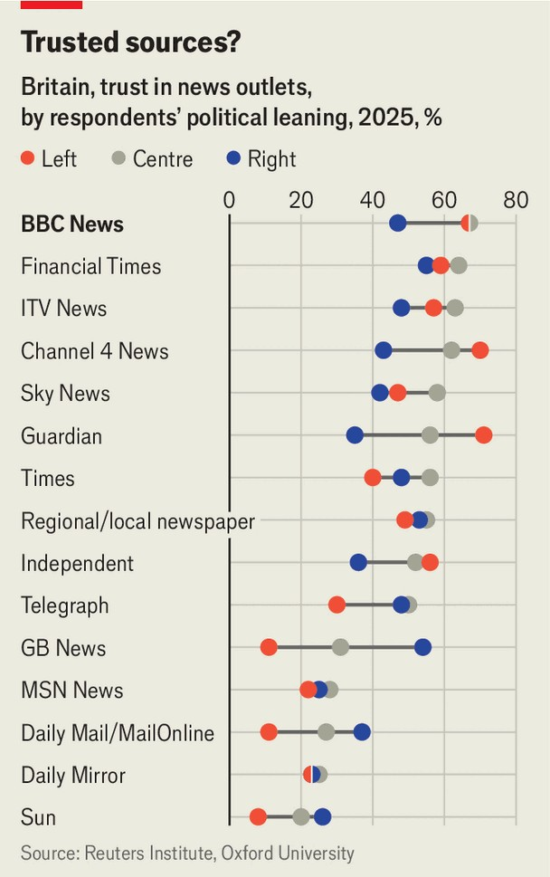

Britain | Inform, educate, enrage
The BBC’s boss quits over a “doctored” Trump speech
Shifts in politics and the media business are making the broadcaster more crisis-prone
November 13th 2025

The job of the British Broadcasting Corporation, laid out a century ago by its austere founder, John Reith, is “to inform, educate and entertain”. The public broadcaster has since displayed another tendency: to enrage. Britons love to watch the BBC, spending more time with it than any other outlet. But they also love to hate it. Its directors-general are periodically jettisoned to gleeful headlines, like losing contestants on “The Traitors”, a hit BBC game show. On November 9th it was the turn of Tim Davie, its boss of five years, to be thrown off. Admitting to mistakes in a documentary about President Donald Trump, Mr Davie quit along with his head of news, Deborah Turness.

The BBC has always been a political lightning rod. Winston Churchill and Margaret Thatcher fought bitter battles with it. Producing news to suit the varied taste of a whole country—as well as a growing international audience —is tricky work. But the BBC’s unusual role is becoming more difficult to sustain. Britain’s political environment and the global media business are both transforming in ways that make it tougher for the public broadcaster to fulfil its purpose. As the frequency of its crises grows, the volume of criticism is rising.

Mr Davie’s resignation followed a run of missteps. In September the BBC’s complaints unit ruled that the corporation had broken editorial guidelines by broadcasting a performance at Glastonbury music festival which included chants of “Death to the IDF”, Israel’s army. In October Ofcom, the broadcasting regulator, ruled that the BBC had committed a “serious breach” of rules by failing to acknowledge that the narrator of a documentary about Gaza was the son of a Hamas official.

The Trump documentary was the last straw. The episode, made by an independent production company and aired last year under the BBC’s “Panorama” brand, featured footage from January 6th 2021 in which Mr Trump appeared to say, “We’re going to walk down to the Capitol…and I’ll be there with you. And we fight. We fight like hell.” But he had said no such thing: the programme-makers had stitched together the incendiary statement from two unrelated remarks. After the Telegraph newspaper published a memo from a whistleblower within the BBC on November 3rd, the White House press secretary, Karoline Leavitt, called the BBC “100% fake news”. The next day Mr Davie stepped down. Mr Trump claimed victory, posting that “The TOP people in the BBC…are all quitting/FIRED, because they were caught ‘doctoring’ my very good (PERFECT!) speech.” He is threatening to sue.

The BBC’s stitch-up of Mr Trump was an egregious one, which might have had some viewers cancelling their subscriptions. But Britons have no easy way to opt out of paying for the BBC. It gets most of its funding from a licence fee levied on any household that watches live television (on any channel), which in practice means nearly everyone. (Some elderly viewers get an exemption.) This year the fee is £174.50 ($230), or enough to

subscribe to the basic plans of both Netflix and Disney+ and still have £30 left over for popcorn.

The BBC’s requirement to serve the whole country has always been challenging. Now two big trends are making it more so. One is that news is becoming more opinionated. Social media reward polarising material, which travels farther than the nuanced sort. Meanwhile, the collapse of TV and newspaper advertising means that news organisations rely more than ever on subscribers. Everywhere from Fox News to the New York Times, news outlets are finding that telling their customers what they want to hear is the surest way to keep them happy. When the BBC tries this—for instance, with analytical podcasts such as its “Americast”, which recently asked whether America’s health secretary was a danger to public health—it upsets as much of its audience as it pleases.

The other shift concerns Britain’s political divides. For most of the 20th century, social class was the main determinant of voting behaviour, and so the middle-class employees of the BBC were well-placed to produce middle- of-the-road content. But in recent years, class has been replaced by a new political dividing line: age. Polls by YouGov show that whereas Reform UK, an insurgent right-wing party, is backed by 35% of over-65s, it is supported by only 8% of 18- to 24-year-olds. There is also a widening split between town and country. In London Reform is on 15%, half its level of support in any other English region. For a London-based news organisation, 70% of whose staff are under 50, it has never been harder to keep in touch politically.

Audiences seem to suspect this. The BBC remains among Britain’s most trusted news brands. But whereas 67% of self-described left-wingers and 67% of centrists say they trust BBC News, only 47% of right-wingers do, according to the Reuters Institute at Oxford University (see chart). Ms Leavitt’s comment that Britons are “forced to foot the bill for a leftist propaganda machine” is one that a large minority might agree with.

There is plenty of talk of change. Nigel Farage, Reform’s leader, says the BBC is on its “last chance”. Kemi Badenoch of the Conservatives says it should not receive a licence fee unless it can be truly impartial. Even the Liberal Democrats, though noisy defenders of the BBC, have been complaining that it treats them unfairly.

Yet the public broadcaster has tended to prove hardier than its foes expect. Under Boris Johnson, when the bitter aftermath of the Brexit referendum had stretched relations with the government almost to breaking point, Downing Street advisers let it be known that they were planning to “whack” the BBC. They succeeded in appointing more conservatives to its board and to Ofcom’s leadership, and reined in its funding, but “Auntie”, as the BBC is known, marched doggedly on.

One reason was the covid-19 pandemic, during which the public broadcaster made itself useful disseminating health information and remote education. Another was the rise of Mr Trump, which highlighted the value of a bulwark against fake news. But the main reason for the BBC’s survival is that the voters who complain about it are in fact the ones who watch it the most. Over-65s may plan to vote for the anti-BBC Mr Farage. But this age group also spends an average of more than five hours a day watching television, according to Ofcom.

Criticising the BBC is enormously popular for politicians; actually doing away with it, and its highly watched shows like “The Traitors”, could be very unpopular indeed. Unless they too want to be voted off, most will be content to make a lot of noise but do rather less.■

For more expert analysis of the biggest stories in Britain, sign up to Blighty, our weekly subscriber-only newsletter.

This article was downloaded by zlibrary from https://www.economist.com//britain/2025/11/10/the-bbcs-boss-quits-over-a-doctored- trump-speech