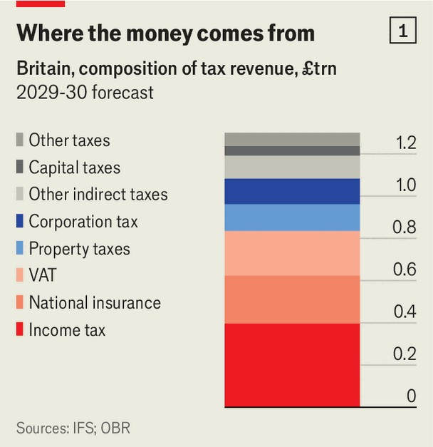
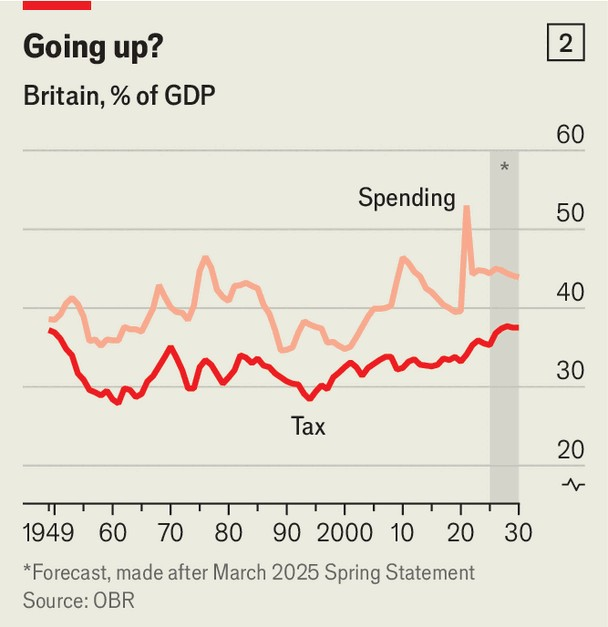
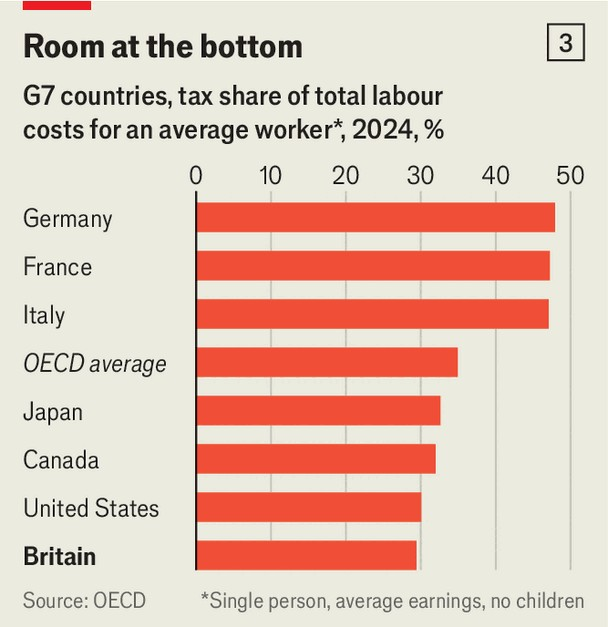

Britain | Time to come clean
Labour’s tax-and-spend policy has been dominated by wild gambling
In the budget on November 26th that must change
November 13th 2025

Sir Keir Starmer campaigned in 2024 like a man applying to run a regional bank branch. He pitched himself as dutiful and tight with money. Much as a banker might have to reject unprofitable loan applications, Sir Keir promised not to “shy away from making unpopular decisions”. Yet when it comes to fiscal policy, the prime minister has not acted like that stolid branch manager. He is instead more akin to an increasingly desperate gambler, putting more on red as losses pile up. His first bet was that he could afford to pledge in Labour’s manifesto not to raise corporation tax or taxes on “working people”. This was always going to be tricky—these taxes comprise 74% of the total tax take (see chart 1). Sir

Keir in effect broke this promise in October when he increased employers’ national insurance, a payroll tax, indirectly hurting wages. His second gamble concerned the government’s fiscal rule that tax revenues must match day-to-day spending in 2029-30. At the last budget he left a buffer of just £9.9bn ($13.0bn, or 0.3% of GDP) for meeting that rule. The buffer has since vanished and turned into a hefty funding shortfall.

The budget on November 26th will be the day of reckoning when Sir Keir must settle his losing bets. The government needs to find £29bn in tax rises or spending cuts simply to restore its previous headroom, according to Capital Economics, a consultancy. How Sir Keir approaches this task will define his premiership. He could do the bare minimum to plug the hole, through a smattering of economically damaging increases to smaller taxes. Or he could live up to his promise to make unpopular decisions, even if this means raising taxes on people in work.

His chancellor, Rachel Reeves, hinted in a cryptic speech on November 4th that the government favours the tougher route, warning that “we will all have to contribute”. But she offered no specifics. Most of the deterioration stems from the Office for Budget Responsibility, the fiscal watchdog, cutting its forecasts for productivity growth, a judgment on Britain’s limp performance since the financial crisis. Ms Reeves points to Conservative

choices—above all austerity and Brexit—as the culprits. But as Helen Miller, the director of the Institute for Fiscal Studies, a think-tank, puts it, “Everyone knew going into the election that the forecasts were optimistic. The chancellor bears responsibility for sufficiently insuring against that risk.”

The government should not have rolled the dice by leaving so little margin for error. The buffer set aside in 2024 was less than half the average between 2010 and 2022. As it became clearer that this was inadequate, speculation mounted about possible tax rises, from higher capital-gains tax to pension raids. This stoked uncertainty and dented business confidence. Expanding headroom at this budget—doubling it or more—would reassure businesses and could, alongside falling interest rates, get businesses investing again.

To double the headroom, the government could need to find savings of £40bn or more in 2029-30. There is a case that these should mostly come from spending cuts, not tax rises. Government spending rose from 40% of GDP before the covid-19 pandemic to 45% in 2025-26. Meanwhile tax rose from 33% to 37% of GDP, the highest level since the 1940s (see chart 2). Making tough decisions on spending would help shore up Labour’s fiscal credibility.

Yet Sir Keir has few politically viable options for cutting spending in the short run. Departmental budgets have been set until 2028-29; prising them open would be messy. Ministers will be wary of fresh welfare cuts after retreating on disability-benefit reforms in the summer. For now the heavy lifting will fall on tax rises.

Those are hardly popular either. But though the tax burden is already high by Britain’s historical standards (and much higher than in America), it is lower than in many other European countries. Britain’s tax take pales in comparison with France’s (45.3% of GDP in 2024) and remains comfortably below the EU average (40.4% that year). Labour’s problem is its manifesto straitjacket, which explicitly ruled out increasing Britain’s top three revenue- raisers: income tax, national insurance and value-added tax (VAT). The temptation will be to make the sums add up by tinkering with smaller taxes.

Yet that would be a particularly poor bet: oodles of risk for a paltry return. The politics can be brutal: last year’s axing of inheritance-tax relief for farms and family firms will raise a mere £500m a year, yet provoked months of rural fury. The economics can be no kinder. A hefty rise in capital-gains tax would prompt investors to sit tight rather than sell, gumming up the economy. So strong is this effect that, by the government’s own reckoning, a ten-point rise in the higher rate would actually lose the Treasury £3.6bn in its third year.

Despite these difficulties, Ms Reeves has indicated that the wealthy must play their part. There are some sensible options that use smaller taxes to achieve this. The chancellor could increase property taxes for the most expensive homes (raising £4bn a year) or end the unjustifiable exemption from capital-gains tax for dead people’s estates (another £2bn). But there is no plausible route to the sums required through tinkering and soaking the rich alone—at least not without inflicting real economic harm.

The most reliable way to raise serious revenue is to increase taxes on income or consumption. Lifting VAT would have an inflationary impact. But there is room to raise income tax.

Even with Britain’s high overall tax take, most people’s labour income is taxed lightly by international standards. This is clear from the “labour tax wedge”, defined as the share of total labour costs paid in tax. Britain’s wedge in 2024 for a single average earner without children was 29.4%, the lowest in the G7 group of rich countries (see chart 3). The wedge rose to 31.4% in 2025 because of the employers’ national-insurance rise, but it remains well below the G7 average. Comparatively low taxes for middle earners have been sustained only because the top 10% now contribute about 59% of income tax, up from 50% a quarter-century ago.

Ms Reeves’s scene-setting speech has been widely seen as an attempt to prepare voters for tax rises across the income spectrum. A first step is likely to be freezing until 2030 the thresholds at which different personal-tax rates kick in, a stealth measure expected to raise £7bn in 2029-30. Ministers could also target groups whose earnings are particularly undertaxed. For example, pensioners pay no national insurance, while the self-employed enjoy lower rates. The Resolution Foundation, another think-tank, has suggested lifting income-tax rates and simultaneously reducing national-insurance rates as a way to raise more revenue from these groups, while sparing most “working people”.

If Labour pursues this idea, it should make it the first step in a programme of principled tax reform. Britain’s taxes are riddled with perversities that stifle growth—none more than the bias encouraging self-employment even when a salaried job might be more productive. A budget that raises taxes without reform would be a poor gamble for Sir Keir, continuing Britain’s managed decline. A tax-reforming budget, in contrast, would be a better bet—one that might spur the growth he needs to win the next election.■

For more expert analysis of the biggest stories in Britain, sign up to Blighty, our weekly subscriber-only newsletter.

This article was downloaded by zlibrary from https://www.economist.com//britain/2025/11/13/labours-tax-and-spend-policy-has- been-dominated-by-wild-gambling