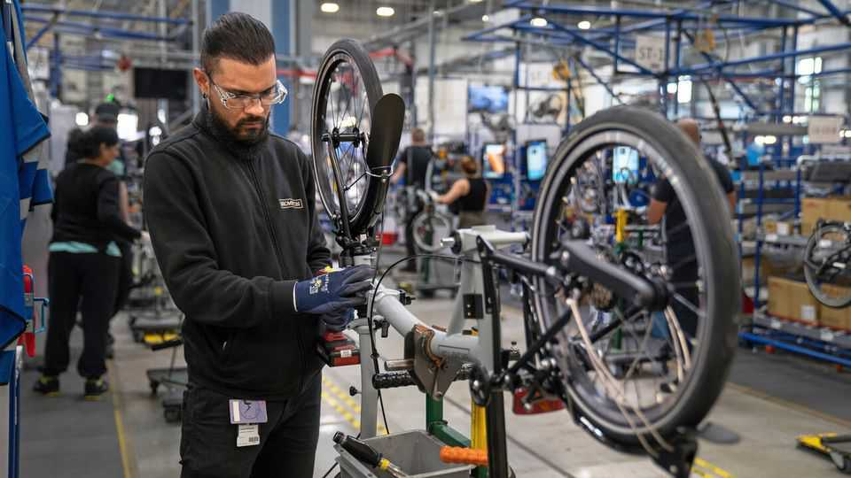
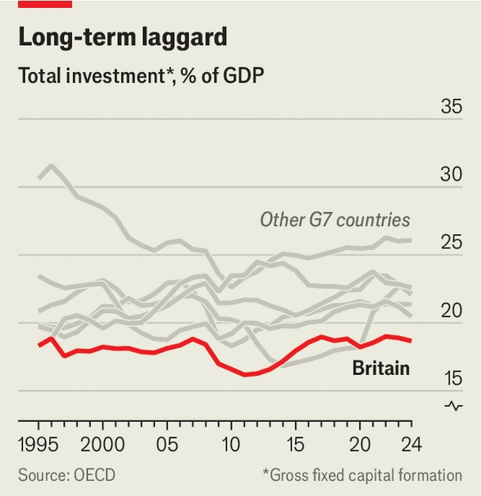

Britain | Confidence trick
British businesses say they are furious with the government
But they are behaving more bullishly than they sound
November 13th 2025

“The taxes she has put in place have destroyed business.” It is fair to say that Colin Sweeten, who runs a door-manufacturing business in north-eastern England, is not happy with the chancellor, Rachel Reeves. Above the screech of saws, Mr Sweeten says her last budget’s increase in employers’ national insurance, a payroll tax, has put up his costs. With “zero trust in Labour”, he is no more optimistic about the next budget on November 26th. Mr Sweeten is not alone. Anger at the government has seeped into measures of business confidence, many of which are negative. Yet such surveys don’t tell the full story about what is happening in the economy. As Rob Wood of Pantheon Macroeconomics, a consultancy, notes: “You can be annoyed

about tax hikes but that might not affect your business’s output.” In practice, firms are not in the free fall that some of the more breathless rhetoric suggests.

Even the confidence measures themselves tell different stories, depending on the exact question asked. Views on the wider economy are the most gloomy. When the Institute of Directors polled its members in October, only 7% said they were optimistic about the economy over the next year; 80% were pessimistic. But when asked about their own businesses, the same organisations were more upbeat: just a third were pessimistic, with roughly as many feeling hopeful.

The main source of discontent is labour costs. The national-insurance rise might have been manageable on its own, but the government has raised the minimum wage and expanded employment rights as well. For Mr Sweeten, this combination has had a “big impact” on his approach to hiring. He is particularly worried about employees getting day-one rights against unfair dismissal. As he puts it, an interview won’t tell you if somebody is going to turn up drunk in their second week.

There are other concerns. Simon Rowland, a construction lawyer in Newcastle, says the building industry has also been weighed down by cumbersome planning rules, surging materials costs and high energy bills. Nina Narramore, a cheese-shop owner from Norfolk, says her energy bills are “through the roof”. Both fret about the coming budget. Ms Narramore is worried that personal-tax rises will dampen her customers’ appetite for Christmas cheeses.

It is clear that British business is hardly enjoying a purple patch. But the absence of boom should not be mistaken for the presence of bust. Private- sector activity is, if anything, on the up. Take the S&P composite purchasing managers’ index, a survey that asks businesses whether they expect output to be higher, lower or the same in a year’s time. October’s index was 52.2, the sixth month in succession when the score has been over 50 (indicating expansion). This makes sense: while consumer demand remains weak, there are signs of improvement. Retail sales in September were at their highest level since 2022. Projected rate cuts over the coming year should stimulate consumption further.

Businesses are responding. Take hiring. At first glance, things look bad. The unemployment rate hit 5% in the three months to September, the highest since 2020. Job vacancies have fallen markedly over the past year. But there are signs of hope, with vacancies starting to stabilise in recent months. Market intelligence from the Bank of England suggests that many of the employment changes in response to the national-insurance and minimum- wage increases have already taken place. While the labour market remains weak, the seeds of recovery are emerging.

A similar story applies to business investment. Though it fell by 1.1% between the first and second quarter of 2025, it was still 3% higher than a year ago. Barclays, a bank, says that investment will increase more rapidly in 2026, aided by falling interest rates and an end to budget uncertainty.

The real problem with Britain’s private sector is not its short-term moodiness but its long-standing risk-aversion. Firms have underinvested for decades, a central reason why British investment has lagged behind its peers’ (see chart). This has in turn acted as a drag on productivity. If Ms Reeves truly wants to revive growth, she will need to tackle the barriers to private-sector investment, from poor public infrastructure to the sclerotic planning system. Until that happens, British businesses will never reach their potential. ■

For more expert analysis of the biggest stories in Britain, sign up to Blighty, our weekly subscriber-only newsletter.

This article was downloaded by zlibrary from https://www.economist.com//britain/2025/11/13/british-businesses-say-they-are- furious-with-the-government