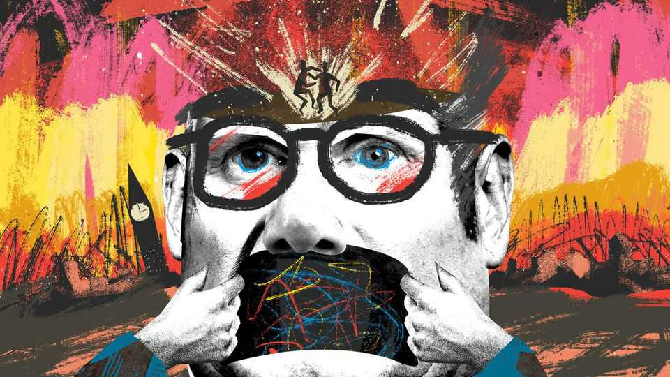

Britain | Bagehot
Sir Keir Starmer is a prisoner of the politics he pledged to end
When rigmarole becomes reality
November 13th 2025

Of all the distortions and deceits that Sir Keir Starmer deployed in order to reach Downing Street, one stands out. It was not the promise of free tuition fees offered to left-wing Labour members, ditched after the leadership contest was over. It was not the solemn pledge to forgo tax rises on income, vat or national insurance made at the last election, which will be smashed in the budget on November 26th. It was the promise of stability. Sir Keir pledged to “stop the chaos”. Britain, he argued, was a prisoner of Westminster rigmarole. After a decade of Conservative instability, featuring minority governments, a carousel of chancellors and Britain’s first six-week prime minister, a Labour

government would bring serenity, he pledged. “We’re all stuck in their psychodrama,” said Sir Keir. “All being dragged down to their level.”

In a way, Sir Keir was more right than he knew. On November 12th officials in Downing Street accused Wes Streeting, the health secretary, of planning to oust the prime minister. Mr Streeting labelled his accusers conspiracy theorists who were trying to “kneecap” him. In the space of 16 months Sir Keir’s government has managed to accumulate a stench of death that it took his Conservative predecessors a good decade to build up. Rigmarole is ascendant once more.

A man who set out to slay rigmarole has seen his government swallowed by it. It starts in the place Sir Keir still, for now, calls home. Briefings against Mr Streeting stemmed from people Sir Keir appointed. Downing Street has been in disarray since Sir Keir entered office, with a constant stream of sackings, surprisingly short tenures and ill-tempered briefings about senior advisers and, increasingly, cabinet ministers. It is a bad record for a prime minister who prided himself on being a bureaucrat. A nasty office is one thing in the private sector; it is quite another when it is supposed to be running a g7 country.

Relationships at the top of government are not just a matter for gossip. After all, Sir Keir is merely first among equals in cabinet and must rely on persuasion rather than power. The problem is that the other people at the coffin-shaped table see the prime minister as more of a lesser. Cabinet ministers regard him with increasingly ill-disguised contempt. Discipline is close to breaking down. During a reshuffle in September Ed Miliband, both the closest thing Sir Keir has to a friend at the top of politics and a potential replacement, was asked to move jobs. He refused. It is not just Mr Streeting in cabinet who thinks they could do a better job than Sir Keir. And they might be right.

Sir Keir’s cabinet colleagues are thinking about their options because Labour faces not just defeat but potential annihilation in 2029. It is usually wise to dismiss polls this far out from an election. Poor numbers can be put down to mid-term contempt, more than anything else. At the moment, the polls point to a once-in-a-century political revolution. It is as if a pilot

should ignore screaming sirens in his cockpit because the plane is not due to land for another five hours and it might be a false alarm anyway.

Still, to some, polls are nothing more than fluff; something for drama- addicts in Westminster to point at and shriek about. To others, they are what counts. Most backbench Labour mps fall into the latter camp. Backbenchers should not matter, especially when a government has a huge majority, like Sir Keir’s. Instead, they shape the workings of this government. Sir Keir has not had a functional majority since backbench MPs killed off a modest reduction in welfare spending this summer, in a catastrophic mangling of both policy and politics. What should be irrelevant rigmarole is political reality for this government.

The result? In the City, slack-jawed fund managers ask former Labour apparatchiks whether the government has the votes to pass the budget. Who can blame them? A government with a majority of 168 seats is supposed to pass its legislation with ease. The benefits farrago showed it cannot. If it is unable to do that, how can it push through a manifesto-busting budget this month? Since Labour MPs do not like cutting benefits, they will probably be happy to pass a budget with lots of tax rises. Yet while such doubts linger, it becomes an expensive question for a government to answer. Westminster drama costs the government real money.

Rigmarole becomes reality because there is little else happening. Sir Keir has no guiding project to talk about when being bullied about the ambitions of his health secretary. There is no grand plan for this government, which, given Downing Street started a civil war a fortnight before a budget, is incapable of thinking even weeks ahead, never mind years. The engine of government is sputtering. Yet a total overhaul of Downing Street and Whitehall in general is unthinkable when the top of government is a circus.

Perhaps a more skilled politician could fill the void where this government’s plan for office was supposed to be. Alas, Sir Keir has no personal charisma to charm his way through. Likewise, there is no reserve of loyalty for a prime minister who has neither friends nor followers in the party. Sir Keir’s only source of legitimacy was a historic victory, which looks as if it is turning out to be little more than a prelude to a historic defeat. All that

remains is silence, broken only by the discussion of when, not if, the prime minister goes. Rigmarole abhors a vacuum.

The best Labour can do is try to govern well. But a viperous Downing Street, a fed-up cabinet, feral and panicking mps, polls pointing to oblivion and doubts that the prime minister will be there in six months, never mind six years, make this impossible. Rigmarole rules in Westminster. Sir Keir is a prisoner of the politics he pledged to end. ■

Subscribers to The Economist can sign up to our Opinion newsletter, which brings together the best of our leaders, columns, guest essays and reader correspondence.

This article was downloaded by zlibrary from https://www.economist.com//britain/2025/11/12/sir-keir-starmer-is-a-prisoner-of- the-politics-he-pledged-to-end

International

China’s creepiest export surge Beijing insiders’ plan to play Donald Trump