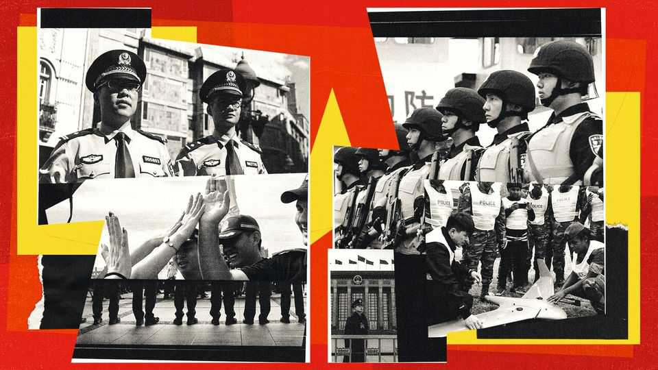
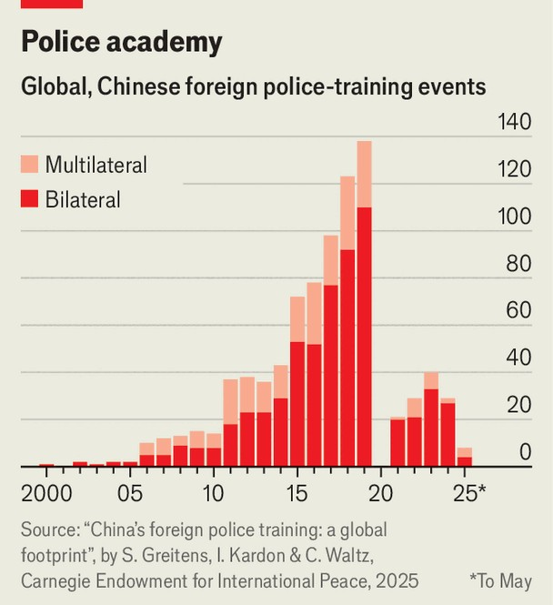
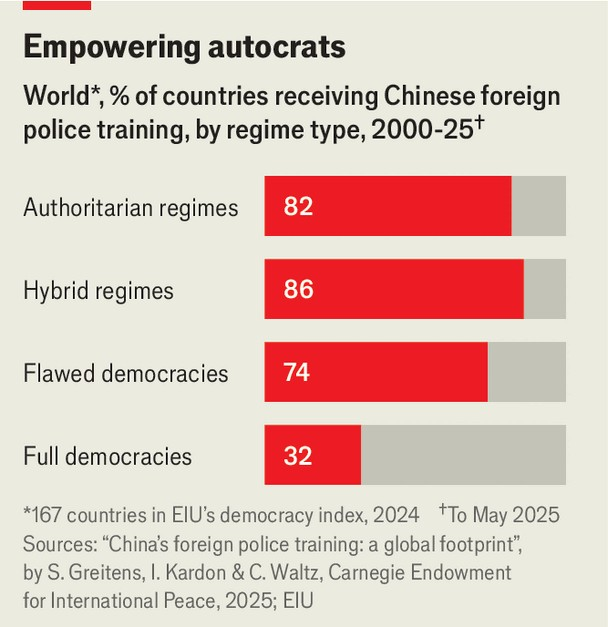
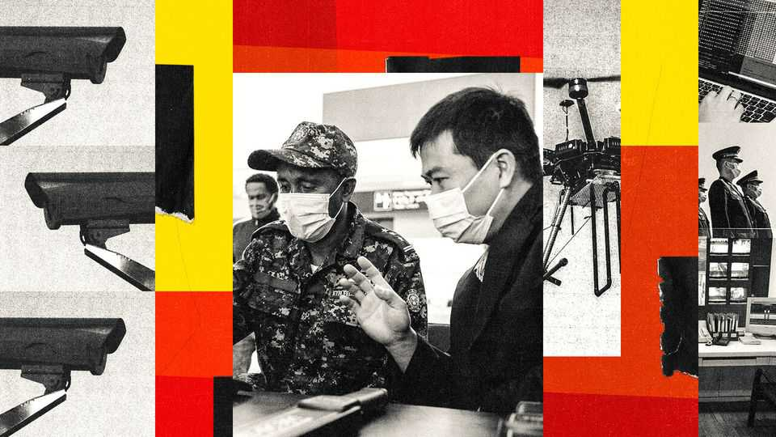

International | Order here please
China’s creepiest export surge
Countries are queuing to buy the tools and techniques of the CCP’s security state
November 13th 2025

“I MET THE most lovable people on the streets of Serbia: Chinese police officers,” gushes a Chinese tourist in an article released by one of his country’s police universities about joint patrols with Serbian police in Belgrade. “I felt so happy, safe and proud,” he says. The propagandist article perfectly matched China’s vision for global security: one in which it helps “maintain world peace and security” while upholding “non-interference in internal affairs” in contrast to Western ways of “unilateralism” and “bloc confrontation”. At least that is how China’s supreme leader, Xi Jinping, described the Global Security Initiative (GSI) when he launched it in 2022.

Since then China has rapidly expanded its security activity abroad by offering foreign governments police training and surveillance technology with a focus on internal stability. China is helping governments not only combat crime, but also control their citizens and stay in power—and that is proving stunningly popular.

The GSI, like Mr Xi’s three other global initiatives (on development, governance, and cultural diversity), is firstly an attempt to build new networks of international influence centred on China. To that end it has revamped a small regional policing forum into China’s biggest international security event: the Global Public Security Co-operation Forum. Delegates from more than 120 countries go to discuss security co-operation and admire China’s police technology, such as robotic dogs.

Last year the organisers launched the “Global Public Security Index”, which ranks countries by seemingly arbitrary scores on measures including gun crime, traffic deaths and terrorism. The top performer was China. America was pointedly below average. It was an exercise in “resetting standards around what security means and what it looks like”, as well as “the right example to follow”, says Sheena Greitens of the University of Texas.

China’s public-security influence is spreading in practical ways too. Surveillance-tech exports are soaring. Two Chinese firms, Hikvision and Dahua, are the world’s biggest surveillance-camera makers, with a combined market share of 40%. Huawei supplies its “Safe City” surveillance systems to more than 100 countries. A recent investigation by InterSecLab, a digital- forensics network, found that Geedge Networks, a private Chinese firm, had sold internet-control technology to the governments of Ethiopia, Kazakhstan, Myanmar and Pakistan, helping them censor and spy on their citizens.

China has also provided nearly 900 training sessions to the police and domestic-security forces of 138 countries since 2000, according to a new study by Ms Greitens, Isaac Kardon and Cameron Waltz at the Carnegie Endowment for International Peace, an American think-tank. The annual number of sessions grew nearly ten-fold in the first decade of Mr Xi’s rule, jumping from 14 in 2010 to 138 in 2019 (see chart). They dropped during the covid pandemic, however, and have not yet fully rebounded.

Most of the training programmes take place at police colleges within China, which usually host visiting groups of several dozen for a few weeks or months. They learn about China’s law-enforcement system, go on field trips to local public-security bureaus and take courses on specialised topics like border control or railway security. Often photos are taken of the head trainees receiving copies of Mr Xi’s book “The Governance of China”. Sometimes they do tai chi (a martial art) or calligraphy on the side. Chinese police also embed abroad with foreign police. This year a group of Chinese advisers went to the Solomon Islands to promote the “Fengqiao Model”, a Mao-era system whereby villagers would spy on one another.

The countries receiving the most police training from China are its neighbours, especially in Central and South-East Asia (see map). Some co- operation goes back decades because of concerns over border security.

Central Asia does more training on counter-terrorism, and South-East Asia works with China on combating scams and trafficking. African countries are also major participants, probably because of Chinese concerns over protecting its extensive Belt and Road investments on the continent.

More intriguing are the kinds of regimes China is working with. We cross- referenced the Carnegie Endowment’s data with a democracy index by the EIU, our sister company, and found that 82% of authoritarian regimes have received police training (see chart) from China. Nearly a third of full democracies have had Chinese police training, too, though the Carnegie researchers say this tends to be relatively superficial, like teaching European police officers Mandarin to help them liaise with their Chinese counterparts.

Most Chinese police training teaches generic skills, like combating cybercrime or counter-narcotics. This is not very different from the foreign- police training America does through its International Law Enforcement Academies in Botswana, El Salvador, Ghana, Hungary and Thailand. These have produced more than 70,000 graduates from 100 countries since 1995. The difference is that American assistance also aims to promote democracy, and cannot be given to human-rights abusers. (Though those laws have not always been enforced, and the democracy-promotion programmes have been defunded under the Trump administration.)

China, however, says its help has no strings attached. That has made it popular with authoritarian regimes, flawed democracies and hybrid regimes, which have weak political institutions and problematic elections. Three- quarters of flawed democracies and 86% of hybrid regimes have received police training from China.

That does not necessarily mean China is teaching them to become authoritarian, though there are some courses that directly address regime security, like VIP protection and riot control. Most students enrolled in these courses are police officers from authoritarian regimes like the Central African Republic, Myanmar, and Guinea. Although China claims its help is not conditional, in reality recipients are expected to support its territorial claims over Taiwan and other territories.

Does Chinese security engagement make governments behave in more authoritarian ways? It depends on their predispositions. A recent study by Erin Carter and Brett Carter at the University of Southern California finds that imports of Huawei technology increase digital repression in autocratic countries, but have no effect in democratic countries. China is “providing a public good and creating potential repressive capacity” at the same time, says Ms Greitens. Its police training and technology are filling genuine needs for many countries, and those with sufficient legal safeguards and strong civil societies can use them without veering into repression.

For governments leaning towards authoritarianism, though, China is an enabler—and an inspiration. Kazakhstan, for example, blanketed the streets of Almaty, its largest city, with thousands of Chinese-made cameras after civil unrest in 2022, says Dana Malikova, a Kazakh digital-rights expert. Its security agencies may be learning from Chinese systems across the border in Xinjiang, which use AI to identify and impose extra restrictions on potentially troublesome individuals, even if they have not committed any crimes. In June an anti-corruption activist named Sanzhar Bokayev was stopped at the Almaty airport after his face set off an alert in a police database of “wanted people”.

Chinese security support does not necessarily make countries more stable, either. Ethiopia has become more heavily monitored and repressive with the help of China, which has trained its security forces and whose firms have provided surveillance and internet-censorship systems. Yet it is teetering on the edge of chaos, with insurgencies raging in its two most populous regions, ethnic tensions boiling over and the threat of a new war with Eritrea. This is hardly the vision of peace and security that Mr Xi’s GSI describes.

The cleverest part of China’s security assistance is how it has managed to empower authoritarians without explicitly promoting authoritarianism. It presents itself simply as a provider of tools for client governments to use as they will. In Serbia, the collapse of a Chinese-built railway-station canopy that killed 16 people last November sparked mass protests that have shaken the country for nearly a year. Student protesters are furious with the EU for failing to support their cause. (“The EU doesn’t give a single fuck about the state of democracy in Serbia,” said one.) Yet 81% of Serbians view China favourably, even though it trains their police and provided the spy gear that activists believe is used to target protesters. In part that is because China does not claim to stand for any sort of political or value system in the way Western countries do and it has refrained from commenting on Serbia’s domestic unrest.

China’s values-free security diplomacy is hard to compete with. That is most visible in the Pacific Islands. Since accepting training from China, police forces in places like the Solomon Islands have shifted towards a culture of protecting the state rather than the people, says Mihai Sora of the Lowy Institute, an Australian think-tank. Australia can compete only by engaging in “gifting brinkmanship”, says Mr Sora: offering local police more equipment and assistance than China does, with fewer conditions. Recently the Solomon Islands government started talking about establishing its own armed forces—which “nobody thinks is a good idea” but Australia may support it doing so lest it ask China for help instead, says Mr Sora.

China offers savvy middling powers a chance to get both Chinese internal- security support and American defence assistance. That is what countries like Vietnam and the United Arab Emirates have been doing. The world could be moving into “uncharted territory” of having “two different types of security assistance that overlap but are led by different actors”, says Ms Greitens. It would be a more transactional and cynical world, in which states are stronger, but citizens are weaker. ■

This article was downloaded by zlibrary from [https://www.economist.com//international/2025/11/13/chinas-creepiest-export-surge](https://www.economist.com//international/2025/11/13/chinas-creepiest-export-surge)