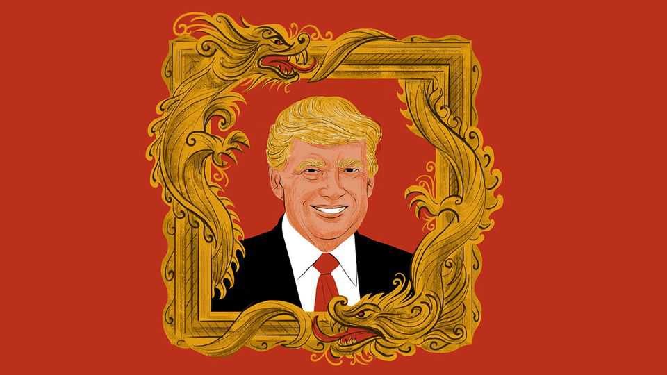

International | The Telegram
Beijing insiders’ plan to play Donald Trump
They see America’s president as a golden opportunity for China
November 13th 2025

XI JINPING, CHINA’S supreme leader, is not frightened of President Donald Trump. Increasingly, Chinese elites see Mr Trump as “very soft” on their country, say Beijing insiders. China was “a bit panicky” during Mr Trump’s first term, concedes an analyst in Beijing. The first Trump administration expanded a trade war into an ideological contest, with officials making stern critiques of China’s political and economic systems. China is not panicking any more, insists the analyst. When Trumpian bullying resumed this year, China’s leaders pushed back hard, refusing to buy American soyabeans and restricting exports of rare- earth minerals and permanent magnets that are vital to carmakers and other industries. Mr Trump “blinked first”, the analyst says.

At a meeting with Mr Xi in South Korea on October 30th Mr Trump offered concessions, including a one-year pause of a rule extending American export controls to the subsidiaries of blacklisted Chinese companies. China agreed to buy soyabeans and made vaguer promises to block smuggled shipments of chemicals used to make fentanyl, and to facilitate exports of rare earths.

Pundits in Beijing claim other wins. Since returning to power ten months ago, Mr Trump has shown no ideological ill-will towards the Communist Party, even when imposing dizzying tariffs on China. In the telling of Chinese scholars, Mr Trump treats China as an “indispensable” nation. He urges China to buy American goods and has welcomed its companies to invest in America. As an added bonus, in his second term Mr Trump has so tightened his grip over the federal government and the Republican Party that conservatives dare not challenge him for engaging with China.

The hitch is that Chinese leaders do not trust Mr Trump. A control-obsessed bunch, they disagree about how to deal with a man who revels in unpredictability. Over a week of conversations in Beijing with officials, government advisers, academics and entrepreneurs, a consensus emerges that Mr Trump represents a historic opportunity for China. He is described as a president unconstrained by liberal principles, who weakens America’s standing with his capricious treatment of allies and adversaries alike. How China should take advantage of him is a more divisive question.

Mr Trump is deemed too unreliable to pull off a big, beautiful deal that would resolve America’s and China’s most pressing disputes. What is more, hardliners in America and China might obstruct the compromises needed to pull off a grand bargain, analysts add. With trust at a low ebb, there are predictions of further decoupling between the two countries in such realms as technology and finance. True, in Beijing it is admitted that many Chinese AI companies long to buy high-performance American semiconductors. It is noted that Mr Trump has talked of selling advanced chips to China, though perhaps not those at the cutting edge. Still, American and Chinese security concerns make America’s market uniquely daunting to high-tech Chinese exporters. Geopolitical risk, too, is cited as the reason why China holds fewer US Treasury bonds than before, and wants its currency, the yuan, to be used more often in its international trade.

Insiders suggest that the two countries will focus on “piecemeal” agreements during the year-long truce agreed on in South Korea. Alongside such workaday sectoral deals, though, some in Beijing wonder whether Mr Trump might agree to more ambitious forms of co-operation.

Some experts argue that China could advance long-held goals by appealing to Mr Trump’s pride at being a peacemaker. Mr Xi began last month’s meeting with Mr Trump by congratulating him on his Middle East peace accord, they note. Maybe, at a future summit, Mr Trump could be persuaded to publicly oppose Taiwanese independence and urge the democratically ruled island to hold “peace talks” with China. Even if Mr Trump’s call were later disowned by other American politicians, from China’s point of view it would set a useful precedent for an American president to have made it. To soothe North Korean (and Chinese) anxieties, Mr Trump might be prevailed upon to reduce American military exercises with South Korea. Perhaps an equilibrium could be reached in the South China Sea, balancing China’s territorial claims with America’s insistence on the freedom of navigation in international waters. Some scholars suggest that China stands ready to help with peace talks between Russia and Ukraine, as long as Mr Trump does not ask Mr Xi to put public pressure on Russia.

A professor recalls the moment, about a decade ago, when China offered President Barack Obama a “new type of great-power relations”. That model was calculated to appeal to Mr Obama’s belief that America and China, as the two largest economies, have special responsibilities to lead multilateral efforts on climate change and other global challenges. Mr Obama declined, in part because the offer was conditional on respecting China’s “core interests”: code for Chinese claims on Taiwan and other territories. And also because America’s allies disliked talk of two superpowers deciding how to run the world. Now, the professor asks, might America accept a model updated for the Trump era? Instead of warm words about multilateralism, China could play up Mr Trump’s and Mr Xi’s shared bond as nationalist leaders and men of destiny, bent on restoring their countries to greatness.

Mr Trump does seem ready to treat Mr Xi as a peer. After their encounter in South Korea, Mr Trump bragged on social media about a “G2 meeting” that would lead to “everlasting peace and success”. China has learned how to intimidate America’s president: hence the current, uneasy truce in their trade

war. Wooing Mr Trump is a trickier task. China hawks in Washington have much to fear, should Mr Xi succeed. ■

Subscribers to The Economist can sign up to our Opinion newsletter, which brings together the best of our leaders, columns, guest essays and reader correspondence.

This article was downloaded by zlibrary from https://www.economist.com//international/2025/11/11/beijing-insiders-plan-to-play- donald-trump

Business

The seven deadly sins of corporate exuberance How HR took over the world TSMC’s cautious expansion is frustrating the AI industry Libellous chatbots could be AI’s next big legal headache The 10-4 rule for interacting with customers The costs of dating your boss Elon Musk’s $1trn pay deal highlights companies’ superstar dilemma