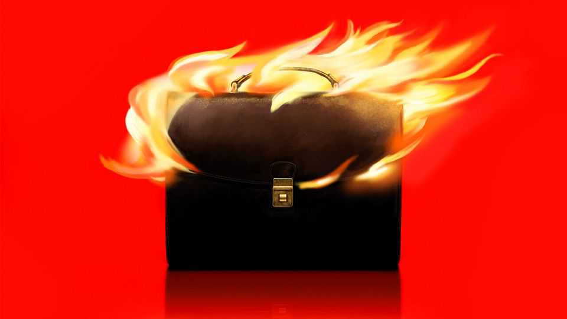
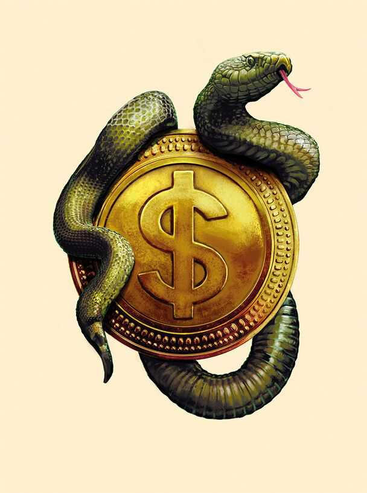

Business | Before the fall
The seven deadly sins of corporate exuberance
A frenzy of financial innovation has ensnared America Inc. What could go wrong?
November 13th 2025

Just as great cities reflect the genius of their architects, great financial manias reflect the folly of their besuited draughtsmen. New ways of raising and spending capital beguile ambitious bosses and propel markets. This time is no different. Silicon Valley, Wall Street and Washington are conspiring in one of American capitalism’s great money-making eras. The value of America’s listed companies relative to the size of the economy is the highest it has ever been. Wrapped up in the madness, America’s chief executives are embracing seven risky financial strategies. These reflect the obsessions of the moment, from artificial intelligence and cryptocurrencies to private capital and

performative patriotism. Some have echoes in past booms, while others are entirely novel. All involve jaw-dropping feats of paper engineering—and offer clues as to the nature of the coming crash.

President Donald Trump has eagerly promoted the cryptocurrency industry during his second term. Corporate America has followed. Never has something treated so dismissively in boardrooms been subsequently embraced so enthusiastically. America’s biggest banks and retailers say they are now considering creating their own so-called stablecoins pegged to the dollar. Some companies have even transformed their treasury departments from clearing houses for receipts into hubs of speculation. The most notable is Strategy (MicroStrategy, until recently), the leader of the “crypto treasury” movement. Once a dotcom darling, it now exists solely to buy bitcoin. The company owns nearly $70bn of the stuff, paid for by aggressively issuing debt and equity. The business is valuable because investors struggle to get leveraged exposure to bitcoin, say its cheerleaders. Yet more than 100 companies are doing something similar.

Such schemes are partly designed to appeal to America’s indefatigable retail investors. Their main impulse is to buy the dip. But some of them will buy anything. Meme stocks are back, and bosses are playing to the gallery. Elon Musk has a fanatical crowd of retail investors to thank for his $1trn pay deal at Tesla. Palantir’s frothy valuation is a product of the herd instincts of amateur traders. Tapping into this meme-inflected world is also possible for smaller firms like American Eagle. The clothing brand’s stock is up by more than 70% since putting Sydney Sweeney, a blue-eyed, blonde-haired actress, in an advertisement. Companies can also harness the retail crowd to go public quickly, and with little scrutiny, by merging with a special-purpose acquisition company (SPAC). After a pandemic-era boom, these shell entities, favoured by retail investors, are again flooding the market. More than 150 are expected to go public this year.

When markets soar, so does their tolerance for corporate complexity. Silicon Valley is testing the limits, with the AI ecosystem now characterised by circular spending and webs of cross-holdings. Consider Nvidia, the leading supplier of AI chips. It owns stakes in CoreWeave, which buys its chips to rent out to others, and is investing in xAI, which buys Nvidia’s chips to run its models. It will also put up to $100bn into OpenAI, giving the maker of

ChatGPT more cash to buy Nvidia’s chips. For its part, OpenAI—which is also part-owned by Microsoft, its biggest supplier of computing power—has a stake in CoreWeave and could soon own 10% of Advanced Micro Devices, Nvidia’s main competitor.

Enthusiasts say all this is little different from the “vendor financing” arrangements common in other industries. Cynics see parallels to the “round-tripping” practices of energy traders and internet firms in the late 1990s. In such deals—known as “Lazy Susans”—often no goods or services were actually exchanged, though both parties recorded revenue to hit earnings targets. Which label sticks to the AI deals will depend on whether companies follow through with their investment promises.

Every boom is defined by its mega-mergers, from the buy-out of RJR Nabisco, a consumer-products conglomerate, in 1989 to the merger of AOL and Time Warner in 2001. This year cheap credit and regulatory easing have revived the takeover business—no matter the value destroyed during previous waves. Since the summer American bosses have inked the largest ever railway merger, data-centre acquisition and leveraged buy-out. This month Kimberly-Clark, the purveyor of Huggies, agreed to pay nearly $50bn for Kenvue, the maker of Tylenol, in the biggest consumer-products takeover in a decade.

To finance its splurge on data centres and takeovers, America Inc is feasting on debt. Meta, a Silicon Valley giant, recently sold $30bn of bonds to pay for its data-centre investments, the biggest such deal of the year. To power the endless rows of servers AI models require, electricity providers are also borrowing heavily.

In the process, companies have been experimenting with more novel forms of debt. Private credit, provided by an investment company rather than a bank, has surged in popularity. Sometimes private loans look similar to those made by traditional lenders. But often they are more creative. One innovation pioneered by Apollo, a private-markets colossus, involves making a loan considered by rating agencies to be an “equity” investment for the recipient (leaving its credit-rating intact) while furnishing the lender’s balance-sheet with investment-grade debt.

As borrowing increases, it will be further obfuscated. As well as its bond offering, another $27bn of largely debt-funded investment tied to Meta’s new data centre in Louisiana will sit off its balance-sheet. xAI is planning something similar.

If the mania has an anthem, it is “Born in the USA”. American companies are showcasing their patriotism with splashy but vague investment pledges. JPMorgan Chase has said it will bankroll companies involved in “security and resiliency” to the tune of $1.5trn. Some bosses have gone further and shacked up with Uncle Sam. America’s government now possesses: a “golden share” in US Steel, a faded industrial icon; 10% of Intel, a struggling chipmaker; and minority investments in three mining companies. It could soon own a large stake in Westinghouse, a maker of nuclear reactors. Bankers say that American companies with even tangential connections to national “resilience” are eager to make deals with the White House. OpenAI’s finance chief recently suggested that the government provide a “backstop” for her industry’s data-centre borrowing binge, before walking back the comment.

A final sin could soon rear its ugly head. Every hot market in the past has concealed fraud. Like with the accounting scandals at WorldCom or Enron, it is unlikely to be unearthed until a correction begins. But the conditions for wrongdoing are ripe. Accounting practices for AI, crypto and private credit are all sufficiently flexible and opaque. And guardrails are wobbling. Activist investors don’t hold the sway they once did in public markets. Immigration enforcement is a bigger priority for the White House than white-collar crime.

For now, Wall Street expects the good times to continue. Credit spreads remain tight. Equity-market volatility is low. Retail investors show no signs of flagging. Last week Robinhood, an online broker, said that its clients’ borrowing had risen by 153% this year. The makings of a bubble often become clear well before it pops. Alan Greenspan warned of “irrational exuberance” in 1996, some four years before the next crash came.

Yet in some corners the mood is beginning to sour. Take crypto. Earlier this year Strategy traded at more than double the value of its bitcoin holdings. As the price of bitcoin has fallen, the company’s shares have fallen even further.

Its premium has eroded to around 20%. If it is unable to sell more shares, it may need to liquidate its bitcoin holdings to pay steep interest costs. As a large owner, and ever larger champion, of bitcoin, it risks ending up in a downward spiral.

Worries about credit markets have grown, too. First Brands, a provincial manufacturer of spark plugs, borrowed more than $10bn before collapsing into bankruptcy. Its lenders now accuse it of fraud. Jamie Dimon, the boss of JPMorgan Chase, warned that more “cockroaches” would emerge. Since then a few have scuttled out from under lenders’ loan books. Some business- development companies, a type of private-credit fund, are trading well below the value of their assets. Shares in Blue Owl, a private-credit firm, have fallen by more than 40% from their peak at the start of the year. Markets and regulators have turned on Egan-Jones, one of private credit’s favourite rating agencies. The industry’s use of life-insurance policies to fund investments is also being scrutinised.

Then there is the question of whether Silicon Valley’s colossal spending on AI will pay off before investors lose patience. If it does not, the punishment may be harshest for companies that have succumbed to the seven sins. The consequences, though, would ripple far beyond them. Losses for investors would spill over into consumer spending. Credit markets—and possibly the

government—would also bear losses. Parts of the financial system that have hitherto been untested would come under strain. Engineers would be put out of work. But the financial engineers would be to blame. ■

To stay on top of the biggest stories in business and technology, sign up to the Bottom Line, our weekly subscriber-only newsletter.

This article was downloaded by zlibrary from https://www.economist.com//business/2025/11/12/the-seven-deadly-sins-of-corporate- exuberance