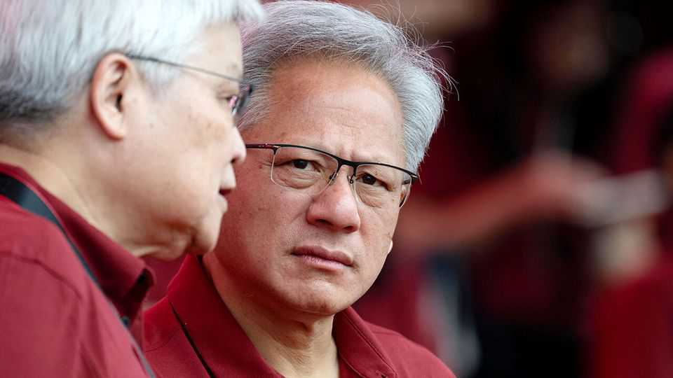
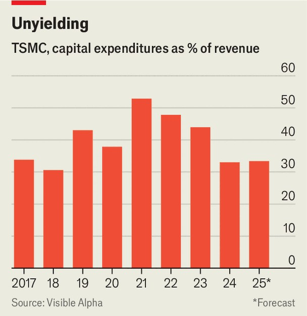

Business | Semi-slow
TSMC’s cautious expansion is frustrating the AI industry
The Taiwanese chipmaking giant has been burned by previous investment booms
November 13th 2025

The craze for artificial intelligence has brought seemingly limitless demand for the chips that power it. Last month Jensen Huang, the boss of Nvidia, said that his company, the leading designer of AI chips, had $500bn-worth of orders to deliver this year and next. OpenAI, one of its customers, has also struck supply deals for the next few years with Advanced Micro Devices, for six gigawatts’ worth of AI chips (around 3m-6m), and Broadcom, for another ten gigawatts. The frenzy for AI silicon has led to growing concerns over supply constraints. Nearly all high-end AI chips are made by one company: TSMC,

a Taiwanese chip manufacturer. Mr Huang recently visited Taiwan to urge the company to double its production of Nvidia’s chips. Elon Musk has mused that Tesla, the electric-car maker he runs, may need to build its own “gigantic chip fab” (as semiconductor factories are known) to supply its AI and robotics efforts. Sam Altman, OpenAI’s boss, has called on TSMC to “just build more capacity”.

TSMC is obliging, but far less quickly than its customers would like. It will spend around $41bn on capital expenditures this year, of which more than two-thirds is allocated to the types of cutting-edge chips the AI industry requires. That is up from $30bn last year. Analysts expect the figure to reach $52bn by 2027. As a share of revenue, however, TSMC’s capital expenditures have fallen, and are expected to continue doing so over the coming years, even as its customers grow noisier in their complaints (see chart). In time, TSMC’s cautious approach, shaped by the semiconductor industry’s history of booms and busts, could undermine the AI industry’s bullish projections.

Designers of AI chips have little choice but to rely on TSMC. Intel, once at the forefront of chipmaking, has struggled to catch up in the production of cutting-edge chips. Samsung, the only other viable alternative, is facing difficulties of its own. In July Tesla signed a deal worth $16.5bn with the

South Korean electronics giant to begin producing AI chips in Texas from next year, but the project is said to have fallen behind schedule.

Taiwan’s chipmaking champion thus finds itself swamped with orders. Signs of strain are already visible. Last month C.C. Wei, its chief executive, said capacity for AI-related products “is very tight” and that the company is working “very hard” to close the gap. Meanwhile, demand keeps growing. Jefferies, an investment bank, expects Nvidia to ship 6.3m AI chips next year, a 23% increase on this year. Broadcom, which designs chips for cloud- computing giants including Google and Meta, is forecast to need 5.4m, a 29% rise. JPMorgan Chase, another bank, reckons that TSMC’s two most advanced chip types will run at full capacity for years.

Expanding supply, however, is costly and slow. A top-tier fab costs around $20bn and takes three to four years to complete. Building in America raises the price tag. TSMC has pledged to construct six new cutting-edge fabs in the country, together costing around $165bn. America’s dysfunctional construction industry, however, means these fabs are significantly more expensive to build than equivalent ones in Taiwan, and progress is slower, too.

Adding capacity also poses risks for TSMC, which helps explain its caution. The chip industry has long been characterised by bruising cycles of tight supply followed by overcapacity. Manufacturers often expand aggressively during booms, only to be saddled with idle capacity when demand later cools. Daniel Wu of Bristlemoon Capital, a hedge fund, notes that TSMC ramped up investment during the pandemic to ease shortages of less advanced chips. Now its capacity to produce them is underused. The company will be wary of making the same mistake again. It may also fear that the market for AI chips could swing into oversupply if Intel and Samsung were at last to resolve their production problems.

Chip designers calling for more capacity do not have to spend anything until TSMC builds it. But Mr Wu says that if TSMC commits, say, $80bn-100bn over two years only for the AI boom to deflate, it would be left with underused factories for years. Its caution may frustrate its customers. But they should not count on TSMC changing its tune. ■

To stay on top of the biggest stories in business and technology, sign up to the Bottom Line, our weekly subscriber-only newsletter.

This article was downloaded by zlibrary from https://www.economist.com//business/2025/11/13/tsmcs-cautious-expansion-is- frustrating-the-ai-industry