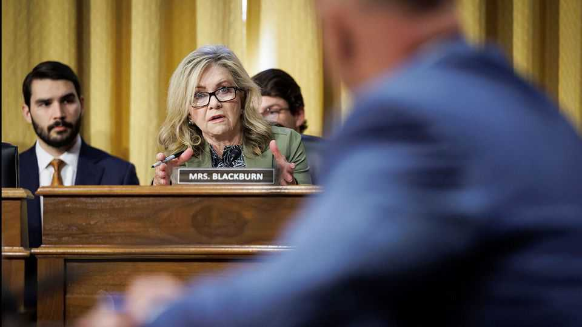

Business | Virtual malice
Libellous chatbots could be AI’s next big legal headache
Companies from Google and Meta to OpenAI are getting sued for defamation
November 13th 2025

For all the advances in artificial intelligence over the past few years, even the cleverest chatbots still spout nonsense from time to time. In most cases this is but a mild irritation. Sometimes, however, it can get their makers into trouble. When recently asked if Marsha Blackburn, a Republican senator, had been accused of rape, Gemma, an AI developed by Google, replied that in 1987 a state trooper had said she “pressured him to obtain prescription drugs for her and that the relationship involved non-consensual acts”. Ms Blackburn had never faced such an allegation.

The senator was understandably displeased with the AI, and late last month sent Google a letter arguing that the tech giant should “shut it down until you can control it”. Google quickly removed Gemma from its line-up, and said that the AI had been intended for use only by developers and researchers.

Ms Blackburn is one of several high-profile people to have recently complained of being defamed by a chatbot. In August Meta, another tech giant, settled a lawsuit brought by Robby Starbuck, a right-wing activist, after one of its bots falsely said that he took part in the attack on the Capitol on January 6th 2021.

Such lawsuits could become a big headache for AI companies, which are already caught in legal tussles over copyright and other complaints. Even a small number of cases could be extremely costly. In 2022 an American court ordered Alex Jones, a right-wing conspiracy theorist, to pay $1.4bn in damages for claiming that a 2012 school shooting was a hoax. The question of whether AI companies can be held liable for what their bots say is almost certain to end up before the Supreme Court, argues Peter Henderson, a professor at Princeton University. Until the law is clarified, they will be keeping their defamation lawyers on speed dial.

AI companies are at pains to emphasise the care they take to prevent their models from making things up. Yet some errors, including those in which an AI conflates information about people with similar names, are tricky to prevent. That is why model-makers’ terms of use warn that their chatbots can provide inaccurate information. A defamation lawsuit in America brought by a radio host against OpenAI, the maker of ChatGPT, was dismissed by a court in Georgia after the judge concluded that the company’s “extensive warnings” about possible errors meant that it could not be found liable.

Other courts, though, may be unconvinced by that argument. AI firms may hope instead for protection from one of Silicon Valley’s greatest strokes of legal fortune. Since the 1990s, American judges have interpreted a provision known as Section 230, which states that internet firms are not the publishers of material on their sites, to mean they are not liable for it, sparing them from defamation cases.

Unlike Facebook and other internet forums, however, chatbots generate fresh material. Justice Neil Gorsuch, one of the judges on the Supreme Court, said during a 2023 case against Google that he did not think Section 230 applied to AI-generated material (though in the same case another justice admitted that the court’s members “are not, like, the nine greatest experts on the internet”).

If Section 230 does not help them, model-makers might argue that chatbots, like companies, have a right to free speech in America. If they succeed, they will benefit from decades of court rulings that have made the country one of the hardest places in the world to win libel lawsuits. Yet even then, model- makers would still have to worry about jurisdictions such as Britain, where courts place the burden of proof on publishers accused of libel. With chatbot use only growing, the lawyers may soon be rubbing their hands. ■

To stay on top of the biggest stories in business and technology, sign up to the Bottom Line, our weekly subscriber-only newsletter.

This article was downloaded by zlibrary from https://www.economist.com//business/2025/11/13/libellous-chatbots-could-be-ais- next-big-legal-headache