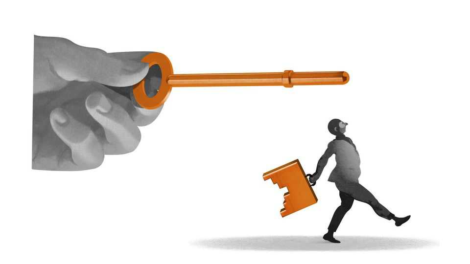

Business | Schumpeter
Elon Musk’s $1trn pay deal highlights companies’ superstar dilemma
Can firms hedge against losing key talent?
November 13th 2025

EVERY EMPLOYER knows that, in the knowledge economy, a superstar employee is worth every penny. When that employer is Tesla and the employee is Elon Musk, he is worth up to 100trn pennies. On November 6th the electric-car maker said that more than 75% of its shareholders had backed its chief executive’s new compensation package, which would grant him up to $1trn-worth of Tesla shares over ten years. To pocket it all, the star chief executive must do a reliably stellar job, including lifting Tesla’s market capitalisation to $8.5trn, from $1.4trn today. Ahead of the shareholder vote Mr Musk threatened that if he did not get his inducement, he simply might not bother.

The astronomical pay deal shows the light years to which firms will go in order to retain talent. It also highlights the potentially cataclysmic risk, as businesses see it, of talent loss. In its annual reports Tesla states explicitly that it is “highly dependent on the services of Elon Musk, Technoking of Tesla and our Chief Executive Officer”. The latest one mentions him by name 25 times (not counting signatures and the like). Meta’s warns that if Mark Zuckerberg, the social-media empire’s boss, were out of action, “there could be a material adverse impact on our operations” (and has for the past two years listed his potentially incapacitating pursuits: “combat sports, extreme sports and recreational aviation”).

Such fears are not confined to big tech. Ralph Lauren, a purveyor of preppy clothes, makes the same point as Meta about its eponymous founder. Berkshire Hathaway’s own Meta-esque admission about Warren Buffett invites questions about the investment firm’s future now that its 95-year-old leader is, in his words, “going quiet” ahead of his imminent retirement.

These concerns also increasingly extend beyond the corner office. Across knowledge-intensive industries, many companies depend on an ever- shrinking set of hypertalented individuals for an ever-greater share of their profits. Alphabet, Amazon, Oracle and Palantir, as well as Meta, all list key “engineering” or “technical” personnel as material to their continued success. This concentration of moneymaking power is a blessing for businesses when those individuals stick around. In their sudden absence it becomes a curse.

The cost of losing critical workers can be immense. A study from 2020 by Morten Bennedsen, Francisco Pérez-González and Daniel Wolfenzon, a trio of business-school professors, looked at companies whose chief executives suddenly wound up in hospital. They found that those firms’ profitability and investments suffered significantly, especially if the boss was younger and the company belonged to a human-capital-intensive industry. When Bill “Bond King” Gross was poached from PIMCO in September 2014, the share price of Allianz, the asset manager’s parent company, immediately slumped by 6%. The following month PIMCO’s funds saw net outflows of $48bn.

The unexpected departure of an organisation’s superstars can also negatively affect those who remain. In 2010 Pierre Azoulay and Jialan Wang, then of

the MIT Sloan School of Management, and Joshua Graff Zivin of the University of California, San Diego, estimated that the premature death of a superstar researcher caused their collaborators to publish between 5% and 8% fewer high-impact papers over the long term. In a research-dependent business like biotechnology or artificial intelligence, this difference could be measured in billions of dollars.

If the superstars defect rather than die, a decline in their former colleagues’ productivity may be compounded by the competitive threat they now pose from the outside. Just ask OpenAI. The maker of ChatGPT is fending off rival AI labs launched by several of its co-founders (including Mr Musk’s xAI and Ilya Sutskever’s Safe Superintelligence) and senior engineers (Anthropic and Thinking Machines). On November 11th the Financial Times reported that Yann LeCun, Meta’s top AI boffin, was planning to strike out on his own.

Superstars often do not jump ship alone. Sometimes one exit can provoke an exodus unwittingly. In 2008 two elite American law firms, Heller Ehrman and Thelen, each collapsed within a month as a result of self-perpetuating partner flight.

Occasionally, the collective defection can be premeditated rather than coincidental. When Mustafa Suleyman, Alexandr Wang and Varun Mohan left the firms they co-founded and ran (Inflection AI, Scale AI and Windsurf), they took entire engineering teams with them. They now toil for Microsoft, Meta and Google, respectively. (Mr Suleyman also moonlights as a director of The Economist’s parent company.) Shorn of their key personnel, the rump startups rely on a corporate dowry in the form of licensing deals with the talent-grabbing tech giants. That limits their prospects—and the upside for their early venture-capital backers.

There is not much companies or investors can do to hedge against the loss of superstars. Firms regularly take out key-person insurance against the hospitalisation or death of critical staff. Life policies typically pay out up to ten times the employee’s gross salary or up to five times the net profit attributable to them. Buying cover against Mr Musk getting run over by a robotaxi would, in other words, have been eye-wateringly expensive before. His new pay deal makes him uninsurable.

And no cover exists for people quitting. What is more, a number of jurisdictions, including AI’s heartland of California, bar non-compete agreements that limit employees’ ability to move between jobs. Britain wants to cap them at three months. Businesses’ only resort is to bid up salaries. Obscene as Mr Musk’s 13-figure package looks today, tomorrow it may be table stakes. ■

Subscribers to The Economist can sign up to our Opinion newsletter, which brings together the best of our leaders, columns, guest essays and reader correspondence.

This article was downloaded by zlibrary from https://www.economist.com//business/2025/11/13/elon-musks-1trn-pay-deal-highlights- companies-superstar-dilemma

Finance & economics

Recessions have become ultra-rare. That is storing up trouble Old folk are seized by stockmarket mania The problem with America’s shutdown economy How AI is breaking cover letters In defence of personal finance Tree murders and the economics of crime