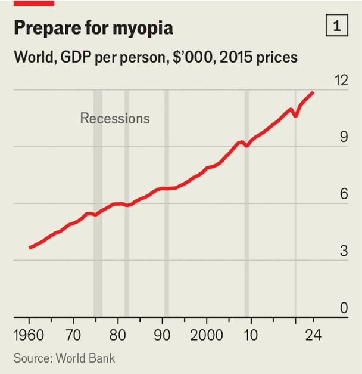
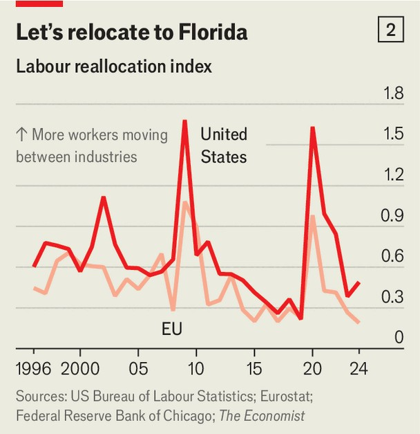
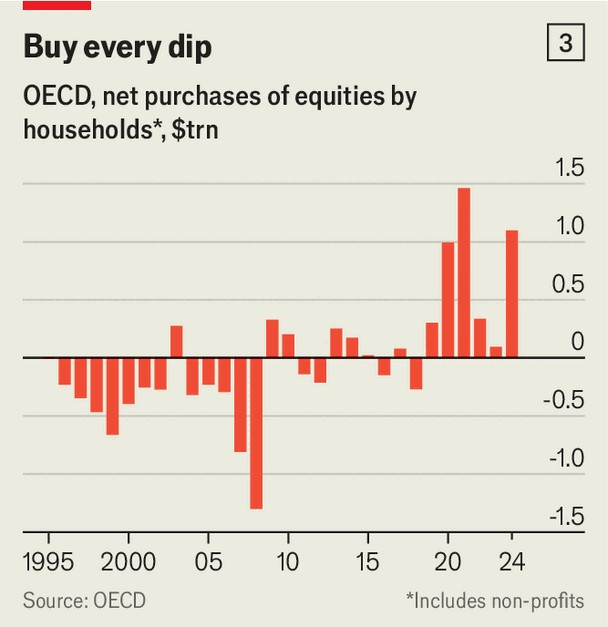
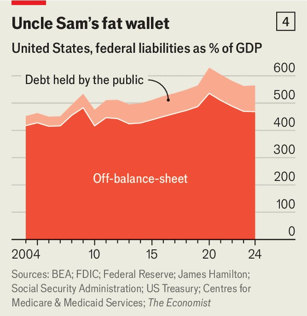

Finance & economics | Recession recession
Recessions have become ultra-rare. That is storing up trouble
Continuous growth can make economies fat and slow
November 13th 2025
From 1300 to 1800, economic historians estimate that England and then Britain were in recession almost half the time. The economy was volatile, with storming recoveries following crashing downturns. As capitalism matured and policymaking improved, recessions became less frequent. In the 19th century the country was in recession only a quarter of the time, a share that fell lower still in Britain and other rich countries in the 20th century. Today things are even more placid: recessions have become an endangered species. In the past four years the world has faced challenges of unusual scope, from higher interest rates and banking crises to trade wars and hot wars. Yet from 2022 to 2024 global real GDP growth was 3% a year on average, and the economy looks set to grind out another 3% this year. Unemployment in the OECD, a club accounting for 60% or so of global GDP, remains near historical lows. In the third quarter of 2025 global company profits rose by 11% against a year earlier, the most in three years.

Aside from a contraction owing to covid-19 lockdowns, the world economy has not suffered a synchronised recession for over 15 years (see chart 1). Perhaps a third of America’s workforce has never experienced a prolonged downturn. This is good news: slumps exact a tremendous human cost. Yet there is a catch. When the world lives through a “recession recession”, costs begin to mount.

Some suggest an economy needs the occasional downturn to stay healthy. Joseph Schumpeter, an Austrian economist, argued that they provoke “creative destruction”. Failing firms leave the market, capital decamps to more promising technologies and workers move to more productive jobs. The result is short-term pain and long-term gain. Schumpeter did not argue that politicians should deliberately engineer downturns. But nor did he think they should try to prevent them. “Depressions are not simply evils, which we might attempt to suppress,” he wrote. They represent “something which has to be done”.

The idea feels intuitive: just as the human body may benefit from an occasional detox, why not the economy? To many observers, contemporary capitalism has grown flabby, as can be seen in the armies of consultants, social-media influencers and crypto traders who produce little, if anything, of lasting value. A recession, were it to thin out such jobs, might redirect

talent and capital towards more useful ends. “Great companies are born in recessions,” goes the adage. Just look at Apple and Microsoft in the mid- 1970s or Uber in 2009. Entrepreneurs try revolutionary ideas when they have nothing to lose.

A landmark paper in 1994 by Ricardo Caballero of the Massachusetts Institute of Technology and Mohamad Hammour, then of Columbia University, found that recessions could indeed purge outdated or unprofitable techniques and products. Other work at the time found that the Depression helped push out small, unproductive car factories, paving the way for mass production. In 2022 Daniel Bias of Vanderbilt University and Alexander Ljungqvist of the Stockholm School of Economics discovered that startups born in a recession outperform those which emerge in temperate periods. They are more likely, for instance, to list on public exchanges.

The events of 2020 also showed that recessions can spur creative destruction. During the pandemic, European politicians tried to prevent a downturn by protecting jobs, putting millions on furlough schemes. Unemployment peaked at 8.6% of the labour force. America, by contrast, let jobs die (unemployment hit 15%) but gave people oodles of cash. American politicians thus encouraged creative destruction, with workers moving to where demand was growing, including suburbs, and away from where

demand was shrinking, namely city centres. Borrowing a methodology from the Chicago branch of the Federal Reserve, which focuses on the composition of employment by industry, we estimate that in 2020-22 labour- market reallocation increased by twice as much in America as in Europe (see chart 2). Perhaps it is no surprise that, since 2019, American labour productivity has grown by 10%, while the EU’s has grown by just 2%.

So Schumpeter may have a point—at least sometimes. At other times, though, recessions fail to provoke creative destruction. After the bursting of the Japanese bubble in the early 1990s weak banks rolled over credit to distressed borrowers, keeping unproductive firms alive. The Japanese economy would be in better shape today had that recession never happened. In 2016 Lucia Foster of the US Census Bureau and colleagues examined American recessions. Although typical downturns accelerated reallocation, they found that 2007-09 was different. It ushered in a long period of exceptionally low reallocation.

Recessions are guaranteed to be painful. And it is hard to know if the next downturn will be a cleansing one like 2020, or a productivity-destroying one like 2007-09, so most politicians seek to avoid them altogether. To that end, emerging-market governments have adopted better policies. Flexible exchange rates are more common. From 2000 to 2022 the number of emerging-market central banks targeting inflation rose from five to 34. Local bond markets are more established, meaning poor countries can borrow in their own currencies at respectable rates, leaving them less exposed to global fluctuations.

Rich-world governments have gone further still. At the first hint of trouble they open their wallets, leading to a political settlement we have called “bail-outs for everyone”. During the energy shock of 2022 European governments allocated support worth 3% of GDP to help firms and households. After the collapse of Silicon Valley Bank in 2023, Uncle Sam stepped in to guarantee deposits. Politicians are quick to offer support to “strategically important” firms in trouble. And after they intervene, they are slow to pull back. Today, amid a solid economy, fiscal deficits are still huge. America’s exceeds 5% of GDP.

Fiscal policy may have stopped demand from collapsing. But the intervention has been so large that politicians are distorting the economy’s allocation of resources. The longer the recession recession continues, the more three risks—financial, fiscal and allocative—will grow.

First, the financial risk. Long stretches without downturns foster “disaster myopia”, a tendency for people to forget that bad stuff can happen. They load up on risky assets—just the sort that struggle in times of trouble. Today’s dealmakers are in a frenzy, investing vast sums in artificial- intelligence companies with fundamentally uncertain prospects. Households across the rich world appear oblivious to the fact that the line does not always go up. In recent years they have allocated $3trn of their savings to global equity markets, by far the biggest inflow on record (see chart 3). With 30% of American households’ assets now exposed to the stockmarket, an all-time high, a proper correction would cause serious pain.

The second risk is fiscal. Governments’ efforts to insure against recession are expensive. Over the past decade, combined rich-world public debt has risen to its highest level since the end of the Napoleonic wars. Many governments have also made commitments for future outlays that are not captured in conventional budget arithmetic. The American government, for instance, guarantees an enormous chunk of households’ bank deposits,

protects mortgage lenders against losses if a borrower defaults and has made a number of unfunded promises to people on Medicare. The federal government’s “contingent liabilities” now exceed $130trn—nearly five times American GDP (see chart 4). As the bail-out state grows, ever more interest groups begin to expect help in times of trouble. This is dangerous. What if many industries were to come cap in hand to Uncle Sam at the same time?

And then there is the allocative risk. To argue that Western capitalism sustains itself on social-media influencers and crypto traders is, in spirit, correct: capital and labour are increasingly trapped in low-productivity uses. Bruno Albuquerque of the IMF and Roshan Iyer of American University look at “zombie firms”—a definition that includes firms which are persistently unprofitable. Across the world, the share of listed companies that are zombies has grown from 6% in 2000 to 9% in 2021.

Economists once argued that zombie firms were a product of low interest rates, which allowed bad companies to service their debts and thus limp along. Yet even as rates have risen, so have the ranks of the undead. A recent report from BofA Securities, a broker, finds that the share of European companies which fall into this category (albeit using a subtly different definition) rose from 2023 to 2025. Zombie firms survive in part because of

benign economic conditions. Managers need not obsess about cost-cutting. Banks are happier to “extend and pretend” on loans. Workers may have other sources of income that compensate for poor pay.

As zombie firms grow, their influence becomes more malign. In the decade to 2022, the least productive British companies also saw the slowest productivity growth, dragging down the average. And they directly hurt the rest of the economy. Messrs Albuquerque and Iyer find that in industries with more zombie firms, “healthy firms exit the market faster and entry rates are lower, hindering healthy creative destruction.” Zombies keep workers in positions that are poorly matched to their skills, depriving better companies of their talents and therefore keeping them less productive than they would otherwise be. Consistent with the rise in zombie firms, job-to-job moves across the rich world are in steady decline.

The world economy has avoided a prolonged downturn for an impressively long stretch. Yet the very success of stabilisation policy creates vulnerabilities. If governments are determined to prevent downturns, they must be equally determined to allow the continual turnover of companies and jobs that a growing economy requires. Otherwise, the system will demand ever larger doses of fiscal support to maintain a steady state that delivers less and less. At best, the result is a drift into stasis. At worst, it is the accumulation of enormous fiscal and financial risks. ■

For more expert analysis of the biggest stories in economics, finance and markets, sign up to Money Talks, our weekly subscriber-only newsletter.

This article was downloaded by zlibrary from https://www.economist.com//finance-and-economics/2025/11/10/recessions-have-become- ultra-rare-that-is-storing-up-trouble