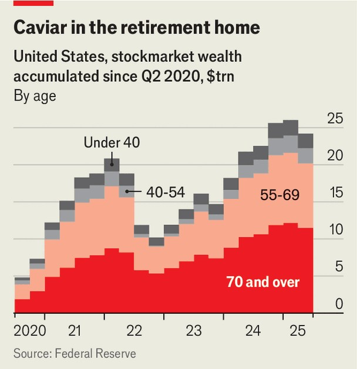
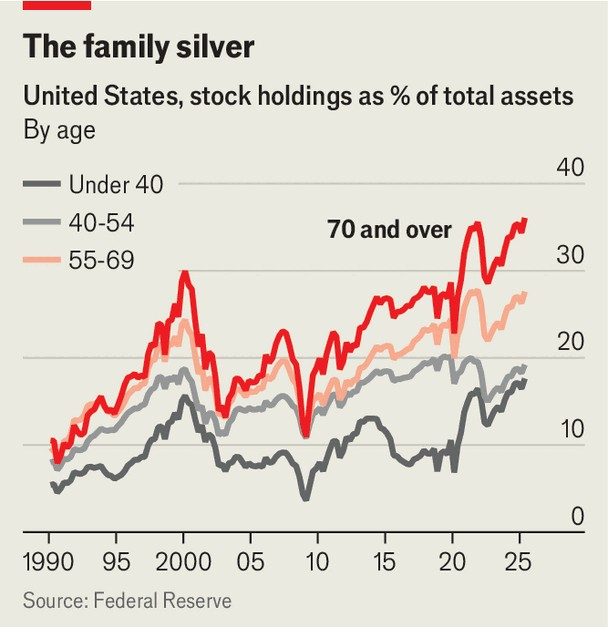
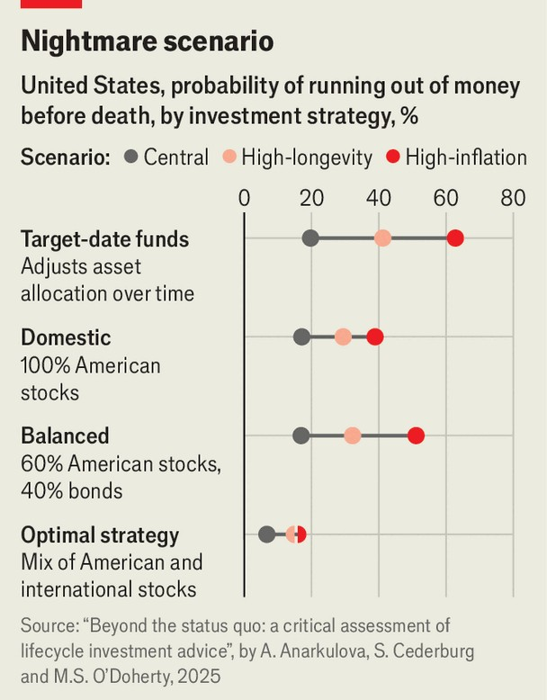

Finance & economics | Boomers and busts
Old folk are seized by stockmarket mania
Investing in equities may make sense for individuals—but it could also exacerbate a crash
November 13th 2025

Generation Z has already made its mark on investing—consider crypto, FOMO, meme stocks and gamified investing. But, in a less flashy way, it is grandparents who are truly shaking things up. America’s surging stockmarket has been driven, most of all, by old investors. Indeed, in recent years there has been a quiet revolution. Americans aged 70 and over now own 39% of all stocks and mutual funds (which mostly invest in equities), almost twice as much as was common from 1989 to 2009. The trend reflects a shift in outlook. Elderly Americans’ risk tolerance has shot up. Many now eschew traditional investment advice, which is concerned

with protecting rather than increasing their wealth. If a downturn strikes, this could have profound implications.

Some of the rise in elderly stockmarket wealth reflects the fact that there are more old people: in 2010, 9% of Americans were 70 or older; today 12% are. Yet that is only part of the story. Had the age group held their portfolio allocations steady, their share of stockmarket wealth would have risen by just half as much as it has in reality since the financial crisis of 2007-09. And the shift has been particularly fast in the past five years: almost half the $24trn rise in stock and mutual-fund wealth has been accumulated by the over-70s.

America’s newfound silver confidence is also a product of its growing wealth. “Unless I have an unusually long lifespan, I have enough to survive on for the rest of my life,” says Jay Gourley, a 77-year-old studying mathematics at George Mason University. “I can...take on some risk without worrying about having to panhandle.” Mr Gourley holds a portfolio with 8% or so in cash and the rest in a mix of index funds and individual stocks. If pressed, he would shift his stocks to more defensive industries instead of reallocating to bonds.

For much of a current pensioner’s investing life, the bond market provided useful returns. From 1980 to 2005 yields on ten-year Treasuries returned 3.8 percentage points above inflation a year on average. But in the subsequent period that figure dropped below 0.5 percentage points. Investors in bonds were burned by the surge in consumer prices that followed the covid-19 pandemic. Thomas Van Spankeren of RISE Investments, a wealth manager, says that many old folk he advises assume the recent strong performance of American stockmarkets will continue. So why bother with piddling returns on bonds?

There may be another, less rational driving force. Older investors are just as susceptible to FOMO as their grandchildren. According to Michelle Gessner, a financial planner in Houston, most of her clients in their 70s have investment allocations of at least 60% in stocks. Another financial planner recalls a client who recently passed away in her late 90s—with a net worth of around $20m—purchasing shares in Nvidia while in a hospice.

Such behaviour will especially concern purveyors of conventional financial advice. One heuristic, dating back at least to the 1950s, holds that an investor’s stock allocation should be 100 minus their age. Thus a 25-year- old should hold 75% of assets in stocks; a 75-year-old, just 25%. This logic has spawned an entire industry of target-date funds, vehicles that steadily

reallocate from equities to bonds as an investor ages. For instance, the Target Retirement 2070 fund run by Vanguard, an asset manager, now has an allocation of 90% or so to the stockmarket. Over the next 45 years, that will decline to around 30%.

But some researchers are more optimistic. In 2014 Wade Pfau of the American College of Financial Services and Michael Kitces, then of Pinnacle Advisory Group, another wealth manager, found that old folk could benefit by raising their allocation to stocks throughout retirement. The timing of returns, they argued, really matters. Investors who sell stocks and buy bonds during slumps lock in losses and have no exposure to an eventual rebound. Historically, they note, an investor starting retirement with a 30% allocation to stocks, and raising it steadily to 80%, would outperform one who heads in the opposite direction over a 30-year period.

Other researchers go one step further. In a recent study, Aizhan Anarkulova of Emory University, Scott Cederburg of the University of Arizona and Michael O’Doherty of the University of Missouri suggest that investors should hold a third of their portfolio in American stocks and two-thirds in stocks from the rest of the world. Based on hundreds of years of data from 39 countries, they estimate that investors withdrawing 4% of their retirement savings every year have a 39% chance of running out of money if they

invest solely in short-term bonds, compared with a 17% chance if they have a balanced portfolio and just 7% for their favoured all-equity strategy.

Although a stock-heavy portfolio may make sense for individual investors, it could still cause problems for the market, especially during a downturn. In an optimistic scenario old folk are buying for their children and grandchildren, and expect the stocks to be handed down and held for decades. As a result, they may prove to be iron-stomached, fortified by memories of market recoveries after 2007-09, the dotcom bubble and the crash of 1987. A survey by Schroders, another asset manager, finds that only 25% of investors aged 71 or over made changes to the risk level of their portfolio during the pandemic slump of 2020, the smallest share of any age group.

Yet in a long downturn a different logic may prevail. While younger investors may be reassured, knowing that they have decades left to recoup losses, older folk are less fortunate. Those who have gone for a bold allocation out of FOMO may be tempted to reverse course, or sell up altogether because they need the cash for, say, care. If the numbers are large, that shift could worsen a market slump. Whether the new silver-haired giants of the stockmarket are ride-or-die investors will become clear only when things go wrong. The outcome matters more than ever. ■

For more expert analysis of the biggest stories in economics, finance and markets, sign up to Money Talks, our weekly subscriber-only newsletter.

This article was downloaded by zlibrary from https://www.economist.com//finance-and-economics/2025/11/11/old-folk-are-seized-by- stockmarket-mania