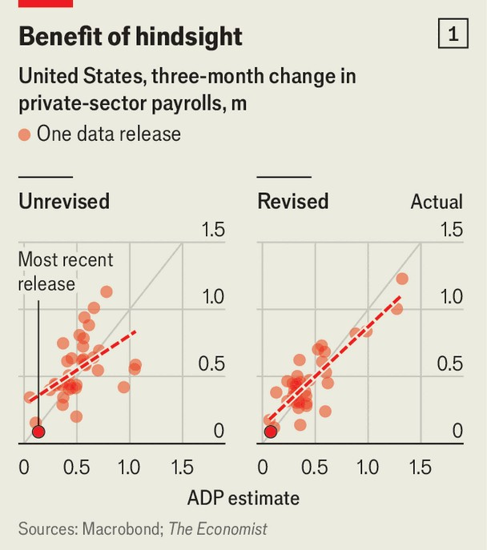
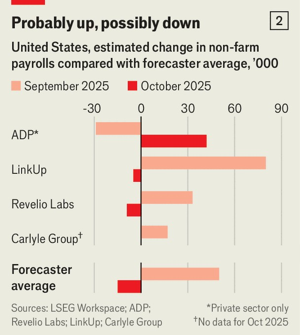
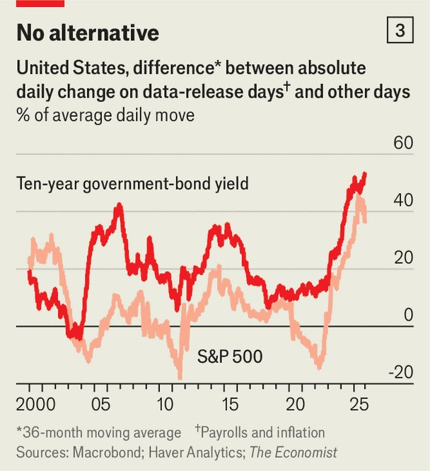

Finance & economics | All fogged up
The problem with America’s shutdown economy
Gridlock in Washington has prevented official data releases. And unofficial ones disagree
November 13th 2025

Imagine, for a moment, America without the Bureau of Labour Statistics (BLS). To some wonks, few scenarios are more terrifying. After President Donald Trump threw a tantrum over weak job figures and sacked the head of the largely apolitical body in August, putting forward E.J. Antoni, a partisan figure, to replace her, such a scenario also looked worryingly plausible. The White House subsequently withdrew Mr Antoni’s nomination. Yet for the past month America’s government shutdown, the longest in history, has subjected the country to a similar experiment. Although Mr Trump brought the gridlock to an end on November 12th, signing a spending bill to reopen government, official data have not yet started to flow. Can anyone make

sense of America’s economy without them? And have vaunted private-sector alternatives been adequate replacements?

The results, so far, are not particularly reassuring. Jerome Powell, chair of the Federal Reserve, has compared the experience of policymaking without official data to “driving in the fog”. A sharp, material shift in the economy would still be visible, he suggests, but beyond that it is hard to say anything with much certainty. The problem is not a shortage of private-sector data alternatives—there are plenty—but their consistency, reliability and breadth.

Take non-farm payrolls, which count jobs created each month and are the most likely official release to move markets. Indeed, their decline over the summer was critical in persuading the Fed to cut interest rates, even as inflation crept up. The longest-standing alternative series is produced by ADP, an employment-technology company. Since 2006, it has released an estimate of private-sector payrolls a day or two ahead of the official figures. In theory, the firm should be uniquely well placed to calculate such figures, since a sixth of American jobs pass through its software.

And, at first glance, ADP’s figures track the BLS’s. Since 2022, when ADP updated its methodology, monthly moves in its data have been about 60% correlated with the equivalent BLS series; three-month changes have been

90% correlated. But these figures are illusory: both ADP and the BLS revise their numbers. The initial releases—a better measure of their usefulness when tracking the economy in real time—are much less correlated: 50% for three-month changes and only 10%, in essence uncorrelated, for monthly changes (see chart 1).

Another problem is that private-sector data sources disagree. Without long track records, it is difficult to know which to trust. Some rely on web- scraping; others on in-house data. Payrolls figures for both September and October have gone unpublished. ADP’s numbers point to a decline in September, followed by a rebound in October. Those of Revelio Labs, a competitor, point to a rise in September and a decline in October (see chart 2). The trickle of remaining official data, such as unemployment-support claims, which are collected at the state level and so continued despite the shutdown, have not budged much.

Some measures are especially challenging for the private sector. Decent alternatives exist for employment, housing and goods prices. But services, which make up the bulk of spending, are varied and harder to measure. Jed Kolko, who oversaw several statistical agencies under Joe Biden, fears that policymakers may fixate on areas where private-sector data are more plentiful. Focusing on weak job figures, where there are more data, instead

of, say, inflation, could tilt them in the direction of interest-rate cuts. If a future shutdown lasts longer, private-sector data will get worse still. Statistical models that turn unwieldy inputs into a set of representative figures are almost always trained on, and benchmarked to, official releases.

True, official figures have their own problems. Survey response rates have been falling, particularly since the covid-19 pandemic. Recent revisions, including those over the summer that provoked the president, have been unusually large. Staffing cuts at statistical agencies are already causing issues. A BLS memo in July said that the agency had stopped collecting about 15% of prices in its usual sample, up from 5% during the worst of the pandemic. The next few months will be particularly bad, since the shutdown stretched on for long enough that decent figures will be tough to reconstruct; in some cases, doing so might be impossible.

Yet the continued importance of official data can be seen in how the market responds to them. Derek Lemoine of the University of Arizona finds that the market’s expectation of stock volatility falls after releases, suggesting investors find them clarifying. A rough-and-ready calculation by The Economist indicates that markets’ sensitivity to official data has risen substantially in recent years—the exact opposite of what would have

happened if private-sector figures were supplanting government ones (see chart 3).

Fortunately, this particular no-data experiment has come to an end. Reassuringly, too, the White House has yet to put up a new candidate to replace Mr Antoni. The president’s attention seems to have moved elsewhere. Perhaps that will allow a degree of normality to return to American data. ■

For more expert analysis of the biggest stories in economics, finance and markets, sign up to Money Talks, our weekly subscriber-only newsletter.

This article was downloaded by zlibrary from https://www.economist.com//finance-and-economics/2025/11/09/the-problem-with- americas-shutdown-economy