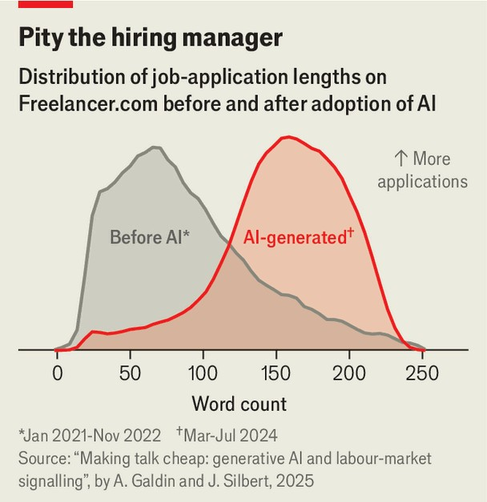

Finance & economics | Signal failure
How AI is breaking cover letters
And leading to lower pay
November 13th 2025
A good cover letter marries an applicant’s CV to the demands of the job. It helps employers identify promising candidates, particularly those with an employment history that is orthogonal to their career ambitions. And it serves as a form of signalling, demonstrating that the applicant cares enough about the position to go through a laborious process, rather than simply scrawling their desired salary at the top of a résumé and mass-mailing it to every business in the area. Or, at least, it used to. The rise of large language models has changed the dynamic. Jobseekers can now produce a perfectly targeted cover letter, touching on all an advertisement’s stated requirements, at the touch of a button. Anyone and everyone can present themselves as a careful, diligent applicant, and do so hundreds of times a day. A new paper by Anaïs Galdin of Dartmouth College and Jesse Silbert of Princeton University uses data from Freelancer.com, a jobs-listing site, to work out what this means for the labour market. Comparing pre- and post-ChatGPT activity, two results stand out. The first is that cover letters have lengthened. In the pre-LLM era, the median one was 79 words long. (Since Freelancer.com attracts workers for one-off tasks, such letters are more to-the-point than those for full-time roles.) A few years later, post-ChatGPT, the median had risen to 104 words. In 2023 the site introduced its own AI tool, allowing users to craft a proposal without even having to leave the platform. The subset of applications written using the tool—the only ones that can be definitively labelled as AI-generated—are longer still, with a median length of 159 words, more than twice the human- written baseline.

The second is that firms have stopped caring about what is written. When only some applications contain evidence an employee has put in effort, they are likely to be from the best workers—and thus all letters are worth reading closely to identify strong candidates. When all letters show evidence of “effort”, there is little benefit in reading any. To explain this, the researchers used AI to mark every letter, looking at nine categories, from evidence the applicant has actually read the job advert to being able to produce clearly written English. Applicants were marked in each category from zero to two, giving a maximum overall score of 18. Pre-LLM, the median score was 3.9. Post-LLM, it had nearly doubled.

This has consequences. In the pre-LLM era, a well-written proposal was worth an extra $26 per task, a huge sum on a platform where the median one brings in $100. After the arrival of AI, the bump disappeared. Ms Galdin and Mr Silbert estimate that wages on the platform are now 5% lower and hiring 1.5% lower than in a world without AI cover letters. Employers, having lost a way of telling strong from weak candidates, have cut all new hires’ pay, and more often end up recruiting worse candidates. For bosses, the fall in quality is more than compensated for by the fall in candidate wages. But this benefit to businesses was worth less, the researchers calculated, than the losses suffered by workers. ■

For more expert analysis of the biggest stories in economics, finance and markets, sign up to Money Talks, our weekly subscriber-only newsletter.

This article was downloaded by zlibrary from https://www.economist.com//finance-and-economics/2025/11/13/how-ai-is-breaking- cover-letters