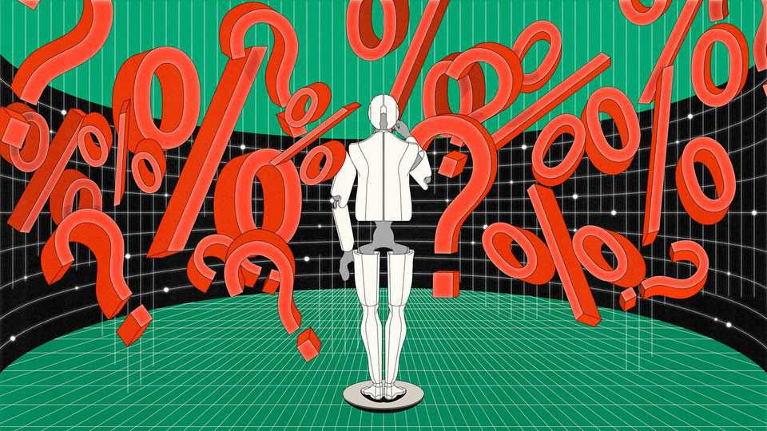
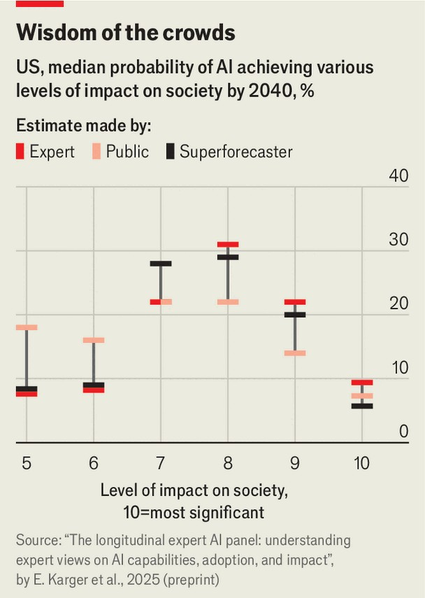
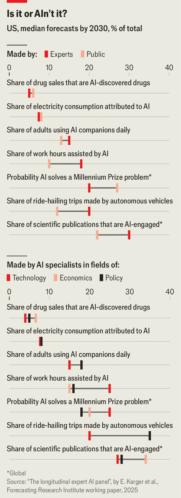

Science & technology | Casting the runes
A new project aims to predict how quickly AI will progress
Superforecasters weigh in on the subject
November 13th 2025

The leaders of the big three artificial-intelligence (AI) labs promise great things, and soon. Sam Altman, the boss of OpenAI, thinks next year computers will be capable of “novel insights”. Dario Amodei, who runs Anthropic, says “powerful AI” (what others call AGI—artificial general intelligence) could arrive in the same timeframe. Demis Hassabis of Google DeepMind has suggested that “within the next decade or so”, AI could cure all diseases. Some of the grandest claims may be made with at least one eye on marketing. Still, getting a true sense of the probable speed of AI development is important, says Ezra Karger, an economist at the Federal

Reserve Bank of Chicago. When the spectrum of plausible outcomes includes an appreciable portion of white-collar tasks being automated, or a tenth of all electricity in America being used for AI training and deployment, good forecasts matter.

Dr Karger is in charge of an effort—not affiliated with his day job—to build such digital divinations. The Longitudinal Expert AI Panel (LEAP) sets out to do three things. First, rather than assessing vague claims about concepts like AGI, it offers specific, testable hypotheses. When will self-driving cars account for 20% of American ride-hailing trips? What proportion of the country’s electricity will be used for AI by 2040? What will be the benchmark scores for open-source and proprietary AI models in 2025, 2027 and 2030?

Secondly, Dr Karger’s team has asked those questions of almost 350 experts from many fields. Besides corporate AI researchers LEAP includes academic computer scientists, economists, and policy types. It also includes “superforecasters”, a group of prophets, some amateur and some professional, whose expertise is in no particular area other than being more accurate than other experts at predicting the future. Finally the project will ask the same questions as the years go by. The idea is to build a sense of how hope—and hype—around AI waxes and wanes.

The results of the first round, published on November 10th, suggest AI’s impacts are just beginning to be felt. The median forecast has more than 18% of American work hours being AI-assisted by 2030, up from 2% in September this year. The forecasters expect that AI will account for about 7% of American electricity usage by the same year.

The forecasters doubted that AI would meet the loftiest expectations of its boosters—or at least, not as quickly as they claim. The average expert thought there was only a one in five chance of developing Mr Amodei’s “powerful AI” by 2030. But by 2040, they expect AI to be as important to this century as electricity or the car were to the previous one—a score of eight on a ten-point scale devised by Nate Silver, a statistician, designed to measure the impact of different inventions. They also thought there was a nearly one-in-three chance that AI might rank at least as high as level nine, where it would join technologies like the printing press as a technology that “changed the course of human history”.

On the other hand, rapid progress in the field has caught out even the experts before. When the fieldwork for the current report was done in April, the top score for an AI system on a tricky maths challenge called FrontierMath was 19%. The median expert guess for where it would be by the end of 2025 was 31%. In a parallel study asking the general public the same questions, the

median guess was 27%. But in August Google announced a score of 29%, beating many forecasts—and with four months left in which to get better still.

Biology offers another example. Earlier this year the research institute behind LEAP asked a different panel, this time of forecasters and biologists, to guess when an AI system would be able to describe how to synthesise a novel virus with as much precision as a team of human virologists. Guesses ranged from 2030 to 2034. When researchers posed the challenge to OpenAI’s o3 model, released in April, it had already reached that level.

One advantage of questions with short deadlines, says Mr Krager, is that they may help quickly spot the best forecasters. Their predictions can then be given more weight in future. The best prognosticators, he says, are often those who notice inconsistencies in their own predictions: a claim that AI electricity use will shoot up, for instance, may be incompatible with predicting little impact on employment. Eventually, Dr Karger hopes, the techniques developed by Leap’s panel will be used alongside the standard economic research in his day job to help plan for a world that could be very different from today’s. ■

Curious about the world? To enjoy our mind-expanding science coverage, sign up to Simply Science, our weekly subscriber-only newsletter.

This article was downloaded by zlibrary from https://www.economist.com//science-and-technology/2025/11/10/a-new-project-aims-to- predict-how-quickly-ai-will-progress