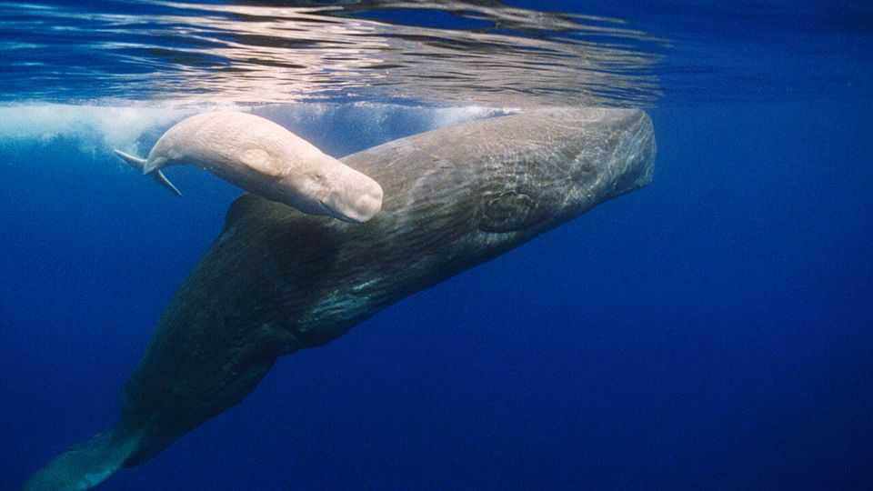

Science & technology | Thanks for all the fish
Sperm whales communicate with vowels
The clicks that the animals make share at least one property with human language
November 13th 2025

AS READERS OF “The Hitchhiker’s Guide to the Galaxy” will know, humans are only the third-cleverest species on Earth. The first two places go to mice and dolphins. But perhaps Douglas Adams’s comic novel should have included dolphins’ cetacean cousins. Scientists have been studying the complex vocalisations of whales ever since they first discovered the evocative songs sung by humpback whales in the 1960s. In a paper just published in Open Mind, a journal, a group of researchers with the Cetacean Translation Initiative (CETI), which studies sperm whales in the Caribbean, describe a strikingly human-like feature in whale communication. Female sperm whales communicate using a series of clicks

that researchers call “codas”. These codas, the researchers argue, look a lot like vowels in human languages.

For linguists, vowels have a precise definition. They are characterised by the free flow of air through a vibrating vocal tract (consonants, by contrast, involve disruptions of the airflow). The fundamental acoustic frequency of a vowel, known technically as F0 and perceived as its pitch, is determined by things like sex and body size. But the arrangement of things like the tongue and lips create “formants”. Dubbed F1, F2, F3 and so forth, these are concentrations of sonic energy at specific, higher frequencies. The formants’ relationship to each other determines which specific vowel is heard: an “ah” or an “ee”, for example.

To humans, sperm-whale codas do not sound like pitches at all; the clicks are much too infrequent and irregular. Distinct pulses of sound energy begin to blur together into a pitch only at frequencies of between 20 and 40 cycles per second. But when the whales’ silences were removed in software, the researchers could consider them as pitches nevertheless, and look more closely at their other qualities.

The next step was taken with the help of artificial intelligence (AI). The researchers used an AI system trained to learn human language to examine the codas. Gasper Begus, a linguist at the University of California, Berkeley and the study’s lead author, says that the AI tipped them off to look into the spectral information within the vocalisations—the range of frequencies analogous to human formants.

Sure enough, the whale codas turned out to include two spectral patterns that resembled those in the F1 and F2 formants of human vowels, albeit at much lower frequencies. Moreover, they were discrete rather than continuous, suggesting that the whales intended them to be distinct from each other, just as human vowels are. The researchers called them the a-coda and i-coda vowels, for their resemblance to the sonic patterns in those human vowels. They also found that whales could produce diphthongs—two vowels gliding quickly from one to another like the ah-ee sound in English words like “ride” and “time”. The whales do all this often in what researchers call “conversations”.

Exactly what the whales may be saying to each other remains unknown— although working that out is CETI’s eventual goal. That will require a large body of vocalisations to study, as well as an equally big number of observations of how the animals behave and interact with each other. But the discovery that whales use such sophisticated channels of information will give the third-cleverest species on the planet all the more encouragement to try to work out just how talkative its fellow earthlings may be. ■

Curious about the world? To enjoy our mind-expanding science coverage, sign up to Simply Science, our weekly subscriber-only newsletter.

This article was downloaded by zlibrary from https://www.economist.com//science-and-technology/2025/11/12/sperm-whales- communicate-with-vowels