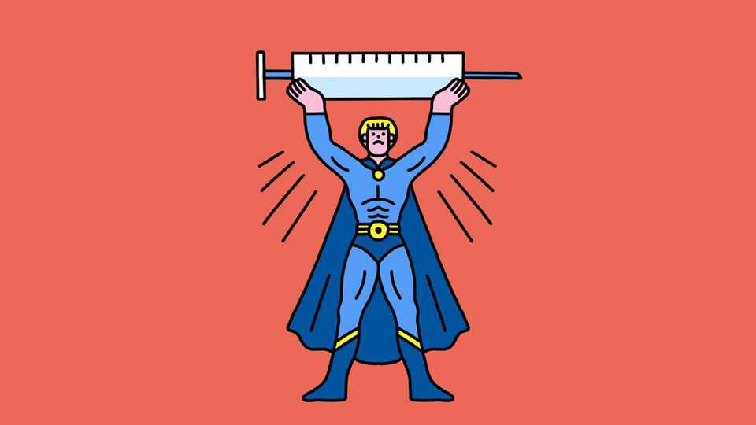

Science & technology | Well informed
Can peptides give you superpowers?
The “Wolverine stack” is supposed to boost healing and recovery
November 13th 2025

Readers might assume that the “Wolverine stack” refers to the accumulated riches of Hugh Jackman, an actor who has played the Marvel Comics superhero in numerous films. The connection with Mr Jackman’s alter ego is, however, more subtle. Wolverine is known for his powers of regeneration. The stack in question is a stack of chemicals—specifically a pair of substances called BPC-157 and TB-500, which are alleged to confer similar benefits on mere mortals. Both are popular among athletes seeking rapid recovery from bone fractures and torn ligaments. But they are spreading more widely. A study of internet forums discussing BPC-157, TB-500 and some related chemicals, published

last year, highlighted their use to promote “anti-ageing” and general well- being, particularly among older men.

Chemically, BPC-157 and TB-500 are peptides—chains of amino acids too short to count as full-fledged proteins. The first is a fragment of a stomach protein. The second of thymosin beta-4, a protein found in most body cells. As is true of many natural peptides, these compounds act as signalling molecules. Animal experiments also demonstrate that both BPC-157 and thymosin beta-4 have multiple injury-ameliorating effects (very little work has been done on the TB-500 fragment itself). These include promoting wound healing and blood-vessel formation, and reducing inflammation. Such experiments have also failed to flag up worrying side-effects.

But human studies are scarce. A recent review found only three small ones for BPC-157 (one of which suggested possible relief for chronic knee pain) and, though thymosin beta-4 is the subject of promising trials for recovery from heart-attack-induced tissue damage and the treatment of corneal problems, TB-500 itself is not. “Informal” users usually administer the stack by injection, which brings risks of its own.

In the absence of trials, a “folk pharmacology” has developed. Forum users swap tips, warn of possible side-effects, excoriate naive expectations of miraculous improvements by credulous newcomers and even run informal product-testing laboratories to sort, from the range of commercial offerings available, the wheat from the chaff.

All this is a result of the compounds’ ambiguous legal status. No jurisdiction has approved their use as medicines, but few ban their sale. They can therefore be marketed as “experimental chemicals”, so long as no medical claims are made. Professional sports bodies, including the World Anti Doping Agency, do ban them. But that does not prevent their use by enthusiastic amateurs.

The result is a mess—and a lost opportunity. Peptides are an important class of drugs. Almost 100 are approved as medicines, including insulin, human growth hormone and GLP-1 (the active principle of Wegovy, a weight-loss drug, and Ozempic, a treatment for type-2 diabetes). In a well-ordered

world, the Wolverine stack’s components would be given a chance either to join this list, or to be rejected from it once and for all.

But that would mean clinical trials on people. Those would be expensive, time-consuming and difficult for drug companies to justify, since it would be hard to patent a product based on molecules so clearly in the public domain. The result, even with the efforts of forum users, is an unregulated market in which the purity and strength of what is on offer cannot be guaranteed, with all the risks which that entails. At the moment, then, caveat very much emptor.■

Curious about the world? To enjoy our mind-expanding science coverage, sign up to Simply Science, our weekly subscriber-only newsletter.

This article was downloaded by zlibrary from https://www.economist.com//science-and-technology/2025/11/07/can-peptides-give-you- superpowers

Culture

Indian comedians have never been so successful or endangered Is “All’s Fair” really the worst television drama ever made? An affecting chronicle of a man’s death—and his life Francisco Franco: the charmless man who became Spain’s dictator Has culture in the 21st century become samey and dull? The best films of 2025