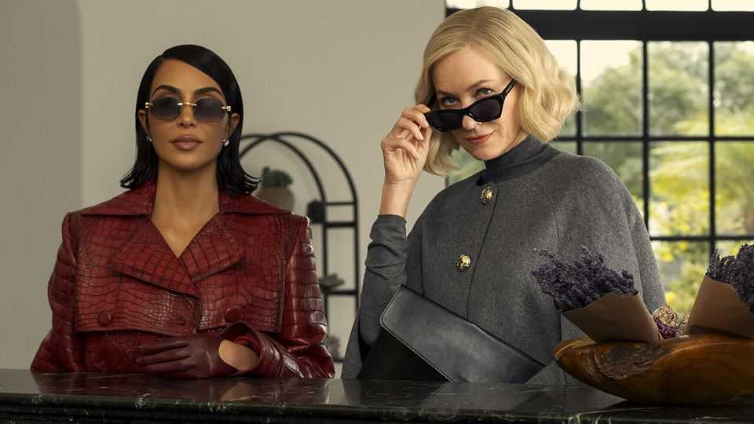
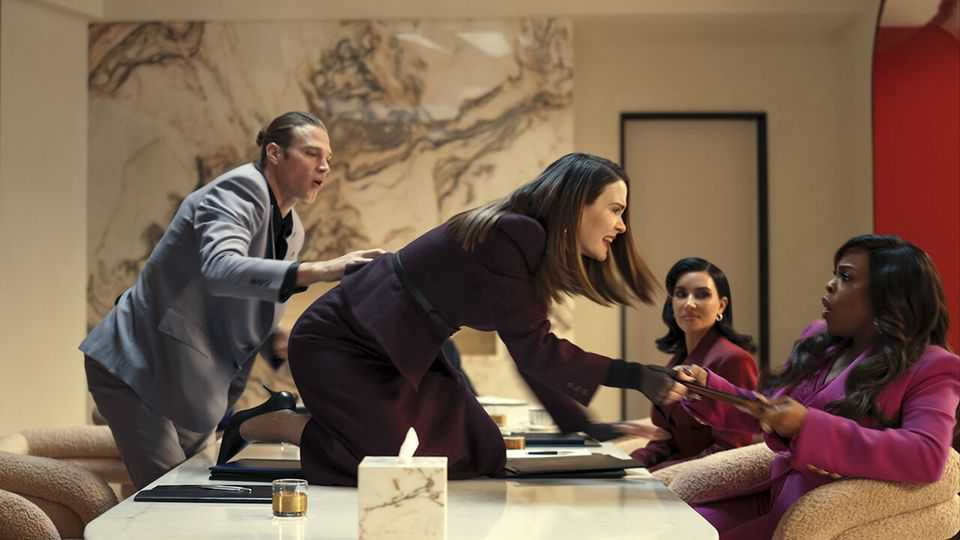

Culture | A law unto itself
Is “All’s Fair” really the worst television drama ever made?
Quite possibly. It is almost all awful—apart from the kitchens
November 13th 2025

It’s all go in the first episode of “All’s Fair”. Viewers witness a work feud (this means that Kim Kardashian, playing the heroine, has to look sad while wearing a suit); a messy divorce case (Ms Kardashian must look sad in a boardroom); then her own husband leaves her (Ms Kardashian must look sad in some luxurious loungewear). But all that is positively uneventful compared with the second episode of this new series: seven minutes in, a character becomes so sad that she jumps off the balcony of an office block. In a scene that might be tragedy, or possibly comedy (it is hard to tell with this series), you see her fall past. “She couldn’t”, says one woman, “stand another minute.”

Nor, it seems, could the TV critics. “All’s Fair” has been almost universally panned: it was given zero stars by the Guardian, zero by the Times and for a while had a 0% critics’ score on Rotten Tomatoes, a review-aggregator site. (It is now up to 4%.) It has been called “terrible”, “awful” and perhaps “the worst television drama ever made”. It has cheered everyone up immensely.

Its main characters are called Allura Grant (Ms Kardashian, pictured above, left), Emerald Greene and Carrington Lane, which sound like paint shades— or possibly porn stars—but who are in fact divorce lawyers. You can tell because they sit around board tables and talk about prenups. In one scene Ms Kardashian wears a waistcoat, tie and exposed thong: sure signs of a legal eagle.

But these women are not just lawyers, they are feminist lawyers. (Tailoring is a fail-safe feminist giveaway.) Viewers know this because they have set up their own law firm and stuff their speech with words like “patriarchy” and “bitches”. Mary Wollstonecraft did similar.

They also love knowledge. For knowledge, says Ms Kardashian, “is the key in the lock”—before adding, lest anyone is confused, “All we have to do is to turn it just the right way.” Viewers will wonder whether that is the kind of legal insight people fork out big bucks for.

What no one seems to have paid for is a decent script. Once, prestige drama meant kitchen-sink realism, offering good prose in bad kitchens. This is the era of kitchen-island dramas, offering bad prose in lovely ones. The dialogue here is execrable: at one point someone says “Let’s put the fucking team in teamwork.” Ms Kardashian came to fame through the glossy pseudo-reality of reality TV and Instagram and this show reflects that phoniness. It is less art imitating life than art imitating Instagram imitating life. It is dreadful. Mind you, the kitchens really are lovely. ■

For more on the latest books, films, TV shows, albums and controversies, sign up to Plot Twist, our weekly subscriber-only newsletter

This article was downloaded by zlibrary from https://www.economist.com//culture/2025/11/13/is-alls-fair-really-the-worst- television-drama-ever-made