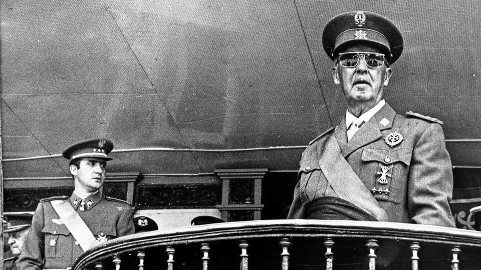
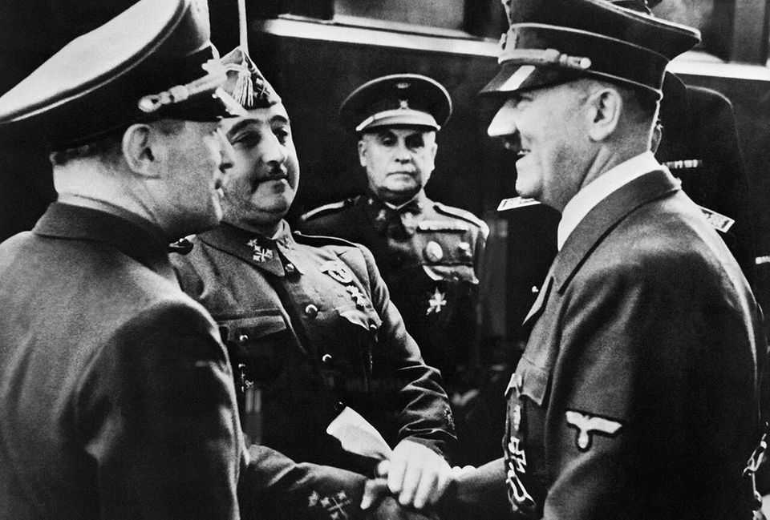

Culture | European politics
Francisco Franco: the charmless man who became Spain’s dictator
The general died 50 years ago this month. A new biography traces his rise to power
November 13th 2025

HE WAS short, uncharismatic and an uninspiring public speaker. And yet General Francisco Franco (pictured, right) would prove to be a remarkably successful dictator. A key figure in the military coup in 1936 that triggered the Spanish civil war, Franco would go on to rule as an autocrat until he died in his hospital bed 50 years ago, on November 20th 1975. Behind his unlikely rise to absolute power lay a combination of relentless personal ambition and much luck. There were two Francos, Giles Tremlett argues: “Soldier Franco was confident and decisive. Civilian Franco was calculating, slow and cautious.” It was as a soldier that he achieved

prominence. Born into a family of naval administrators in the port of El Ferrol, in Galicia, Franco joined the Spanish army when it was waging a brutal colonial war in northern Morocco. He was fearless, notoriously cold and indifferent to the human cost of war. He rose to become commander of the Spanish Legion, the army’s boldest and cruellest unit.

When revolutionary miners staged an insurrection in Asturias in 1934, a conservative government turned to Franco to repress them. But when a group of generals plotted a coup against the left-wing Popular Front government two years later, Franco hesitated, joining only at the last minute. He was lucky that he had been posted to the distant Canary Islands. From there he took charge of the powerful army in Spanish Morocco and secured the support of Hitler and Mussolini to airlift it to the mainland. With rivals dead, he staged a power grab, installing himself as commander-in-chief and head of state of the Nationalist side in the civil war.

Many of the rebels wanted to restore the monarchy; Franco erected a personal dictatorship instead. Despite his wartime alliance with Hitler and Mussolini, he was a fascist only when it suited him. He represented a previous tradition of reactionary Catholic nationalism, his worldview forged by Spain’s humiliating loss of its colonial empire in the Spanish-American war of 1898 and then the Moroccan war.

Mr Tremlett, a former Madrid correspondent for The Economist, has wisely opted not to replicate Paul Preston’s magisterial life of Franco. Instead he has written a perceptive and readable biographical essay, made up of zippy short chapters. He sets out to understand the man and to explain “Francoism as a society-shaping phenomenon”. He sees the young Franco’s attachment to his conservative mother and his estrangement from his libertine father, a freemason, as moulding his lifelong abhorrence not just of Marxism but also of freemasonry and liberalism.

The civilian Franco adapted to events, remaking himself as an American ally against communism in the cold war. After his policy of autarky had inflicted two decades of grinding poverty on Spain, he turned to Catholic technocrats who liberalised the economy, unleashing decades of growth. He bequeathed to Spain’s democracy a professional bureaucracy and a system of administrative law, though this is unmentioned in the book.

The author attributes the relative acquiescence of Spanish society to the memory of post-war repression and to subsequent socialisation in a culture of fear and obedience. A Spanish man, but not a woman, eventually lived a freer and wealthier life than eastern Europeans under communism, Mr Tremlett concludes. But this came at a cost: Franco was “a giant dam” who held back democracy and necessary social and political change. Fortunately, once he was dead, the country quickly made up for lost time. ■

For more on the latest books, films, TV shows, albums and controversies, sign up to Plot Twist, our weekly subscriber-only newsletter

This article was downloaded by zlibrary from https://www.economist.com//culture/2025/11/13/francisco-franco-the-charmless-man- who-became-spains-dictator