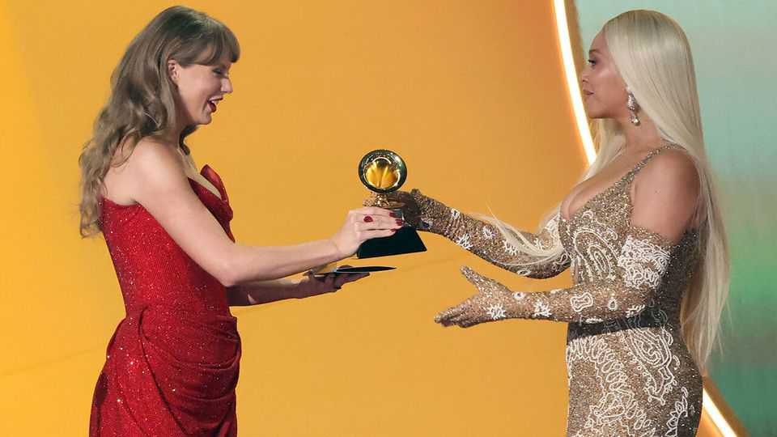

Culture | Back Story
Has culture in the 21st century become samey and dull?
Yes, argues a provocative new book. It is half right
November 13th 2025

Music without instruments and lyrics without meaning. Endless reboots, sequels and superheroes in the cinema. After a burst of magnificent TV dramas in the noughties, every glitzy new show is hailed as a must-see when most are mediocre. The algorithm has vanquished imagination. Especially if you are middle-aged, you may share these gripes about 21st- century culture. There is a confounding glut of art, it often feels, yet little of the original, startling kind that matters. Leaders and crises come and go, but Taylor Swift (pictured) and Beyoncé still top the charts. “Blank Space”, a punchy new book by W. David Marx, laments and explains this sense of

noisy stasis. Mr Marx makes a trenchant case, but he—and maybe you—are too gloomy.

He focuses on pop, fashion, visual art and what you might call the zeitgeist, or just “the internet”. Readers learn of online sensations that they may have missed—and be grateful they did. (Literature and theatre, both said to be on the skids, could have boosted his argument.) Once, he writes, society “encouraged and provided an abundance of cultural invention”. But compared with the explosion of Cubism and Surrealism in the early 20th century, or the counterculture of the 1960s, “There is now a blank space.”

Culprit number one is lucre. For pop stars, Mr Marx argues, the idea of “selling out” has died out. The ultimate measure of value is financial success; distinct musical genres have been squished into “glossy, marketable pop”. Celebrity is less a reward for talent than for commercial nous and chutzpah—witness the rise of Paris Hilton and her ilk. Reality TV confirmed this baleful shift: “Culture became a lowest-common-denominator battle for attention.”

But the left’s aversion to hierarchies is a factor too. A preference for, say, the Rolling Stones over Mariah Carey has become, for some, a retrograde fealty to straight white males. Old-school critics are decried as elitist gatekeepers. Meanwhile, the spread of liberal views on feminism and sexuality spurred a reaction of ironic nihilism, crassness and misogyny. In this “counter- counterculture”, norms and shame are for suckers and wimps.

This is also, naturally, a treatise on technology. In Mr Marx’s telling, at first the internet was a playground for enthusiasts. Then it produced viral crazes like “Gangnam Style” and youth-culture megastars who passed adults by. Latterly it devolved into a swamp of conspiracism and lies: by the late 2010s it was a venue for “fleeting entertainment, get-rich-quick schemes and venomous propaganda”. (On artificial intelligence, he is mordantly sanguine. Since almost all human-made art flops anyway, he asks, why worry about the impact of the AI sort?)

He is a bit hard on commercialism, yet Mr Marx is right to prize bold art that may not be an instant hit but expands “the ways we can see the world”. Still, his sweeping book oversimplifies a dizzyingly messy picture. For starters,

some of his criticisms could have been made in the past, and were. Today’s means of self-publicity are new, but attention-seeking grifters are not. Socialites of yore were famous for being famous too.

And there has always been more dross than gold. The winnowing of time disguises that eternal bias: Hollywood classics endure, not the B-movie schlock; the novels of Joyce and Fitzgerald, not inter-war pulp fiction. The ratio may now be grimmer, but in the midst of the digital torrent, it is too soon to say how much treasure will wash up.

Then there is Mr Marx’s disdain for “retromania”. Endless recycling of stale ideas does indeed betray timidity. But he also frets over older works “feeling more valuable than contemporary ones”, seeing The Beatles’ staying power as a sign of “stagnancy”. Au contraire. Some things are just better than other things, as he himself insists. Just as “The Wire” is better than “Emily in Paris”, previous eras have the edge in some art forms. The rock’n’roll of the 1960s—or the supreme Victorian novels—outclass most of their successors. The fact that old masterpieces are freely enjoyed is a glory of modern culture, not a glitch.

Another way to think of 21st-century Western culture, with its tiny variations and recursive patterns, is as a chronicle of relative complacency. Ructions in the wider world have shaken up the arts. But they have been less traumatic than the cataclysms that launched the leaps of the early 20th century, which Mr Marx so admires. In extremis, could today’s meme- addled creators match that genius? Let’s hope we don’t find out. ■

For more on the latest books, films, TV shows, albums and controversies, sign up to Plot Twist, our weekly subscriber-only newsletter

This article was downloaded by zlibrary from https://www.economist.com//culture/2025/11/10/has-culture-in-the-21st-century- become-samey-and-dull