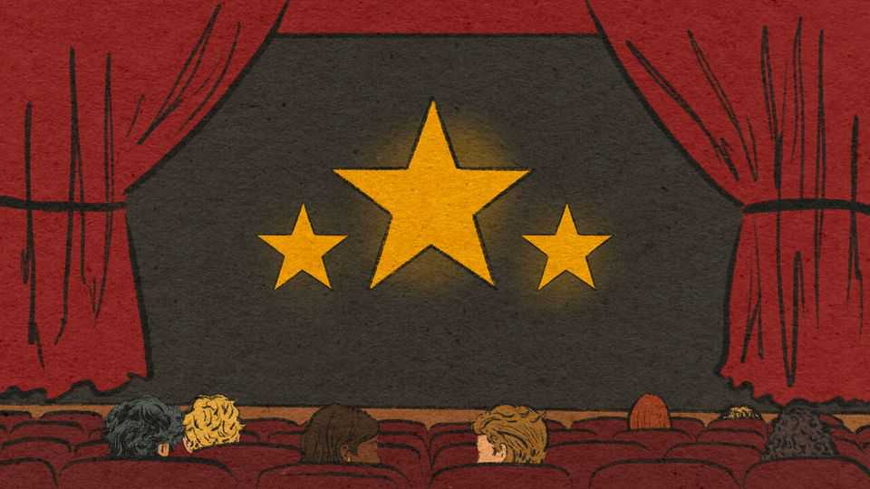

Culture | The reel deal
The best films of 2025
They feature priests, revolutionaries and vampires
November 13th 2025

“28 Years Later”“28 Days Later” (2002), a zombie film written by Alex Garland and directed by Danny Boyle, influenced umpteen films and tv shows. Twenty-three years later—no, not 28—the pair reunited for a sequel. It is a haunting folk-horror which probes Britain’s isolationism. “The Brutalist”An uncompromising period drama which focuses on a Jewish-Hungarian architect (Adrien Brody) who comes to America after the second world war. He is esteemed as a visionary talent, but knows he may never enjoy the status of the patrician industrialist (Guy Pearce) who employs him.

“Flow”A Latvian cartoon which tells the story of a curious cat who drifts around by boat after flood waters engulf Earth. The enigmatic and luminously beautiful eco-fable won Best Animated Feature at the Academy Awards this year.

“Hamnet”This drama imagines how Shakespeare’s work might have been influenced by his marriage to Anne Hathaway and by the death of their 11- year-old son. The film, adapted from Maggie O’Farrell’s novel, is a raw depiction of bereavement and a tribute to the power of art.

“A House of Dynamite”If a nuclear missile were heading towards American soil, and nobody could be certain who launched it, what would happen? Kathryn Bigelow (the director of “The Hurt Locker”) presents the scenario three times from three different perspectives. It is a terrifyingly plausible ticking-clock thriller.

“I’m Still Here”The winner of this year’s Academy Award for Best International Feature Film is a true story of survival under Brazil’s military dictatorship. Fernanda Torres is magnificent as Eunice Paiva, a wife and mother who leads a busy, sociable life in Rio de Janeiro until her activist husband is arrested by the secret police in 1971.

“Is This Thing On?”After a bored financier (Will Arnett) separates from his wife (Laura Dern), he stumbles into a basement club on open-mic night, little suspecting that stand-up comedy will reinvigorate him—and perhaps his marriage. An optimistic account of a mid-life crisis inspired by the experiences of John Bishop, a British comedian.

“It Was Just an Accident”Jafar Panahi has been imprisoned by the Iranian government, but nothing has stopped the writer-director from making films that are critical of the regime. This is one of his best. Its hero is a mechanic, Vahid (Vahid Mobasseri), who abducts one of his customers (Ebrahim Azizi) in the belief that the man used to be a sadistic prison warden. But what if Vahid has made a mistake?

“One Battle After Another”The most topical Hollywood film of the year. Leonardo DiCaprio stars as a washed-up revolutionary activist who thinks he has escaped his past. But then a fascistic colonel (Sean Penn) catches up

with him and his teenage daughter (Chase Infiniti). Paul Thomas Anderson’s action caper is an exhilarating triumph.

“The Secret Agent”Wagner Moura stars as an academic who gets on the wrong side of a corrupt politician and has to get out of Brazil with his young son before he is caught by two hitmen. He hides in Recife (the hometown of the film’s writer-director, Kleber Mendonça Filho), where the feverish carnival only adds to the air of chaos.

“Sentimental Value”A wry drama about a showbusiness dynasty. Renate Reinsve plays a successful actress stricken by stage fright; Stellan Skarsgard plays her narcissistic father, a director who has not had a hit in years. When he offers his daughter the lead role in a semi-autobiographical film, is he exploiting her or trying to bond with her?

“Sinners”A defiantly original horror film which is also a period drama and a vibrant blues musical. Michael B. Jordan stars as gun-toting twin brothers who open a juke joint in their Mississippi hometown in 1932, where they have to fend off vampires and Ku Klux Klan members alike.

“Wake Up Dead Man”Another pleasurable instalment in the “Knives Out” murder-mystery franchise, with a star-studded ensemble cast, some pithy satire and an ingenious solution to a far-fetched crime. Josh O’Connor co- stars as a naive priest who is accused of killing a fellow clergyman in upstate New York.

“Weapons”Seventeen children from the same school class disappear on the same night. Zach Cregger, the film’s writer-director, eventually explains where the children went, but first explores American small-town life and shows how the disappearances have tormented a schoolteacher (Julia Garner) and others.■

All the films on this list were released in America or Britain this year

For more on the latest books, films, TV shows, albums and controversies, sign up to Plot Twist, our weekly subscriber-only newsletter

This article was downloaded by zlibrary from [https://www.economist.com//culture/2025/11/13/the-best-films-of-2025](https://www.economist.com//culture/2025/11/13/the-best-films-of-2025)

Economic & financial indicators

Economic data, commodities and markets