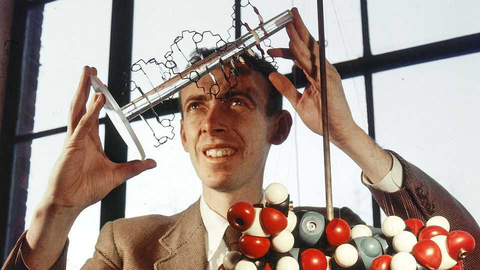
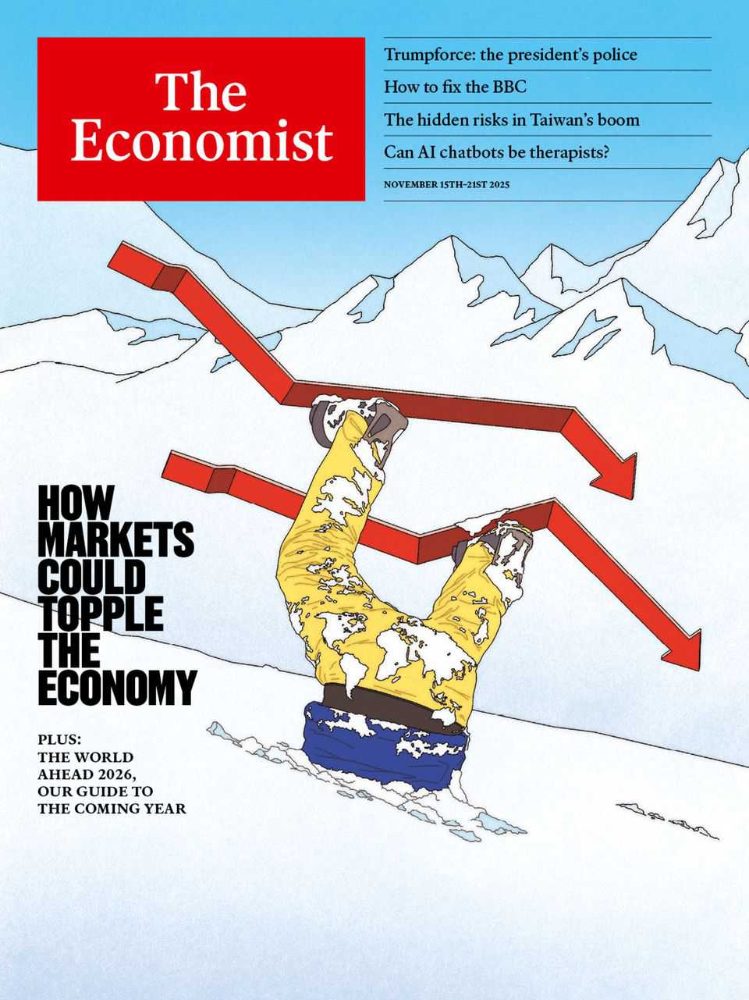

Obituary | The secret of life
James Watson was stunned by the beauty of the double helix
The biologist and co-discoverer of DNA’s structure died on November 6th, aged 97
November 13th 2025

The photograph flicked on the screen for bare seconds, but it put James Watson in a frenzy of excitement. He was in Naples in 1951, at a lecture given by Maurice Wilkins, a physicist working at King’s College, London. What the photo showed was an X-ray diffraction of DNA, the information store of life, which strongly suggested that each molecule had repetitive motifs. Determining what DNA looked like was exactly the problem Dr Watson was about to work on at the Cavendish Laboratory in Cambridge, together with the physicist Francis Crick. There they could build hypothetical models and brew ideas in their heads; but their real need was

for photographs. At the end of the lecture he rushed after Wilkins but, for the moment, he had vanished.

He, Crick and Wilkins were not the only ones obsessed with anatomising DNA. So was Linus Pauling at Caltech, who every so often gave signs that he was going to beat them to it. The race was on to find the key to traits, illnesses, features and inheritance, which would revolutionise both biology and medicine. The fact that the Watson-Crick duo got there first, in 1953 (and, with Wilkins, won the Nobel prize for physiology or medicine in 1962) was the result of hard work, a mad scramble and bad manners.

The bad manners were that he persuaded Wilkins to show him the photograph without asking the permission of the crystallographer, Rosalind Franklin. He didn’t care for “Rosy”, as he and Crick called her. He thought her awkward, possessive and probably sexually repressed. (If only she would take her glasses off and do something with her hair.) Later he liked her better and thought her science first-rate; but that was after she had gracefully conceded that her theories were wrong and his and Crick’s were right.

They were more than right. And they were more than pretty, which was his favourite adjective for a good piece of science (or a good-looking woman). Something as beautiful as the double helix just had to exist. It looked much like a spiral staircase, two twisting sugar-phosphate chains between which the chemical bases, like steps, formed alternate pairings of adenine with thymine and guanine with cytosine. It had taken him a long time to plump for two chains rather than three or four, but that was a deciding factor. As a biologist, whose line of research (when he was not obsessing about DNA) involved sex in bacteria, he knew biological systems tended to come in pairs. And, vitally, that DNA pairing “immediately suggests a possible copying mechanism for the genetic material” as he and Crick laid out briefly, but with utmost speed, in Nature. This molecule could be worked with.

In his Nobel speech he called himself “very much the junior one”. His path to Stockholm had certainly been convoluted. Growing up in Chicago, he wanted only to watch birds. When he read Erwin Schrödinger’s “What is Life?” his interest changed to genes, but he spent a few years avoiding the

chemistry that seemed to be essential. What he chiefly learned at university was that most scientists were stupid; that crap should be called out as crap, and that you could leapfrog over your peers by pursuing an idea that was thought too far ahead of its time. Crick struck him as a man like that, always proclaiming new theories, valid or not, in a voice that was shatteringly loud. His “junior one” liked to provoke him by preferring to spend the rare sunny days in cold, damp Cambridge playing tennis, and not in the lab.

With some relief, because he could not have stomached English food for much longer, most of his work after 1953 was back in the United States. There he oversaw the renaissance of the Cold Spring Harbor Laboratory in New York and the creation of the molecular-biology department at Harvard, which he led from 1961 to 1976. When he first came to Cold Spring Harbor in 1947 it was like a run-down summer camp; under his guidance it became a first-class centre of genetic research, especially into cancer. Meanwhile his Harvard department also explored the paths opened up by the DNA revelations, notably in the treatment of mental illness—now a sharp, personal interest because his second son Rufus, born in 1970, had developed schizophrenia.

It was also because of Rufus that he missed the first meeting, in 1986, of the scientists he had gathered for another momentous project, the mapping of the human genome. He became both its first director and the second person to have his genome fully sequenced, publishing the results free online in 2007 for anyone to use. It was a good way to reinforce the argument he had had in the early 1990s with the head of the National Institutes of Health, who thought that genes should be patented. He believed they never should. His own genome belonged to the world.

By then, however, the scientific world seemed less eager to have it. His straight talk, as he saw it, had been causing wide offence at least since 1968, when his vivid book on the DNA discoveries, “The Double Helix”, came out. His first title had been “Honest Jim”; both Crick and Wilkins persuaded Harvard not to publish it. Portraying Crick as a loudmouth was only the start. He also opined later that most of his colleagues were “pinkos and shits”. He persisted in his belief that women were intellectually deficient. He was sure no mother would want a homosexual child. Fat folk stood no

chance of employment with him; nor did black people, whose IQs were inferior. Though he apologised for that opinion, he went on to repeat it.

As a result, his emeritus positions at Cold Spring Harbor fell away like autumn leaves and his wider reputation dived. This abandonment, after all he had done for science, infuriated him. In high dudgeon, in 2014 he sold his gold Nobel medal, which fetched $4.8m and was at once returned to him by the buyer. In 1962 he had been incandescent when, despite returning to Harvard with a gleaming prize, there was no uplift in his salary. His Nobel medal, now financing his retirement, came good at last. ■

This article was downloaded by zlibrary from https://www.economist.com//obituary/2025/11/13/james-watson-was-stunned-by-the- beauty-of-the-double-helix

Table of Contents

The world this week Politics Business The weekly cartoon The World Ahead The World Ahead 2026 Leaders How markets could topple the global economy The hidden risks in Taiwan’s boom How the exasperating, indispensable BBC must change Mexico’s surprising record on murder How to avoid Africa’s next war Letters How dangerous is life in Syria? By Invitation A human-rights researcher on why she pushed back when China bullied her university Briefing Taiwan’s amazing economic achievements are yielding alarming strains United States See how Donald Trump is creating his own police force Democrats collapsed in the shutdown fight One of the poorest states in America introduces free child care Parents on e-bikes are transforming the school run Florida is running a radical experiment in education Why the Democrats may lose again to Donald Trump The Americas Making Mexico less of a gangster’s paradise Racy fictional depictions of gangs irk people in Latin America Chile heads for a sharp right turn Asia Which is India’s superstar state? A bombing in Delhi raises tensions in the region

South Korea’s new president is fixing relations with America, Japan and China Japanese women are wrestling with sumo’s boundaries Asia’s most treacherous sailing season Kerala can teach India a thing or two about social welfare China America and China share a dangerous addiction China’s growing global fan club The way Uyghurs speak Mandarin is now a joke Tianmen is China’s test site for baby-boosting policies Middle East & Africa Gaza’s zombie ceasefire The dangers beneath Gaza’s rubble Syria’s ex-jihadist president, now Donald Trump’s new bestie Ethiopia is perilously close to another war Europe Half a century after the death of Franco, Spain is a far better place Georgia is dousing the last embers of democracy Even on Ukraine’s front line there is time, and a need, for beauty How Italy’s mafia uses social media to recruit new blood Europe is cracking down on Russian tourists Britain The BBC’s boss quits over a “doctored” Trump speech Labour’s tax-and-spend policy has been dominated by wild gambling British businesses say they are furious with the government Why Britain may have stopped sharing some intelligence with America A slimy scheme to avoid property tax Sir Keir Starmer is a prisoner of the politics he pledged to end International China’s creepiest export surge Beijing insiders’ plan to play Donald Trump Business The seven deadly sins of corporate exuberance How HR took over the world TSMC’s cautious expansion is frustrating the AI industry Libellous chatbots could be AI’s next big legal headache The 10-4 rule for interacting with customers

The costs of dating your boss Elon Musk’s $1trn pay deal highlights companies’ superstar dilemma Finance & economics Recessions have become ultra-rare. That is storing up trouble Old folk are seized by stockmarket mania The problem with America’s shutdown economy How AI is breaking cover letters In defence of personal finance Tree murders and the economics of crime Science & technology Millions are turning to AI for therapy A new project aims to predict how quickly AI will progress Sperm whales communicate with vowels Can peptides give you superpowers? Culture Indian comedians have never been so successful or endangered Is “All’s Fair” really the worst television drama ever made? An affecting chronicle of a man’s death—and his life Francisco Franco: the charmless man who became Spain’s dictator Has culture in the 21st century become samey and dull? The best films of 2025 Economic & financial indicators Economic data, commodities and markets Obituary James Watson was stunned by the beauty of the double helix