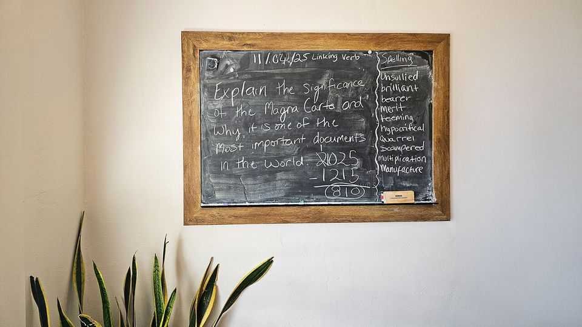

United States | Homeschooling
Florida is running a radical experiment in education
State cash and "unbundled" schools offer parents wide choices
November 13th 2025 
 

LAST MONTH'S Homecoming had a socially enforced uniform: the boys wore suits, the girls sequinned dresses and heels they couldn't walk in. Pop anthems like "Pink Pony Club" and "California Gurls" played as 600 teenagers bounced in unison. By midnight a king and queen were crowned. It had all the trappings of an American high-school ritual, but none of these children attended an actual school. In Tampa, an old southern city with the restless energy of a Florida boomtown, a radical experiment in education is taking place. Parents empowered with $8,000 state vouchers to school their children as they see fit are fuelling a new kind of educational marketplace. It blends traditional 
homeschooling, charter schools and new hyper-specialised "microschools" or "co-ops" that offer unbundled classes on everything from algebra and forestry to karate. The dressing-up ball for untraditional high-schoolers was hosted by one of more than a thousand organisations in the city that help parents curate an à la carte education for their children. 

备注

- <strong><em>Homecoming</em></strong>：/[ˈhəʊmkʌmɪŋ]/ "返校节"；文中用来表达返校节活动，强调这是学校传统；指返校节或校友返校活动。 
- <strong><em>enforced</em></strong>：/[ɪnˈfɔːst]/ "强制的"；文中用来表达社会强制的统一服装，强调这是传统；动词原形是enforce（强制）。 
- <strong><em>sequinned</em></strong>：/[ˈsiːkwɪnd]/ "镶有亮片的"；文中用来表达镶有亮片的连衣裙，强调这是服装；由sequin（亮片）加-ed构成。 
- <strong><em>anthems</em></strong>：/[ˈænθəmz]/ "国歌、赞歌"；文中用来表达流行赞歌，强调这是音乐；由anthem（赞歌）加-s构成。 
- <strong><em>bounced</em></strong>：/[baʊnst]/ "跳跃"；文中用来表达600名青少年一起跳跃，强调这是活动；动词原形是bounce（跳跃）。 
- <strong><em>unison</em></strong>：/[ˈjuːnɪsən]/ "一致"；文中用来表达一致地，强调这是动作；指一致或协调。 
- <strong><em>crowned</em></strong>：/[kraʊnd]/ "加冕"；文中用来表达加冕国王和女王，强调这是活动；动词原形是crown（加冕）。 
- <strong><em>trappings</em></strong>：/[ˈtræpɪŋz]/ "装饰、标志"；文中用来表达美国高中仪式的所有标志，强调这是传统；由trap（陷阱）加-ings构成。 
- <strong><em>ritual</em></strong>：/[ˈrɪtʃuəl]/ "仪式"；文中用来表达高中仪式，强调这是传统；指仪式或典礼。 
- <strong><em>restless</em></strong>：/[ˈrestləs]/ "不安的"；文中用来表达不安的能量，强调这是城市特点；由rest（休息）加-less构成。 
- <strong><em>boomtown</em></strong>：/[ˈbuːmtaʊn]/ "新兴城市"；文中用来表达佛罗里达新兴城市，强调这是城市特点；由boom（繁荣）和town（城市）构成。 
- <strong><em>radical</em></strong>：/[ˈrædɪkəl]/ "激进的"；文中用来表达激进的教育实验，强调这是实验性质；指激进的或根本的。 
- <strong><em>empowered</em></strong>：/[ɪmˈpaʊəd]/ "授权的"；文中用来表达被授权，强调这是政策；动词原形是empower（授权）。 
- <strong><em>vouchers</em></strong>：/[ˈvaʊtʃəz]/ "代金券"；文中用来表达州代金券，强调这是政策；由voucher（代金券）加-s构成。 
- <strong><em>fuelling</em></strong>：/[ˈfjuːəlɪŋ]/ "推动"；文中用来表达推动新的教育市场，强调这是作用；动词原形是fuel（推动）。 
- <strong><em>marketplace</em></strong>：/[ˈmɑːkɪtpleɪs]/ "市场"；文中用来表达教育市场，强调这是新现象；由market（市场）和place（地方）构成。 
- <strong><em>charter schools</em></strong>：/[ˈtʃɑːtə skuːlz]/ "特许学校"；文中用来表达特许学校，强调这是教育类型；charter指特许，schools指学校。 
- <strong><em>hyper-specialised</em></strong>：/[ˈhaɪpə ˈspeʃəlaɪzd]/ "高度专业化的"；文中用来表达高度专业化的微型学校，强调这是新类型；hyper指超，specialised指专业化的。 
- <strong><em>microschools</em></strong>：/[ˈmaɪkrəʊskuːlz]/ "微型学校"；文中用来表达微型学校，强调这是新类型；由micro（微）和schools（学校）构成。 
- <strong><em>co-ops</em></strong>：/[kəʊ ɒps]/ "合作社"；文中用来表达合作社，强调这是新类型；co-op是cooperative的缩写。 
- <strong><em>unbundled</em></strong>：/[ʌnˈbʌndəld]/ "解绑的"；文中用来表达解绑的课程，强调这是特点；由un-（不）和bundled（捆绑的）构成。 
- <strong><em>algebra</em></strong>：/[ˈældʒɪbrə]/ "代数"；文中用来表达代数课程，强调这是课程类型；指代数或代数学。 
- <strong><em>forestry</em></strong>：/[ˈfɒrɪstri]/ "林业"；文中用来表达林业课程，强调这是课程类型；由forest（森林）加-ry构成。 
- <strong><em>karate</em></strong>：/[kəˈrɑːti]/ "空手道"；文中用来表达空手道课程，强调这是课程类型；指空手道或空手道。 
- <strong><em>curate</em></strong>：/[kjʊəˈreɪt]/ "策划"；文中用来表达策划点菜式教育，强调这是活动；指策划或精选。 
- <strong><em>à la carte</em></strong>：/[ɑː lɑː kɑːt]/ "点菜的"；文中用来表达点菜式教育，强调这是特点；来自法语，指点菜的。 
 
In Hillsborough County, where Tampa sits, at least one in every 15 children is homeschooled—more than anywhere else in the state. The typical Florida homeschooler is no longer a mother teaching her children at the kitchen table all alone. Instead, parents now act as general contractors, selecting their children' schooling from a wide range of suppliers and shuttling them between lessons and extra-curricular classes. Many of these pupils have learning disabilities that make conventional school hard. But what is happening in Tampa is much broader. This year the county's public schools lost 7,000 pupils to "deschooling", as well as to more familiar charter, magnet and private schools. 

备注

- <strong><em>homeschooled</em></strong>：/[ˈhəʊmskuːld]/ "在家教育的"；文中用来表达在家教育，强调这是教育方式；由home（家）和schooled（教育的）构成。 
- <strong><em>contractors</em></strong>：/[kənˈtræktəz]/ "承包商"；文中用来表达总承包商，强调这是父母的新角色；由contract（合同）加-or构成。 
- <strong><em>suppliers</em></strong>：/[səˈplaɪəz]/ "供应商"；文中用来表达供应商，强调这是教育提供者；由supply（供应）加-er构成。 
- <strong><em>extra-curricular</em></strong>：/[ˌekstrə kəˈrɪkjʊlə]/ "课外的"；文中用来表达课外课程，强调这是活动；extra指额外的，curricular指课程的。 
- <strong><em>disabilities</em></strong>：/[ˌdɪsəˈbɪlɪtiz]/ "残疾"；文中用来表达学习障碍，强调这是学生特点；由disability（残疾）加-es构成。 
- <strong><em>conventional</em></strong>：/[kənˈvenʃənəl]/ "传统的"；文中用来表达传统学校，强调这是对比；由convention（传统）加-al构成。 
- <strong><em>deschooling</em></strong>：/[diːˈskuːlɪŋ]/ "去学校化"；文中用来表达去学校化，强调这是新现象；由de-（去除）和schooling（学校教育）构成。 
- <strong><em>magnet</em></strong>：/[ˈmæɡnɪt]/ "磁性的"；文中用来表达磁石学校，强调这是学校类型；指磁性的或吸引的。 
 
During the pandemic fed-up parents across America dabbled in homeschooling. But when schools reopened, most sent their children back. In Florida, they didn't. By a conservative estimate, in five years the number of homeschooled pupils jumped by 47%, to 155,000. The surge is a result of statewide policy. In March 2023 lawmakers passed one of America's most expansive school-choice programmes. The cash it provides to subsidise parental choice is available regardless of a family's income. 

备注

- <strong><em>fed-up</em></strong>：/[fed ʌp]/ "厌倦的"；文中用来表达厌倦的父母，强调这是原因；fed-up是固定短语，指厌倦的。 
- <strong><em>dabbled</em></strong>：/[ˈdæbəld]/ "涉足"；文中用来表达涉足在家教育，强调这是尝试；动词原形是dabble（涉足）。 
- <strong><em>conservative</em></strong>：/[kənˈsɜːvətɪv]/ "保守的"；文中用来表达保守估计，强调这是数据；指保守的或谨慎的。 
- <strong><em>surge</em></strong>：/[sɜːdʒ]/ "激增"；文中用来表达激增，强调这是增长；指激增或急剧上升。 
- <strong><em>statewide</em></strong>：/[ˈsteɪtwaɪd]/ "全州的"；文中用来表达全州政策，强调这是范围；由state（州）和wide（广泛的）构成。 
- <strong><em>expansive</em></strong>：/[ɪkˈspænsɪv]/ "广泛的"；文中用来表达最广泛的择校计划，强调这是规模；由expand（扩展）加-ive构成。 
- <strong><em>subsidise</em></strong>：/[ˈsʌbsɪdaɪz]/ "补贴"；文中用来表达补贴父母选择，强调这是政策；指补贴或资助。 
- <strong><em>regardless of</em></strong>：/[rɪˈɡɑːdləs ɒv]/ "无论"；文中用来表达无论家庭收入，强调这是政策特点；regardless of是固定短语，指无论。 
 
At Urban Cottage, an unusually good microschool in a gentrifying part of Tampa, pupils drop in for Montessori classes. For a few hours a day they learn to read with phonics, to write in cursive and to add and subtract with wooden bead frames. Teachers drift between the small rooms of the renovated house, where pupils label maps of South America and discuss the importance of the Magna Carta. "The only moms working here have advanced degrees in their fields," says Marissa Hess, a former public-school teacher who runs it. 

备注

- <strong><em>gentrifying</em></strong>：/[ˈdʒentrɪfaɪɪŋ]/ "中产阶级化的"；文中用来表达中产阶级化的地区，强调这是地点；动词原形是gentrify（中产阶级化）。 
- <strong><em>drop in</em></strong>：/"顺便拜访"；文中用来表达顺便来上课，强调这是灵活性；drop in是固定短语，指顺便拜访。 
- <strong><em>Montessori</em></strong>：/[ˌmɒntɪˈsɔːri]/ "蒙台梭利"；文中用来表达蒙台梭利课程，强调这是教学方法；指蒙台梭利教育法。 
- <strong><em>phonics</em></strong>：/[ˈfɒnɪks]/ "语音学"；文中用来表达用语音学学习阅读，强调这是教学方法；指语音学或自然拼读法。 
- <strong><em>cursive</em></strong>：/[ˈkɜːsɪv]/ "草书"；文中用来表达用草书写字，强调这是教学内容；指草书或连笔字。 
- <strong><em>bead frames</em></strong>：/[biːd freɪmz]/ "算盘"；文中用来表达木制算盘，强调这是教学工具；bead指珠子，frames指框架。 
- <strong><em>drift</em></strong>：/[drɪft]/ "漂移"；文中用来表达教师在小房间之间漂移，强调这是教学方式；指漂移或流动。 
- <strong><em>renovated</em></strong>：/[ˈrenəveɪtɪd]/ "翻新的"；文中用来表达翻新的房子，强调这是地点；动词原形是renovate（翻新）。 
- <strong><em>label</em></strong>：/[ˈleɪbəl]/ "标记"；文中用来表达标记地图，强调这是活动；指标记或标签。 
- <strong><em>Magna Carta</em></strong>：/[ˈmæɡnə ˈkɑːtə]/ "大宪章"；文中用来表达大宪章的重要性，强调这是教学内容；指英国大宪章。 
- <strong><em>advanced degrees</em></strong>：/[ədˈvɑːnst dɪˈɡriːz]/ "高级学位"；文中用来表达高级学位，强调这是教师资质；advanced指高级的，degrees指学位。 
 
Other options are wackier. At Tampa Covenant, a co-op run in a church, families choose from a menu of lessons and clubs for young pupils, including one called "Before Personal Finance" and another on Dungeons & Dragons, a fantasy game. Outside the city, farm schools teach children to 
tend cattle. Most families mix courses with home study—the Good and the Beautiful, a Mormon curriculum, is a popular one. Many parents are seeking more family time, play and fresh air. A pair of philosophy professors chose homeschooling because they believe they can spark a deeper love of learning than a teacher in an overcrowded classroom. 

备注

- <strong><em>wackier</em></strong>：/[ˈwækiə]/ "更古怪的"；文中用来表达更古怪的选择，强调这是多样性；由wacky（古怪的）加-er构成。 
- <strong><em>Covenant</em></strong>：/[ˈkʌvənənt]/ "盟约"；文中用来表达Tampa盟约，强调这是组织名称；指盟约或契约。 
- <strong><em>menu</em></strong>：/[ˈmenjuː]/ "菜单"；文中用来表达课程菜单，强调这是选择方式；指菜单或列表。 
- <strong><em>Dungeons & Dragons</em></strong>：/[ˈdʌndʒənz ænd ˈdræɡənz]/ "龙与地下城"；文中用来表达龙与地下城游戏，强调这是课程内容；指角色扮演游戏。 
- <strong><em>fantasy</em></strong>：/[ˈfæntəsi]/ "幻想的"；文中用来表达幻想游戏，强调这是类型；指幻想的或想象的。 
- <strong><em>tend</em></strong>：/[tend]/ "照料"；文中用来表达照料牛，强调这是教学内容；指照料或管理。 
- <strong><em>curriculum</em></strong>：/[kəˈrɪkjʊləm]/ "课程"；文中用来表达摩门教课程，强调这是课程类型；指课程或教学大纲。 
- <strong><em>spark</em></strong>：/[spɑːk]/ "激发"；文中用来表达激发更深的爱，强调这是目标；指激发或引发。 
- <strong><em>overcrowded</em></strong>：/[ˌəʊvəˈkraʊdɪd]/ "过度拥挤的"；文中用来表达过度拥挤的教室，强调这是问题；由over（过度）和crowded（拥挤的）构成。 
 
The unbundling of education is shaking up the school system. Conventional schools want to join in. Private ones now offer "homeschooling days", where pupils can come in one day a week. Public schools allow families to pay to enroll in individual courses like statistics, or play on the football team. "We haven't had to market our traditional schools in the past and now we have to," says Howard Hepburn, the superintendent of Broward County public schools, Florida's second-biggest district. 

备注

- <strong><em>unbundling</em></strong>：/[ʌnˈbʌndlɪŋ]/ "解绑"；文中用来表达教育的解绑，强调这是变化；由un-（不）和bundling（捆绑）构成。 
- <strong><em>shaking up</em></strong>：/"震动"；文中用来表达震动学校系统，强调这是影响；shake up是固定短语，指震动。 
- <strong><em>enroll</em></strong>：/[ɪnˈrəʊl]/ "注册"；文中用来表达注册个别课程，强调这是选择；指注册或登记。 
- <strong><em>statistics</em></strong>：/[stəˈtɪstɪks]/ "统计学"；文中用来表达统计学课程，强调这是课程类型；指统计学或统计数据。 
- <strong><em>superintendent</em></strong>：/[ˌsuːpərɪnˈtendənt]/ "主管"；文中用来表达学区主管，强调这是职位；指主管或负责人。 
 
Education researchers worry about these changes, especially as other states with similar politics look to Florida as the schooling frontier. They reckon some of the rules are far too lax. On a Facebook group for parents navigating the state subsidy system, anonymous users trade tips on getting Netflix subscriptions, Disney World passes and home-gyms reimbursed as "educational materials". 

备注

- <strong><em>frontier</em></strong>：/[ˈfrʌntɪə]/ "前沿"；文中用来表达教育前沿，强调这是地位；指前沿或边界。 
- <strong><em>reckon</em></strong>：/[ˈrekən]/ "认为"；文中用来表达认为，强调这是观点；指认为或估计。 
- <strong><em>lax</em></strong>：/[læks]/ "宽松的"；文中用来表达规则太宽松，强调这是问题；指宽松的或松懈的。 
- <strong><em>navigating</em></strong>：/[ˈnævɪɡeɪtɪŋ]/ "导航"；文中用来表达导航州补贴系统，强调这是活动；动词原形是navigate（导航）。 
- <strong><em>subsidy</em></strong>：/[ˈsʌbsɪdi]/ "补贴"；文中用来表达州补贴系统，强调这是政策；指补贴或补助。 
- <strong><em>anonymous</em></strong>：/[əˈnɒnɪməs]/ "匿名的"；文中用来表达匿名用户，强调这是特点；指匿名的或无名的。 
- <strong><em>trade</em></strong>：/[treɪd]/ "交换"；文中用来表达交换技巧，强调这是活动；指交换或交易。 
- <strong><em>subscriptions</em></strong>：/[səbˈskrɪpʃənz]/ "订阅"；文中用来表达Netflix订阅，强调这是被报销的内容；由subscribe（订阅）加-ion构成。 
- <strong><em>reimbursed</em></strong>：/[ˌriːɪmˈbɜːst]/ "报销"；文中用来表达被报销，强调这是滥用；动词原形是reimburse（报销）。 
 
That might be less concerning if it were clear pupils were mastering the basics. While most states (but not Florida) require homeschoolers to teach core subjects like math, reading, and history, in practice they don't enforce it, says Angela Watson of Johns Hopkins University. 

备注

- <strong><em>mastering</em></strong>：/[ˈmɑːstərɪŋ]/ "掌握"；文中用来表达掌握基础知识，强调这是期望；动词原形是master（掌握）。 
- <strong><em>basics</em></strong>：/[ˈbeɪsɪks]/ "基础知识"；文中用来表达基础知识，强调这是期望；由basic（基础的）加-s构成。 
- <strong><em>core</em></strong>：/[kɔː]/ "核心的"；文中用来表达核心科目，强调这是要求；指核心的或中心的。 
- <strong><em>enforce</em></strong>：/[ɪnˈfɔːs]/ "执行"；文中用来表达不执行，强调这是问题；指执行或实施。 
 
Test-score data should make clear who is learning critical skills and who is not. But homeschoolers' exam results are rarely, if ever, published. "I don't see why we should be using public funds to pay for an education that lacks real quality control," says Jon Valant of the Brookings Institution, a think- tank. Sheela VanHoose, an education lobbyist in Tallahassee, reckons that there is "going to have to be a fix bill" to fill some of Florida's gaps. 

备注

- <strong><em>critical</em></strong>：/[ˈkrɪtɪkəl]/ "关键的"；文中用来表达关键技能，强调这是重要性；指关键的或重要的。 
- <strong><em>think-tank</em></strong>：/[θɪŋk tæŋk]/ "智库"；文中用来表达智库，强调这是机构；think指思考，tank指坦克。 
- <strong><em>lobbyist</em></strong>：/[ˈlɒbiɪst]/ "游说者"；文中用来表达教育游说者，强调这是职业；由lobby（游说）加-ist构成。 
- <strong><em>fix bill</em></strong>：/[fɪks bɪl]/ "修正法案"；文中用来表达修正法案，强调这是需要；fix指修正，bill指法案。 
 
Ms Hess says stricter rules won't help. She opened Urban Cottage because she saw children slipping in schools and was fed up with how little freedom teachers had to be creative. "The American public school is the most regulated institution in America, and over the past 30 years it failed us," she says. Today, nearly half the country's pupils are below grade level. She 
believes unbridled capitalism is the best remedy—and that if it works in Florida, the rest of America will follow. ■ 

备注

- <strong><em>stricter</em></strong>：/[ˈstrɪktə]/ "更严格的"；文中用来表达更严格的规则，强调这是观点；由strict（严格的）加-er构成。 
- <strong><em>slipping</em></strong>：/[ˈslɪpɪŋ]/ "下滑"；文中用来表达看到孩子在学校下滑，强调这是问题；动词原形是slip（下滑）。 
- <strong><em>regulated</em></strong>：/[ˈreɡjʊleɪtɪd]/ "受监管的"；文中用来表达最受监管的机构，强调这是问题；动词原形是regulate（监管）。 
- <strong><em>institution</em></strong>：/[ˌɪnstɪˈtjuːʃən]/ "机构"；文中用来表达机构，强调这是对比；指机构或组织。 
- <strong><em>grade level</em></strong>：/[ɡreɪd ˈlevəl]/ "年级水平"；文中用来表达年级水平以下，强调这是问题；grade指年级，level指水平。 
- <strong><em>unbridled</em></strong>：/[ʌnˈbraɪdəld]/ "不受约束的"；文中用来表达不受约束的资本主义，强调这是解决方案；由un-（不）和bridled（受约束的）构成。 
- <strong><em>remedy</em></strong>：/[ˈremədi]/ "补救措施"；文中用来表达最好的补救措施，强调这是解决方案；指补救措施或治疗方法。 
 
Stay on top of American politics with The US in brief, our daily newsletter with fast analysis of the most important political news, and Checks and Balance, a weekly note from our Lexington columnist that examines the state of American democracy and the issues that matter to voters. 
This article was downloaded by zlibrary from https://www.economist.com//united-states/2025/11/13/florida-is-running-a-radical- experiment-in-education 
