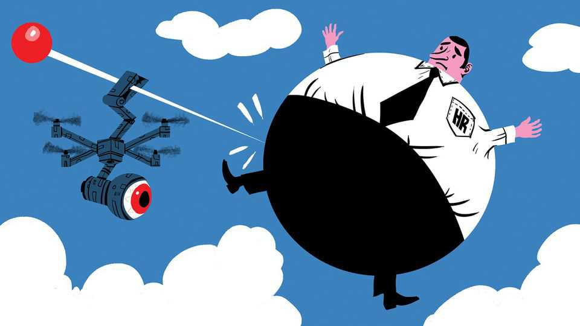
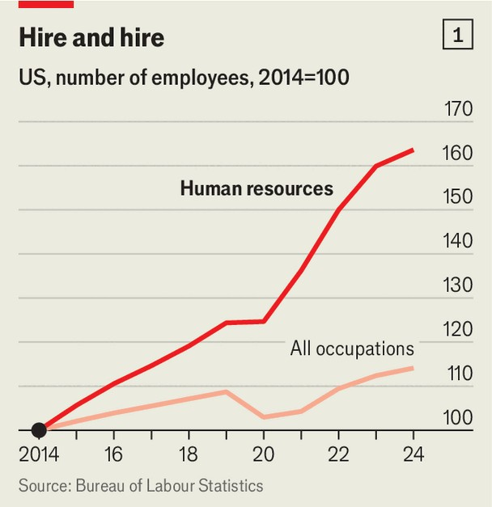
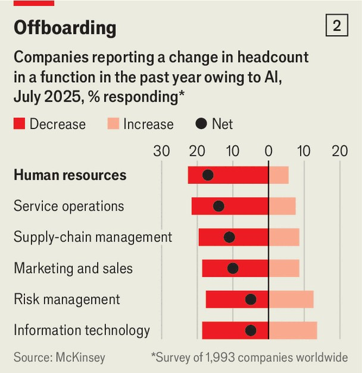

Business | Rise of the people people
How HR took over the world
The profession has rocketed in size and stature. Will AI shrink it?
November 13th 2025 
 

Bit by bit, HR is taking over corporate life. The ranks of human-resources professionals across the rich world are swelling. Their roles are expanding. And some are still insisting that you complete your unconscious-bias training. In 2024 American businesses employed 1.3m HR professionals, up by 64% in ten years, compared with 14% growth for overall employment (see chart 1). The trend is also evident in Australia, Britain and Germany. HR has moved up the office pecking order, too. A study by Nick Bloom and Mert Akan of Stanford University shows that the pay of chief human-resources officers (CHROs) has grown relative to that of other senior executives. In 1992 their total compensation (including bonuses and stock options) was 
40% of the average director's salary (excluding chief executives). By 2022 that figure had risen to 70%. More CHROs have also been moving into the corner office. Mary Barra, the boss of General Motors, previously held the carmaker's top HR job. Firms such as Dunkin' Brands, a doughnut specialist, have also given the top job to HR gurus. 

备注

- <strong><em>corporate</em></strong>：/[ˈkɔːpərət]/ "公司的、企业的"；文中用来表达企业生活，强调HR正在接管企业生活；指公司的或企业的。 
- <strong><em>ranks</em></strong>：/[ræŋks]/ "队伍、行列"；文中用来表达人力资源专业人员的队伍，强调人数增加；指队伍或行列。 
- <strong><em>swelling</em></strong>：/[ˈswelɪŋ]/ "膨胀、增长"；文中用来表达HR专业人员队伍在增长，强调数量增加；动词原形是swell（膨胀）。 
- <strong><em>unconscious-bias</em></strong>：/[ʌnˈkɒnʃəs ˈbaɪəs]/ "无意识偏见"；文中用来表达无意识偏见培训，强调这是HR要求完成的培训；unconscious指无意识的，bias指偏见。 
- <strong><em>pecking order</em></strong>：/[ˈpekɪŋ ˈɔːdə]/ "等级秩序"；文中用来表达HR在办公室的等级地位上升，强调其重要性提升；固定短语，指等级秩序。 
- <strong><em>compensation</em></strong>：/[ˌkɒmpənˈseɪʃən]/ "薪酬、补偿"；文中用来表达CHRO的总薪酬，强调包括奖金和股票期权；指薪酬或补偿。 
- <strong><em>bonuses</em></strong>：/[ˈbəʊnəsɪz]/ "奖金"；文中用来表达薪酬包括奖金，强调这是薪酬的一部分；由bonus（奖金）加-es构成。 
- <strong><em>stock options</em></strong>：/[stɒk ˈɒpʃənz]/ "股票期权"；文中用来表达薪酬包括股票期权，强调这是高管薪酬的一部分；stock指股票，options指期权。 
- <strong><em>corner office</em></strong>：/[ˈkɔːnə ˈɒfɪs]/ "角落办公室"；文中用来表达CHRO进入最高管理层，强调这是最高职位；固定短语，指最高管理层的办公室。 
- <strong><em>gurus</em></strong>：/[ˈɡʊruːz]/ "大师、专家"；文中用来表达HR专家，强调这些人是HR领域的权威；来自梵语，指大师或专家。 
 
Various forces are behind HR's rise. One is the growing value of top talent. In an annual global survey by Manpower Group, a recruiter, 74% of firms said this year that they were experiencing a shortage of skilled labour, up from 38% a decade ago. Ageing populations and technologies such as artificial intelligence, which require new skills, are among the causes. 

备注

- <strong><em>talent</em></strong>：/[ˈtælənt]/ "人才"；文中用来表达顶级人才的价值增长，强调这是HR崛起的原因之一；指人才或才能。 
- <strong><em>recruiter</em></strong>：/[rɪˈkruːtə]/ "招聘公司"；文中用来指Manpower Group是招聘公司，强调这是专业机构；由recruit（招聘）加-er构成。 
- <strong><em>shortage</em></strong>：/[ˈʃɔːtɪdʒ]/ "短缺"；文中用来表达企业面临熟练劳动力短缺，强调这是HR崛起的原因；由short（短的）加-age构成。 
- <strong><em>skilled labour</em></strong>：/[skɪld ˈleɪbə]/ "熟练劳动力"；文中用来表达熟练劳动力短缺，强调这是企业面临的问题；skilled指熟练的，labour指劳动力。 
- <strong><em>ageing</em></strong>：/[ˈeɪdʒɪŋ]/ "老龄化"；文中用来表达人口老龄化，强调这是劳动力短缺的原因之一；由age（年龄）加-ing构成。 
 
A string of disruptions to work has also elevated HR. It has been a "non-stop game day", says Emilie Petrone of Korn Ferry, an HR consultancy. The
#MeToo movement shone a spotlight on office harassment. The covid-19
pandemic meant HR staff had to manage a shift to remote working while monitoring employees' wellbeing. Work-from-home policies and return-to- office mandates followed. Then came the rise of diversity, equity and inclusivity (DEI) initiatives. For a profession that is "prone to scramble around for fashions and fads", as one HR director puts it, DEI brought plenty to deal with, from micro-aggressions to non-gendered toilets. 

备注

- <strong><em>disruptions</em></strong>：/[dɪsˈrʌpʃənz]/ "中断、破坏"；文中用来表达一系列工作中断，强调这些事件提升了HR的重要性；由disrupt（中断）加-ion构成。 
- <strong><em>elevated</em></strong>：/[ˈelɪveɪtɪd]/ "提升、提高"；文中用来表达这些中断提升了HR的地位，强调HR的重要性增加；动词原形是elevate（提升）。 
- <strong><em>consultancy</em></strong>：/[kənˈsʌltənsi]/ "咨询公司"；文中用来指Korn Ferry是HR咨询公司，强调这是专业机构；由consult（咨询）加-ancy构成。 
- <strong><em>spotlight</em></strong>：/[ˈspɒtlaɪt]/ "聚光灯、关注"；文中用来表达#MeToo运动将关注聚焦到职场骚扰，强调这是重要事件；由spot（点）和light（光）构成。 
- <strong><em>harassment</em></strong>：/[ˈhærəsmənt]/ "骚扰"；文中用来表达职场骚扰，强调这是#MeToo运动关注的问题；由harass（骚扰）加-ment构成。 
- <strong><em>wellbeing</em></strong>：/[ˈwelbiːɪŋ]/ "健康、福祉"；文中用来表达员工的健康福祉，强调HR需要监控员工状态；由well（好的）和being（存在）构成。 
- <strong><em>mandates</em></strong>：/[ˈmændeɪts]/ "命令、要求"；文中用来表达返回办公室的要求，强调这是HR需要管理的政策；由mandate（命令）加-s构成。 
- <strong><em>diversity</em></strong>：/[dɪˈvɜːsɪti]/ "多样性"；文中用来表达多样性、公平和包容性倡议，强调这是HR需要处理的新议题；由diverse（多样的）加-ity构成。 
- <strong><em>equity</em></strong>：/[ˈekwɪti]/ "公平"；文中用来表达公平性，强调这是DEI倡议的一部分；指公平或公正。 
- <strong><em>inclusivity</em></strong>：/[ɪnkluːˈsɪvɪti]/ "包容性"；文中用来表达包容性，强调这是DEI倡议的一部分；由inclusive（包容的）加-ity构成。 
- <strong><em>initiatives</em></strong>：/[ɪˈnɪʃətɪvz]/ "倡议、措施"；文中用来表达DEI倡议，强调这是HR需要处理的新措施；由initiate（发起）加-ive构成。 
- <strong><em>prone to</em></strong>：/[prəʊn tuː]/ "倾向于"；文中用来表达HR职业倾向于追逐时尚和潮流，强调这个职业的特点；prone to是固定短语，指倾向于。 
- <strong><em>scramble</em></strong>：/[ˈskræmbəl]/ "争夺、匆忙"；文中用来表达HR职业匆忙追逐时尚，强调其特点；指争夺或匆忙。 
- <strong><em>fads</em></strong>：/[fædz]/ "时尚、潮流"；文中用来表达时尚和潮流，强调HR职业的特点；指短暂的时尚。 
- <strong><em>micro-aggressions</em></strong>：/[ˈmaɪkrəʊ əˈɡreʃənz]/ "微侵犯"；文中用来表达微侵犯，强调这是DEI需要处理的问题之一；micro指微小的，aggressions指侵犯。 
- <strong><em>non-gendered</em></strong>：/[nɒn ˈdʒendəd]/ "非性别的"；文中用来表达非性别厕所，强调这是DEI倡议的一部分；由non-（非）和gendered（性别的）构成。 

 

Other factors have also contributed to HR's rise. State governments in America are enacting more rules on matters such as sick leave and minimum wages, increasing the compliance burden for companies. Employees seem better informed about their rights as well—and happier to complain. In American workplaces the average number of allegations of discrimination or harassment jumped from 6 per 1,000 employees in 2021 to 15 last year, according to a survey by HR Acuity, a software provider. 

备注

- <strong><em>enacting</em></strong>：/[ɪˈnæktɪŋ]/ "制定、颁布"；文中用来表达州政府制定更多规则，强调这是HR崛起的原因；动词原形是enact（制定）。 
- <strong><em>sick leave</em></strong>：/[sɪk liːv]/ "病假"；文中用来表达病假规则，强调这是政府制定的规则之一；sick指生病的，leave指假期。 
- <strong><em>minimum wages</em></strong>：/[ˈmɪnɪməm ˈweɪdʒɪz]/ "最低工资"；文中用来表达最低工资规则，强调这是政府制定的规则之一；minimum指最低的，wages指工资。 
- <strong><em>compliance</em></strong>：/[kəmˈplaɪəns]/ "合规、遵守"；文中用来表达合规负担，强调公司需要遵守更多规则；由comply（遵守）加-ance构成。 
- <strong><em>burden</em></strong>：/[ˈbɜːdən]/ "负担"；文中用来表达合规负担，强调公司面临的负担增加；指负担或重担。 
- <strong><em>allegations</em></strong>：/[ˌælɪˈɡeɪʃənz]/ "指控、投诉"；文中用来表达歧视或骚扰的投诉数量，强调员工更愿意投诉；由allege（指控）加-ation构成。 
- <strong><em>discrimination</em></strong>：/[dɪˌskrɪmɪˈneɪʃən]/ "歧视"；文中用来表达歧视投诉，强调这是职场问题；由discriminate（歧视）加-ion构成。 
- <strong><em>Acuity</em></strong>：/[əˈkjuːɪti]/ "敏锐度"；文中用来指HR Acuity软件公司，强调这是数据来源；指敏锐度或清晰度。 
 
Yet there are signs that the HR boom could soon turn to bust. America's labour market has been characterised by low hiring and low firing for much of the past year, meaning less work for HR. Now lay-offs have jumped. According to Challenger, Gray & Christmas, an outplacement firm, the number of lay-offs announced reached more than 153,000 in October, the highest since the pandemic. While that may give HR teams plenty of paperwork to do, some are finding themselves part of the cull. Amazon, an e-commerce giant, is said to have included many HR roles in the 14,000 jobs it cut last month. Meanwhile, at least in America, enthusiasm for DEI has faded amid complaints of "wokeness". 

备注

- <strong><em>boom</em></strong>：/[buːm]/ "繁荣"；文中用来表达HR的繁荣，强调这可能即将结束；指繁荣或快速增长。 
- <strong><em>bust</em></strong>：/[bʌst]/ "破产、崩溃"；文中用来表达HR繁荣可能转为崩溃，强调可能的下滑；指破产或崩溃。 
- <strong><em>characterised</em></strong>：/[ˈkærɪktəraɪzd]/ "以...为特征"；文中用来表达劳动力市场的特征，强调低招聘和低解雇；动词原形是characterise（以...为特征）。 
- <strong><em>lay-offs</em></strong>：/[leɪ ɒfs]/ "裁员"；文中用来表达裁员数量增加，强调这是HR面临的挑战；固定短语，指裁员。 
- <strong><em>outplacement</em></strong>：/[ˈaʊtpleɪsmənt]/ "再就业服务"；文中用来表达再就业服务公司，强调这是专业机构；由out（外）和placement（安置）构成。 
- <strong><em>paperwork</em></strong>：/[ˈpeɪpəwɜːk]/ "文书工作"；文中用来表达HR团队需要处理大量文书工作，强调裁员带来的工作量；由paper（纸）和work（工作）构成。 
- <strong><em>cull</em></strong>：/[kʌl]/ "淘汰、削减"；文中用来表达HR人员自己也成为被淘汰的一部分，强调HR也面临裁员；指淘汰或削减。 
- <strong><em>e-commerce</em></strong>：/[iː ˈkɒmɜːs]/ "电子商务"；文中用来表达亚马逊是电商巨头，强调这是大型公司；由e-（电子）和commerce（商业）构成。 
- <strong><em>faded</em></strong>：/[ˈfeɪdɪd]/ "消退、减弱"；文中用来表达对DEI的热情消退，强调趋势变化；动词原形是fade（消退）。 
- <strong><em>wokeness</em></strong>：/[ˈwəʊknəs]/ "觉醒主义"；文中用来表达对"觉醒主义"的抱怨，强调这是DEI热情消退的原因；由woke（觉醒的）加-ness构成。 
 
AI may make matters worse. For now, HR teams are busy retraining staff and hiring AI whizzes. Moderna, a drugmaker, has even merged its IT and HR functions, under the leadership of the former CHRO. 

备注

- <strong><em>retraining</em></strong>：/[riːˈtreɪnɪŋ]/ "再培训"；文中用来表达HR团队忙于再培训员工，强调这是应对AI的方式；由re-（重新）和training（培训）构成。 
- <strong><em>whizzes</em></strong>：/[wɪzɪz]/ "专家、能手"；文中用来表达AI专家，强调HR需要招聘AI人才；whiz指专家或能手。 
- <strong><em>drugmaker</em></strong>：/[ˈdrʌɡmeɪkə]/ "制药公司"；文中用来表达Moderna是制药公司，强调这是行业背景；由drug（药物）和maker（制造者）构成。 
- <strong><em>merged</em></strong>：/[mɜːdʒd]/ "合并"；文中用来表达Moderna合并了IT和HR职能，强调这是应对AI的方式；动词原形是merge（合并）。 
- <strong><em>functions</em></strong>：/[ˈfʌŋkʃənz]/ "职能、功能"；文中用来表达IT和HR的职能，强调这是组织结构的改变；由function（职能）加-s构成。 

 

In the long run, however, many HR tasks may be farmed out to AI. Companies already use the technology to scan through piles of CVs and create chatbots that can answer employees' questions. In a survey published this month, McKinsey, another consultancy, asked companies around the world how headcount had changed across various business functions over the past year as a result of AI. Fully 22% of respondents said that it had led to a decrease in the number of HR workers, more than for any other function, with only 5% saying it had led to an increase (see chart 2). For the people people, the rise of the machines looks like bad news. ■ 

备注

- <strong><em>farmed out</em></strong>：/[fɑːmd aʊt]/ "外包"；文中用来表达HR任务可能被外包给AI，强调AI对HR的威胁；farm out是固定短语，指外包。 
- <strong><em>scan through</em></strong>：/"浏览、扫描"；文中用来表达公司使用AI浏览大量简历，强调AI的应用；scan through是固定短语，指浏览。 
- <strong><em>piles</em></strong>：/[paɪlz]/ "堆、大量"；文中用来表达大量简历，强调数量之多；指堆或大量。 
- <strong><em>CVs</em></strong>：/[siː viːz]/ "简历"；文中用来表达简历，强调AI用于筛选简历；CV是curriculum vitae的缩写，指简历。 
- <strong><em>chatbots</em></strong>：/[ˈtʃætbɒts]/ "聊天机器人"；文中用来表达AI聊天机器人，强调AI可以回答员工问题；由chat（聊天）和bot（机器人）构成。 
- <strong><em>headcount</em></strong>：/[ˈhedkaʊnt]/ "员工数量"；文中用来表达员工数量变化，强调AI对HR人员数量的影响；由head（头）和count（计数）构成。 
- <strong><em>respondents</em></strong>：/[rɪˈspɒndənts]/ "受访者"；文中用来表达调查的受访者，强调这是数据来源；由respond（回应）加-ent构成。 
- <strong><em>decrease</em></strong>：/[dɪˈkriːs]/ "减少"；文中用来表达HR人员数量减少，强调AI的负面影响；指减少或下降。 
 
To stay on top of the biggest stories in business and technology, sign up to the Bottom Line, our weekly subscriber-only newsletter. 
This article was downloaded by zlibrary from [https://www.economist.com//business/2025/11/10/how-hr-took-over-the-world](https://www.economist.com//business/2025/11/10/how-hr-took-over-the-world) 
