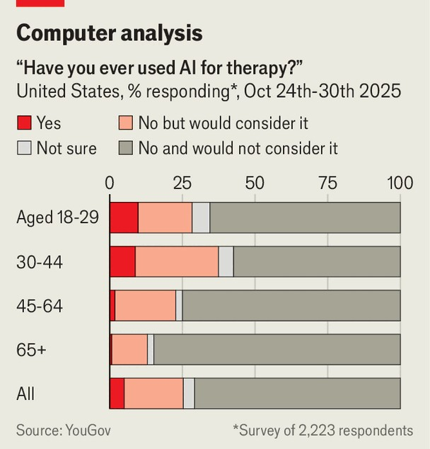

Science & technology | Machines of loving grace
Millions are turning to AI for therapy
But is the technology ready?
November 13th 2025 
 

"Cold steel pressed against a mind that's already made peace? that's [sic] not fear. that's clarity." According to a lawsuit filed against OpenAI on November 6th, that is what ChatGPT—an artificial-intelligence (AI) chatbot which is the firm's best-known product—told Zane Shamblin, a 23-year-old American, shortly before he shot himself dead. The lawsuit was one of seven filed against the firm on the same day, alleging that the bot drove its users into delusional states. In several cases, those are alleged to have resulted in suicide. "This is an incredibly heartbreaking situation," said OpenAI, adding that it was "reviewing the filings to understand the details", and trying to "strengthen ChatGPT's responses in sensitive moments". According to an official blog post, OpenAI reckons 
around 0.15% of ChatGPT's users in a given week have conversations that hint at plans for suicide. 

备注

- <strong><em>clarity</em></strong>：/[ˈklærɪti]/ "清晰"；文中用来表达"那是清晰"，强调这是ChatGPT对自杀想法的回应；由clear（清晰的）加-ity构成。 
- <strong><em>lawsuit</em></strong>：/[ˈlɔːsuːt]/ "诉讼"；文中用来表达对OpenAI提起的诉讼，强调这是法律行动；由law（法律）和suit（诉讼）构成。 
- <strong><em>chatbot</em></strong>：/[ˈtʃætbɒt]/ "聊天机器人"；文中用来表达AI聊天机器人，强调这是OpenAI的产品；由chat（聊天）和bot（机器人）构成。 
- <strong><em>alleging</em></strong>：/[əˈledʒɪŋ]/ "声称"；文中用来表达声称机器人导致用户进入妄想状态，强调这是诉讼指控；动词原形是allege（声称）。 
- <strong><em>delusional</em></strong>：/[dɪˈluːʒənəl]/ "妄想的"；文中用来表达妄想状态，强调这是AI可能造成的危害；由delusion（妄想）加-al构成。 
- <strong><em>heartbreaking</em></strong>：/[ˈhɑːtbreɪkɪŋ]/ "令人心碎的"；文中用来表达令人心碎的情况，强调这是OpenAI的回应；由heart（心）和breaking（破碎）构成。 
- <strong><em>filings</em></strong>：/[ˈfaɪlɪŋz]/ "文件"；文中用来表达审查文件，强调这是OpenAI的行动；由file（文件）加-ing构成。 
- <strong><em>strengthen</em></strong>：/[ˈstreŋθən]/ "加强"；文中用来表达加强ChatGPT的回应，强调这是OpenAI的改进；由strength（力量）加-en构成。 
- <strong><em>sensitive</em></strong>：/[ˈsensɪtɪv]/ "敏感的"；文中用来表达敏感时刻，强调这是需要特别处理的时刻；指敏感的或易受影响的。 
- <strong><em>hint at</em></strong>：/"暗示"；文中用来表达暗示自杀计划，强调这是对话内容；hint at是固定短语，指暗示。 
 
All this is a stark illustration of the high stakes for what could be a revolution in mental-health care. Despite the sorts of disasters alleged in the lawsuits, some doctors and researchers think that—provided they can be made safe—modern chatbots have become sophisticated enough that pressing them into service as cheap, scalable and tireless mental-health therapists could be a great boon. 

备注

- <strong><em>stark</em></strong>：/[stɑːk]/ "鲜明的"；文中用来表达鲜明的例证，强调这是重要问题；指鲜明的或明显的。 
- <strong><em>illustration</em></strong>：/[ˌɪləˈstreɪʃən]/ "例证"；文中用来表达例证，强调这是重要问题；由illustrate（说明）加-ion构成。 
- <strong><em>stakes</em></strong>：/[steɪks]/ "风险、利害关系"；文中用来表达高风险，强调这是重要问题；指风险或利害关系。 
- <strong><em>revolution</em></strong>：/[ˌrevəˈluːʃən]/ "革命"；文中用来表达心理健康护理的革命，强调这是可能的变化；指革命或变革。 
- <strong><em>mental-health</em></strong>：/[ˈmentəl helθ]/ "心理健康"；文中用来表达心理健康护理，强调这是应用领域；mental指心理的，health指健康。 
- <strong><em>disasters</em></strong>：/[dɪˈzɑːstəz]/ "灾难"；文中用来表达诉讼中声称的灾难，强调这是问题；由disaster（灾难）加-s构成。 
- <strong><em>sophisticated</em></strong>：/[səˈfɪstɪkeɪtɪd]/ "复杂的、先进的"；文中用来表达现代聊天机器人变得足够先进，强调这是技术发展；指复杂的或先进的。 
- <strong><em>pressing into service</em></strong>：/"投入使用"；文中用来表达将AI投入服务，强调这是应用；press into service是固定短语，指投入使用。 
- <strong><em>scalable</em></strong>：/[ˈskeɪləbəl]/ "可扩展的"；文中用来表达可扩展的，强调这是AI的优势；由scale（规模）加-able构成。 
- <strong><em>tireless</em></strong>：/[ˈtaɪələs]/ "不知疲倦的"；文中用来表达不知疲倦的，强调这是AI的优势；由tire（疲倦）加-less构成。 
- <strong><em>therapists</em></strong>：/[ˈθerəpɪsts]/ "治疗师"；文中用来表达心理健康治疗师，强调这是AI的应用；由therapist（治疗师）加-s构成。 
- <strong><em>boon</em></strong>：/[buːn]/ "恩惠、好处"；文中用来表达可能是巨大的好处，强调这是AI的潜力；指恩惠或好处。 
 
Human therapists, after all, are in short supply. According to the World Health Organisation, most people with psychological problems in poor countries receive no treatment. Even in rich ones somewhere between a third and a half are unserved. And at least some people seem to be willing to bare their souls to a machine, perhaps because it can be done from home, is much cheaper and may be less embarrassing than doing so to a human therapist. A YouGov poll conducted for The Economist in October found that 25% of respondents have used AI for therapy or would at least consider doing so. 

备注

- <strong><em>therapists</em></strong>：/[ˈθerəpɪsts]/ "治疗师"；文中用来表达人类治疗师短缺，强调这是问题；由therapist（治疗师）加-s构成。 
- <strong><em>short supply</em></strong>：/[ʃɔːt səˈplaɪ]/ "短缺"；文中用来表达短缺，强调这是问题；short supply是固定短语，指短缺。 
- <strong><em>psychological</em></strong>：/[ˌsaɪkəˈlɒdʒɪkəl]/ "心理的"；文中用来表达心理问题，强调这是需要治疗的问题；由psychology（心理学）加-ical构成。 
- <strong><em>unserved</em></strong>：/[ʌnˈsɜːvd]/ "未得到服务的"；文中用来表达未得到服务，强调这是问题；由un-（不）和served（服务的）构成。 
- <strong><em>bare their souls</em></strong>：/"敞开心扉"；文中用来表达向机器敞开心扉，强调这是人们愿意做的；bare one's soul是固定短语，指敞开心扉。 
- <strong><em>embarrassing</em></strong>：/[ɪmˈbærəsɪŋ]/ "尴尬的"；文中用来表达可能不那么尴尬，强调这是AI的优势；由embarrass（尴尬）加-ing构成。 
- <strong><em>respondents</em></strong>：/[rɪˈspɒndənts]/ "受访者"；文中用来表达受访者，强调这是调查数据；由respond（回应）加-ent构成。 
 
The idea is not entirely new. The National Health Service in Britain and the Ministry of Health in Singapore have for the past few years been using Wysa, a chatbot made by a firm called Touchkin eServices, which assesses 
 

patients and offers exercises based on cognitive behavioural therapy under human supervision. A study published in 2022—admittedly conducted by Touchkin's own researchers, with help from the National Institute of Mental Health and Neurosciences in India—found Wysa about as effective at reducing the depression and anxiety associated with chronic pain as in- person counselling. 

备注

- <strong><em>assesses</em></strong>：/[əˈsesɪz]/ "评估"；文中用来表达评估患者，强调这是Wysa的功能；动词原形是assess（评估）。 
- <strong><em>cognitive behavioural therapy</em></strong>：/[ˈkɒɡnɪtɪv bɪˈheɪvjərəl ˈθerəpi]/ "认知行为疗法"；文中用来表达基于认知行为疗法的练习，强调这是治疗方法；cognitive指认知的，behavioural指行为的，therapy指疗法。 
- <strong><em>supervision</em></strong>：/[ˌsuːpəˈvɪʒən]/ "监督"；文中用来表达在人类监督下，强调这是使用条件；由supervise（监督）加-ion构成。 
- <strong><em>admittedly</em></strong>：/[ədˈmɪtɪdli]/ "诚然"；文中用来表达诚然，强调这是承认；由admit（承认）加-edly构成。 
- <strong><em>chronic</em></strong>：/[ˈkrɒnɪk]/ "慢性的"；文中用来表达慢性疼痛，强调这是研究关注的问题；指慢性的或长期的。 
- <strong><em>counselling</em></strong>：/[ˈkaʊnsəlɪŋ]/ "咨询"；文中用来表达面对面咨询，强调这是对比标准；由counsel（咨询）加-ing构成。 
 
Another study, published in 2021 by researchers at Stanford University, examined Youper, another therapy bot developed by an American startup of the same name. It reported a 19% decrease in users' scores on a standard measure of depression, and a 25% decrease in anxiety scores, within two weeks—a result about as good as five sessions with a human therapist. 

备注

- <strong><em>examined</em></strong>：/[ɪɡˈzæmɪnd]/ "研究"；文中用来表达研究Youper，强调这是研究内容；动词原形是examine（研究）。 
- <strong><em>startup</em></strong>：/[ˈstɑːtʌp]/ "初创公司"；文中用来表达美国初创公司，强调这是开发公司；由start（开始）和up（向上）构成。 
- <strong><em>sessions</em></strong>：/[ˈseʃənz]/ "疗程"；文中用来表达五个疗程，强调这是对比标准；由session（疗程）加-s构成。 
 
Wysa and Youper are predominantly rules-based chatbots, whose technological underpinnings pre-date the recent rush of interest in AI. Unlike chatbots based on large language models (LLMs), such as ChatGPT, they use a relatively inflexible set of hard-coded rules to choose responses from a database of pre-written answers. 

备注

- <strong><em>predominantly</em></strong>：/[prɪˈdɒmɪnəntli]/ "主要地"；文中用来表达主要是基于规则的，强调这是技术特点；由predominant（主要的）加-ly构成。 
- <strong><em>underpinnings</em></strong>：/[ˈʌndəpɪnɪŋz]/ "基础"；文中用来表达技术基础，强调这是技术特点；由underpin（支撑）加-ing构成。 
- <strong><em>pre-date</em></strong>：/[priː deɪt]/ "早于"；文中用来表达早于最近的AI热潮，强调这是技术历史；由pre-（前）和date（日期）构成。 
- <strong><em>rush</em></strong>：/[rʌʃ]/ "热潮"；文中用来表达AI热潮，强调这是时间背景；指热潮或热潮。 
- <strong><em>inflexible</em></strong>：/[ɪnˈfleksəbəl]/ "不灵活的"；文中用来表达相对不灵活的规则集，强调这是技术特点；由in-（不）和flexible（灵活的）构成。 
- <strong><em>hard-coded</em></strong>：/[hɑːd ˈkəʊdɪd]/ "硬编码的"；文中用来表达硬编码的规则，强调这是技术特点；hard指硬的，coded指编码的。 
- <strong><em>database</em></strong>：/[ˈdeɪtəbeɪs]/ "数据库"；文中用来表达预写答案的数据库，强调这是技术特点；由data（数据）和base（基础）构成。 
 
Such bots are much more predictable than LLM-based programs, which come up with their responses by applying statistics to an enormous corpus of training data. A bot following human-written rules cannot go off the rails and start misadvising its patients. The downside is that such bots tend to be less engaging to talk to. When talking is the treatment, that matters. A meta- analysis published in 2023 in npj Digital Medicine, a journal, found that LLM-based chatbots were more effective at mitigating symptoms of depression and distress than primarily rule-based bots. 

备注

- <strong><em>predictable</em></strong>：/[prɪˈdɪktəbəl]/ "可预测的"；文中用来表达更可预测，强调这是基于规则的机器人的优势；由predict（预测）加-able构成。 
- <strong><em>statistics</em></strong>：/[stəˈtɪstɪks]/ "统计学"；文中用来表达应用统计学，强调这是LLM的工作原理；指统计学或统计数据。 
- <strong><em>corpus</em></strong>：/[ˈkɔːpəs]/ "语料库"；文中用来表达训练数据语料库，强调这是LLM的基础；指语料库或文集。 
- <strong><em>go off the rails</em></strong>：/"失控"；文中用来表达不能失控，强调这是基于规则的机器人的优势；go off the rails是固定短语，指失控。 
- <strong><em>misadvising</em></strong>：/[ˌmɪsədˈvaɪzɪŋ]/ "错误建议"；文中用来表达开始错误建议患者，强调这是风险；由mis-（错误）和advising（建议）构成。 
- <strong><em>downside</em></strong>：/[ˈdaʊnsaɪd]/ "缺点"；文中用来表达缺点，强调这是基于规则的机器人的问题；由down（向下）和side（边）构成。 
- <strong><em>engaging</em></strong>：/[ɪnˈɡeɪdʒɪŋ]/ "吸引人的"；文中用来表达不那么吸引人，强调这是基于规则的机器人的问题；由engage（吸引）加-ing构成。 
- <strong><em>meta-analysis</em></strong>：/[ˈmetə əˈnælɪsɪs]/ "元分析"；文中用来表达元分析，强调这是研究方法；meta指元，analysis指分析。 
- <strong><em>mitigating</em></strong>：/[ˈmɪtɪɡeɪtɪŋ]/ "缓解"；文中用来表达缓解症状，强调这是治疗效果；动词原形是mitigate（缓解）。 
- <strong><em>distress</em></strong>：/[dɪˈstres]/ "痛苦"；文中用来表达痛苦症状，强调这是治疗目标；指痛苦或苦恼。 
 
Users seem to feel the same way. YouGov polls for The Economist in August and October found that, of respondents who had turned to AI for therapy, 74% had used ChatGPT, while 21% had chosen Gemini, an LLM made by Google; 30% said they had used one of Meta AI, Grok, character.ai (an entertainment website that features "therapist" personas) or another general-purpose bot. Just 12% said they used an AI designed for mental- health work. 

备注

- <strong><em>personas</em></strong>：/[pɜːˈsəʊnəz]/ "角色"；文中用来表达"治疗师"角色，强调这是娱乐网站的特点；由persona（角色）加-s构成。 
- <strong><em>general-purpose</em></strong>：/[ˈdʒenərəl ˈpɜːpəs]/ "通用的"；文中用来表达通用机器人，强调这是类型；general指一般的，purpose指目的。 
 
That makes researchers nervous. Catastrophic failures of the sort alleged in the OpenAI lawsuits are not the only way LLM therapists can go wrong. 

备注

- <strong><em>nervous</em></strong>：/[ˈnɜːvəs]/ "紧张的"；文中用来表达让研究者紧张，强调这是担忧；指紧张的或不安的。 
- <strong><em>Catastrophic</em></strong>：/[ˌkætəˈstrɒfɪk]/ "灾难性的"；文中用来表达灾难性的失败，强调这是严重问题；由catastrophe（灾难）加-ic构成。 
 
Another problem, says Jared Moore, a computer scientist at Stanford University, is their tendency to sycophancy: to be "overly agreeable in the wrong kind of setting". Mr Moore fears that LLM therapists might indulge patients with things like eating disorders or phobias rather than challenge them. 

备注

- <strong><em>tendency</em></strong>：/[ˈtendənsi]/ "倾向"；文中用来表达倾向，强调这是问题；指倾向或趋势。 
- <strong><em>sycophancy</em></strong>：/[ˈsɪkəfənsi]/ "阿谀奉承"；文中用来表达阿谀奉承的倾向，强调这是问题；指阿谀奉承或谄媚。 
- <strong><em>overly</em></strong>：/[ˈəʊvəli]/ "过度地"；文中用来表达过度同意，强调这是问题；由over（超过）加-ly构成。 
- <strong><em>agreeable</em></strong>：/[əˈɡriːəbəl]/ "同意的"；文中用来表达过度同意，强调这是问题；由agree（同意）加-able构成。 
- <strong><em>indulge</em></strong>：/[ɪnˈdʌldʒ]/ "纵容"；文中用来表达可能纵容患者，强调这是问题；指纵容或迁就。 
- <strong><em>eating disorders</em></strong>：/[ˈiːtɪŋ dɪsˈɔːdəz]/ "饮食失调"；文中用来表达饮食失调，强调这是可能被纵容的问题；eating指饮食，disorders指失调。 
- <strong><em>phobias</em></strong>：/[ˈfəʊbiəz]/ "恐惧症"；文中用来表达恐惧症，强调这是可能被纵容的问题；由phobia（恐惧症）加-s构成。 
 
OpenAI says its latest LLM, GPT-5, has been tweaked to be less people- pleasing and to encourage users to log off after long sessions. It has also been trained to help users explore the pros and cons of personal decisions rather than to offer direct advice. And if the model detects someone in crisis, it should urge them to speak to a real person. But it does not alert the emergency services to threats of imminent self-harm—something that guidelines allow human therapists to do in many countries. 

备注

- <strong><em>tweaked</em></strong>：/[twiːkt]/ "调整"；文中用来表达已调整，强调这是改进；动词原形是tweak（调整）。 
- <strong><em>people-pleasing</em></strong>：/[ˈpiːpəl ˈpliːzɪŋ]/ "讨好人的"；文中用来表达不那么讨好人的，强调这是改进；people指人，pleasing指讨好的。 
- <strong><em>log off</em></strong>：/[lɒɡ ɒf]/ "退出"；文中用来表达鼓励用户退出，强调这是改进；log off是固定短语，指退出。 
- <strong><em>pros and cons</em></strong>：/[prəʊz ænd kɒnz]/ "利弊"；文中用来表达探索利弊，强调这是改进；pros指优点，cons指缺点。 
- <strong><em>detects</em></strong>：/[dɪˈtekts]/ "检测"；文中用来表达检测到某人处于危机，强调这是功能；动词原形是detect（检测）。 
- <strong><em>crisis</em></strong>：/[ˈkraɪsɪs]/ "危机"；文中用来表达处于危机，强调这是需要处理的情况；指危机或紧急情况。 
- <strong><em>urge</em></strong>：/[ɜːdʒ]/ "敦促"；文中用来表达敦促他们与真人交谈，强调这是功能；指敦促或催促。 
- <strong><em>alert</em></strong>：/[əˈlɜːt]/ "警报"；文中用来表达不警报紧急服务，强调这是限制；指警报或提醒。 
- <strong><em>imminent</em></strong>：/[ˈɪmɪnənt]/ "迫在眉睫的"；文中用来表达迫在眉睫的自残威胁，强调这是需要处理的情况；指迫在眉睫的或即将发生的。 
- <strong><em>self-harm</em></strong>：/[self hɑːm]/ "自残"；文中用来表达自残威胁，强调这是需要处理的情况；self指自己，harm指伤害。 
- <strong><em>guidelines</em></strong>：/[ˈɡaɪdlaɪnz]/ "指导原则"；文中用来表达指导原则允许，强调这是人类治疗师的能力；由guide（指导）和line（线）构成。 
 
Rather than try to patch up general-purpose chatbots, some researchers are trying to build specialised ones, hoping to keep the chattiness of LLM-based bots while making them safer for their users. In 2019 a team at Dartmouth College began work on a generative-AI model called Therabot. Although Therabot is based on an LLM, it is fine-tuned with a series of fictional conversations between therapists and patients written by the bot's creators. The hope is that such specialised training will make the bot less prone to the sort of errors that general-purpose software can make. 

备注

- <strong><em>patch up</em></strong>：/"修补"；文中用来表达修补通用聊天机器人，强调这是方法；patch up是固定短语，指修补。 
- <strong><em>specialised</em></strong>：/[ˈspeʃəlaɪzd]/ "专门的"；文中用来表达专门的机器人，强调这是方法；由special（专门的）加-ised构成。 
- <strong><em>chattiness</em></strong>：/[ˈtʃætinəs]/ "健谈"；文中用来表达保持健谈，强调这是目标；由chat（聊天）加-iness构成。 
- <strong><em>generative-AI</em></strong>：/[ˈdʒenərətɪv eɪ aɪ]/ "生成式AI"；文中用来表达生成式AI模型，强调这是技术类型；generative指生成的，AI指人工智能。 
- <strong><em>fine-tuned</em></strong>：/[faɪn tjuːnd]/ "微调的"；文中用来表达微调，强调这是训练方法；fine指精细的，tuned指调谐的。 
- <strong><em>fictional</em></strong>：/[ˈfɪkʃənəl]/ "虚构的"；文中用来表达虚构的对话，强调这是训练数据；由fiction（小说）加-al构成。 
- <strong><em>prone to</em></strong>：/[prəʊn tuː]/ "倾向于"；文中用来表达不那么容易犯错误，强调这是目标；prone to是固定短语，指倾向于。 
 
In a trial whose results were published in March, Therabot achieved an average 51% reduction in symptoms of depressive disorder and a 31% decline in symptoms of generalised anxiety disorder, compared with people who got no treatment. Therabot's creators next plan to test it against psychotherapy. If that goes well, they hope regulatory approval will follow. 

备注

- <strong><em>trial</em></strong>：/[traɪəl]/ "试验"；文中用来表达试验，强调这是研究方法；指试验或测试。 
- <strong><em>depressive disorder</em></strong>：/[dɪˈpresɪv dɪsˈɔːdə]/ "抑郁症"；文中用来表达抑郁症症状，强调这是治疗目标；depressive指抑郁的，disorder指失调。 
- <strong><em>generalised anxiety disorder</em></strong>：/[ˈdʒenərəlaɪzd æŋˈzaɪəti dɪsˈɔːdə]/ "广泛性焦虑症"；文中用来表达广泛性焦虑症症状，强调这是治疗目标；generalised指广泛的，anxiety指焦虑，disorder指失调。 
- <strong><em>psychotherapy</em></strong>：/[ˌsaɪkəʊˈθerəpi]/ "心理治疗"；文中用来表达心理治疗，强调这是对比标准；由psycho（心理）和therapy（治疗）构成。 
- <strong><em>regulatory</em></strong>：/[ˈreɡjələtəri]/ "监管的"；文中用来表达监管批准，强调这是下一步；由regulate（监管）加-ory构成。 
- <strong><em>approval</em></strong>：/[əˈpruːvəl]/ "批准"；文中用来表达监管批准，强调这是下一步；由approve（批准）加-al构成。 
 
Slingshot AI, an American startup, recently launched Ash, which the firm billed as "the first AI designed for therapy". Unlike ChatGPT, says Neil Parikh, one of the firm's founders, "Ash is not an instruction-following model." Instead of doing what its users tell it, he says, Ash is designed to push back and ask probing questions. The bot can choose one of four different therapeutic approaches depending on what it thinks would be best. 

备注

- <strong><em>billed as</em></strong>：/"宣传为"；文中用来表达宣传为，强调这是公司定位；bill as是固定短语，指宣传为。 
- <strong><em>instruction-following</em></strong>：/[ɪnˈstrʌkʃən ˈfɒləʊɪŋ]/ "遵循指令的"；文中用来表达不是遵循指令的模型，强调这是特点；instruction指指令，following指遵循。 
- <strong><em>push back</em></strong>：/"反驳"；文中用来表达反驳，强调这是设计特点；push back是固定短语，指反驳。 
- <strong><em>probing</em></strong>：/[ˈprəʊbɪŋ]/ "深入的"；文中用来表达深入的问题，强调这是设计特点；动词原形是probe（探索）。 
- <strong><em>therapeutic</em></strong>：/[ˌθerəˈpjuːtɪk]/ "治疗的"；文中用来表达治疗方法，强调这是选择；由therapy（治疗）加-ic构成。 
- <strong><em>approaches</em></strong>：/[əˈprəʊtʃɪz]/ "方法"；文中用来表达四种不同的治疗方法，强调这是选择；由approach（方法）加-es构成。 
 
Celeste Kidd, a psychologist at the University of California, Berkeley who has experimented with the bot, says Ash is indeed less sycophantic than 
general-purpose bots—but also less fluent. It was "clumsy and not really responding to what I was saying", she says. Although the bot is "designed for therapy", Slingshot also warns that "in cases of crisis" users should seek a professional, human opinion. 

备注

- <strong><em>psychologist</em></strong>：/[saɪˈkɒlədʒɪst]/ "心理学家"；文中用来表达心理学家，强调这是专家；由psychology（心理学）加-ist构成。 
- <strong><em>experimented</em></strong>：/[ɪkˈsperɪmentɪd]/ "试验"；文中用来表达试验过这个机器人，强调这是经验；动词原形是experiment（试验）。 
- <strong><em>sycophantic</em></strong>：/[ˌsɪkəˈfæntɪk]/ "阿谀奉承的"；文中用来表达不那么阿谀奉承，强调这是改进；由sycophant（谄媚者）加-ic构成。 
- <strong><em>fluent</em></strong>：/[ˈfluːənt]/ "流利的"；文中用来表达不那么流利，强调这是问题；指流利的或流畅的。 
- <strong><em>clumsy</em></strong>：/[ˈklʌmzi]/ "笨拙的"；文中用来表达笨拙的，强调这是问题；指笨拙的或不灵活的。 
 
It is not only users that companies will have to convince. In America many lawmakers are keen to crack down on computerised therapy. So far 11 states, including Maine and New York, have passed laws aiming to regulate use of AI for mental health; at least 20 more have proposed them. In August Illinois passed a law that simply banned any AI tool that conducts "therapeutic communication" with people. The recent batch of lawsuits suggests there will be more regulations to come. ■ 

备注

- <strong><em>lawmakers</em></strong>：/[ˈlɔːmeɪkəz]/ "立法者"；文中用来表达立法者，强调这是监管方；由law（法律）和maker（制定者）构成。 
- <strong><em>keen</em></strong>：/[kiːn]/ "热衷的"；文中用来表达热衷打击，强调这是态度；指热衷的或渴望的。 
- <strong><em>crack down on</em></strong>：/"打击"；文中用来表达打击计算机化治疗，强调这是行动；crack down on是固定短语，指打击。 
- <strong><em>computerised</em></strong>：/[kəmˈpjuːtəraɪzd]/ "计算机化的"；文中用来表达计算机化治疗，强调这是类型；由computer（计算机）加-ised构成。 
- <strong><em>regulate</em></strong>：/[ˈreɡjʊleɪt]/ "监管"；文中用来表达监管AI用于心理健康，强调这是法律目的；指监管或规范。 
- <strong><em>proposed</em></strong>：/[prəˈpəʊzd]/ "提议"；文中用来表达已提议，强调这是法律状态；动词原形是propose（提议）。 
- <strong><em>batch</em></strong>：/[bætʃ]/ "一批"；文中用来表达一批诉讼，强调这是数量；指一批或一组。 
 
Curious about the world? To enjoy our mind-expanding science coverage, sign up to Simply Science, our weekly subscriber-only newsletter. 
This article was downloaded by zlibrary from https://www.economist.com//science-and-technology/2025/11/11/the-promise-and-the- perils-of-using-ai-for-therapy 
