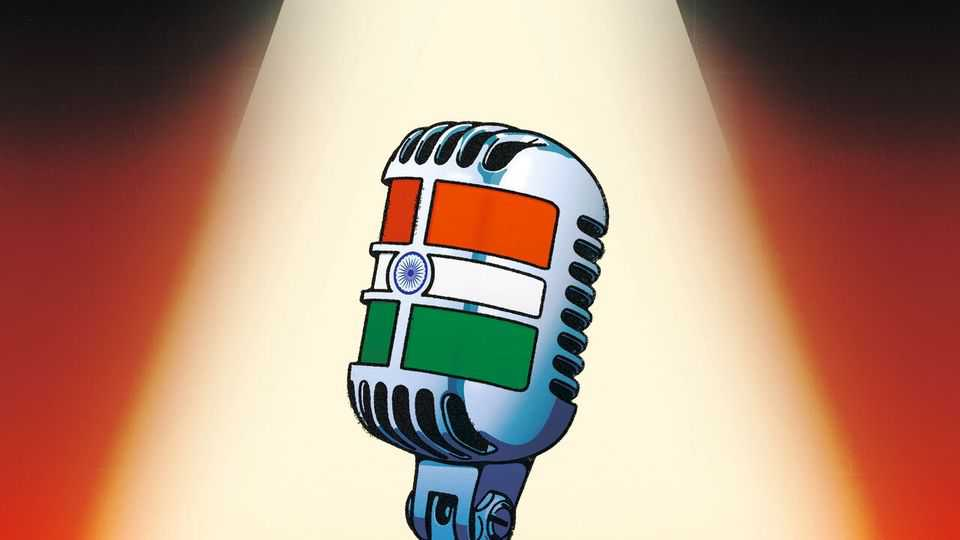

Culture | Stand-up and fight
Indian comedians have never been so successful or endangered
Jokesters lead the fight for free expression in India
November 13th 2025 
 

ON THE INSIDE Habitat looks like any other comedy club. The audience in Mumbai, buzzing and eager to laugh even on a sweltering Thursday evening, had to pack in tight near the small stage. The first act, Niveditha Prakasam, did some expert crowd work, gently ribbing a group of colleagues on a work outing. Following her a succession of other comics did their "tight ten" in English, Hindi or both. On the outside, however, there are clues that this Habitat is endangered. The comedy club is tucked into a busy side street near the Khar railway station, but there are no signs advertising where it is. Most would walk straight past what appears to be a closed shop. The only evidence to the contrary is the 
loitering groups of young professionals, who are ushered in shortly before the show begins. 

备注

- <strong><em>buzzing</em></strong>：/[ˈbʌzɪŋ]/ "嗡嗡声、兴奋"；文中用来表达观众兴奋，强调这是氛围；动词原形是buzz（嗡嗡声）。 
- <strong><em>sweltering</em></strong>：/[ˈsweltərɪŋ]/ "闷热的"；文中用来表达闷热的周四晚上，强调这是环境；指闷热的或酷热的。 
- <strong><em>pack in</em></strong>：/"挤进"；文中用来表达挤在舞台附近，强调这是拥挤；pack in是固定短语，指挤进。 
- <strong><em>crowd work</em></strong>：/[kraʊd wɜːk]/ "观众互动"；文中用来表达专业的观众互动，强调这是技巧；crowd指观众，work指工作。 
- <strong><em>ribbing</em></strong>：/[ˈrɪbɪŋ]/ "取笑"；文中用来表达温和地取笑，强调这是互动；动词原形是rib（取笑）。 
- <strong><em>colleagues</em></strong>：/[ˈkɒliːɡz]/ "同事"；文中用来表达一群同事，强调这是对象；由colleague（同事）加-s构成。 
- <strong><em>outing</em></strong>：/[ˈaʊtɪŋ]/ "外出"；文中用来表达工作外出，强调这是场合；指出外或郊游。 
- <strong><em>succession</em></strong>：/[səkˈseʃən]/ "连续"；文中用来表达连续的其他喜剧演员，强调这是顺序；指连续或继承。 
- <strong><em>comics</em></strong>：/[ˈkɒmɪks]/ "喜剧演员"；文中用来表达喜剧演员，强调这是职业；由comic（喜剧的）加-s构成。 
- <strong><em>tight ten</em></strong>：/[taɪt ten]/ "十分钟段子"；文中用来表达十分钟段子，强调这是表演；tight指紧凑的，ten指十。 
- <strong><em>endangered</em></strong>：/[ɪnˈdeɪndʒəd]/ "濒危的"；文中用来表达这个Habitat濒危，强调这是状态；由endanger（危及）加-ed构成。 
- <strong><em>tucked into</em></strong>：/"藏在"；文中用来表达藏在繁忙的侧街，强调这是位置；tuck into是固定短语，指藏在。 
- <strong><em>advertising</em></strong>：/[ˈædvətaɪzɪŋ]/ "广告"；文中用来表达没有广告标识，强调这是问题；由advertise（广告）加-ing构成。 
- <strong><em>loitering</em></strong>：/[ˈlɔɪtərɪŋ]/ "徘徊"；文中用来表达徘徊的年轻专业人士群体，强调这是线索；动词原形是loiter（徘徊）。 
- <strong><em>ushered</em></strong>：/[ˈʌʃəd]/ "引导"；文中用来表达被引导进入，强调这是活动；动词原形是usher（引导）。 
 
The club is not struggling financially: Habitat's owner, Balraj Singh Ghai, has expanded the space several times to meet demand and is opening another club in Pune soon. The furtiveness is because Habitat has been repeatedly vandalised by mobs who cannot take a joke. The most recent attack, in March, came after Kunal Kamra used the word gaddar (traitor) in apparent reference to the deputy chief minister of Maharashtra. This is the scowl- smile paradox of comedy in India: it has never been more dangerous—or more popular. 

备注

- <strong><em>struggling</em></strong>：/[ˈstrʌɡlɪŋ]/ "挣扎"；文中用来表达不在财务上挣扎，强调这是状态；动词原形是struggle（挣扎）。 
- <strong><em>expanded</em></strong>：/[ɪkˈspændɪd]/ "扩大"；文中用来表达扩大空间，强调这是成功；动词原形是expand（扩大）。 
- <strong><em>furtiveness</em></strong>：/[ˈfɜːtɪvnəs]/ "隐秘"；文中用来表达隐秘性，强调这是原因；由furtive（隐秘的）加-ness构成。 
- <strong><em>vandalised</em></strong>：/[ˈvændəlaɪzd]/ "破坏"；文中用来表达被暴徒破坏，强调这是问题；动词原形是vandalise（破坏）。 
- <strong><em>mobs</em></strong>：/[mɒbz]/ "暴徒"；文中用来表达不能接受笑话的暴徒，强调这是问题；由mob（暴徒）加-s构成。 
- <strong><em>gaddar</em></strong>：/[ˈɡædɑː]/ "叛徒"；文中用来表达叛徒这个词，强调这是引发攻击的词；指叛徒或背叛者。 
- <strong><em>traitor</em></strong>：/[ˈtreɪtə]/ "叛徒"；文中用来表达叛徒，强调这是词义；指叛徒或背叛者。 
- <strong><em>apparent</em></strong>：/[əˈpærənt]/ "明显的"；文中用来表达明显指的是，强调这是理解；指明显的或显然的。 
- <strong><em>deputy</em></strong>：/[ˈdepjuti]/ "副的"；文中用来表达副首席部长，强调这是职位；指副的或代理的。 
- <strong><em>scowl-smile</em></strong>：/[skaʊl smaɪl]/ "皱眉-微笑"；文中用来表达皱眉-微笑的悖论，强调这是矛盾；scowl指皱眉，smile指微笑。 
- <strong><em>paradox</em></strong>：/[ˈpærədɒks]/ "悖论"；文中用来表达悖论，强调这是矛盾；指悖论或矛盾。 
 
Performers face a very real prospect of violence. Vir Das has said he received 50,000 death threats after a set about the "two Indias" in 2021. (He said that his countrymen "worship women during the day and gang rape them at night".) In October police in Delhi arrested members of a gang who were planning to murder Munawar Faruqui. The comedian had been jailed for five weeks in 2021, having been arrested for "hurting religious sentiments". 

备注

- <strong><em>prospect</em></strong>：/[ˈprɒspekt]/ "前景"；文中用来表达面临暴力的前景，强调这是危险；指前景或可能性。 
- <strong><em>threats</em></strong>：/[θrets]/ "威胁"；文中用来表达死亡威胁，强调这是危险；由threat（威胁）加-s构成。 
- <strong><em>countrymen</em></strong>：/[ˈkʌntrimən]/ "同胞"；文中用来表达他的同胞，强调这是对象；由country（国家）和men（人）构成。 
- <strong><em>worship</em></strong>：/[ˈwɜːʃɪp]/ "崇拜"；文中用来表达崇拜女性，强调这是讽刺；指崇拜或敬拜。 
- <strong><em>gang rape</em></strong>：/[ɡæŋ reɪp]/ "轮奸"；文中用来表达轮奸，强调这是讽刺；gang指团伙，rape指强奸。 
- <strong><em>arrested</em></strong>：/[əˈrestɪd]/ "逮捕"；文中用来表达逮捕，强调这是行动；动词原形是arrest（逮捕）。 
- <strong><em>jailed</em></strong>：/[dʒeɪld]/ "监禁"；文中用来表达被监禁，强调这是后果；动词原形是jail（监禁）。 
- <strong><em>sentiments</em></strong>：/[ˈsentɪmənts]/ "情感"；文中用来表达宗教情感，强调这是被指控的；由sentiment（情感）加-s构成。 
 
Mr Kamra warns that "it's getting very claustrophobic" for comedians in the country. After the attack on Habitat, he moved to Puducherry and stepped back from public performance. He estimates that his fellow jokesters expend about "30% of [their] energy" worrying about whom they might offend. Though outré stand-ups in the West may get heckled or have a few shows cancelled, in India the danger is graver. "You just need one idiot," Mr Kamra says, to "cause a stampede". 

备注

- <strong><em>claustrophobic</em></strong>：/[ˌklɔːstrəˈfəʊbɪk]/ "幽闭恐惧的"；文中用来表达变得非常幽闭恐惧，强调这是感受；指幽闭恐惧的或令人窒息的。 
- <strong><em>stepped back</em></strong>：/"退后"；文中用来表达退出公开表演，强调这是行动；step back是固定短语，指退后。 
- <strong><em>estimates</em></strong>：/[ˈestɪmeɪts]/ "估计"；文中用来表达估计，强调这是观点；动词原形是estimate（估计）。 
- <strong><em>jokesters</em></strong>：/[ˈdʒəʊkstəz]/ "开玩笑的人"；文中用来表达他的同行开玩笑的人，强调这是职业；由joke（笑话）加-ster构成。 
- <strong><em>expend</em></strong>：/[ɪkˈspend]/ "花费"；文中用来表达花费能量，强调这是成本；指花费或消耗。 
- <strong><em>offend</em></strong>：/[əˈfend]/ "冒犯"；文中用来表达可能冒犯谁，强调这是担忧；指冒犯或得罪。 
- <strong><em>outré</em></strong>：/[uːˈtreɪ]/ "极端的"；文中用来表达极端的单口喜剧演员，强调这是对比；来自法语，指极端的。 
- <strong><em>heckled</em></strong>：/[ˈhekəld]/ "起哄"；文中用来表达被起哄，强调这是西方的情况；动词原形是heckle（起哄）。 
- <strong><em>graver</em></strong>：/[ˈɡreɪvə]/ "更严重的"；文中用来表达危险更严重，强调这是对比；由grave（严重的）加-er构成。 
- <strong><em>stampede</em></strong>：/[stæmˈpiːd]/ "踩踏"；文中用来表达引起踩踏，强调这是危险；指踩踏或恐慌。 
 
Freedom of expression for artists, journalists and other critics has deteriorated under Narendra Modi's government. Freedom House, a think- tank, classifies India as "partly free" alongside countries such as El Salvador and Mozambique. India's constitution claims to guarantee freedom of speech, but it makes exceptions for the sake of "public order, decency or morality". 

备注

- <strong><em>deteriorated</em></strong>：/[dɪˈtɪəriəreɪtɪd]/ "恶化"；文中用来表达表达自由恶化，强调这是问题；动词原形是deteriorate（恶化）。 
- <strong><em>think-tank</em></strong>：/[θɪŋk tæŋk]/ "智库"；文中用来表达智库，强调这是机构；think指思考，tank指坦克。 
- <strong><em>classifies</em></strong>：/[ˈklæsɪfaɪz]/ "分类"；文中用来表达分类印度，强调这是评估；动词原形是classify（分类）。 
- <strong><em>partly free</em></strong>：/[ˈpɑːtli friː]/ "部分自由"；文中用来表达部分自由，强调这是状态；partly指部分地，free指自由的。 
- <strong><em>constitution</em></strong>：/[ˌkɒnstɪˈtjuːʃən]/ "宪法"；文中用来表达宪法，强调这是法律；指宪法或章程。 
- <strong><em>guarantee</em></strong>：/[ˌɡærənˈtiː]/ "保证"；文中用来表达保证言论自由，强调这是权利；指保证或担保。 
- <strong><em>exceptions</em></strong>：/[ɪkˈsepʃənz]/ "例外"；文中用来表达例外，强调这是限制；由exception（例外）加-s构成。 
- <strong><em>decency</em></strong>：/[ˈdiːsənsi]/ "体面"；文中用来表达体面，强调这是例外理由；指体面或正派。 
- <strong><em>morality</em></strong>：/[məˈrælɪti]/ "道德"；文中用来表达道德，强调这是例外理由；指道德或品行。 
 
It also states that "no person shall be deprived of his life or personal liberty", which the Supreme Court has ruled includes a right to dignity. This allows anyone who feels a joke transgresses that right, or is indecent, to file a police 
complaint—or indeed multiple complaints with multiple police agencies. Though comedians may not be fined or jailed for every complaint, police are required to investigate, which means comedians spend time and money defending themselves. 

备注

- <strong><em>deprived</em></strong>：/[dɪˈpraɪvd]/ "剥夺"；文中用来表达被剥夺，强调这是权利；动词原形是deprive（剥夺）。 
- <strong><em>liberty</em></strong>：/[ˈlɪbəti]/ "自由"；文中用来表达个人自由，强调这是权利；指自由或解放。 
- <strong><em>Supreme Court</em></strong>：/[suːˈpriːm kɔːt]/ "最高法院"；文中用来表达最高法院，强调这是机构；supreme指最高的，court指法院。 
- <strong><em>dignity</em></strong>：/[ˈdɪɡnɪti]/ "尊严"；文中用来表达尊严权，强调这是权利；指尊严或体面。 
- <strong><em>transgresses</em></strong>：/[trænsˈɡresɪz]/ "违反"；文中用来表达违反这个权利，强调这是指控；动词原形是transgress（违反）。 
- <strong><em>indecent</em></strong>：/[ɪnˈdiːsənt]/ "不雅的"；文中用来表达不雅的，强调这是指控；由in-（不）和decent（体面的）构成。 
- <strong><em>file</em></strong>：/[faɪl]/ "提交"；文中用来表达提交警察投诉，强调这是行动；指提交或归档。 
- <strong><em>complaint</em></strong>：/[kəmˈpleɪnt]/ "投诉"；文中用来表达投诉，强调这是行动；指投诉或抱怨。 
- <strong><em>agencies</em></strong>：/[ˈeɪdʒənsiz]/ "机构"；文中用来表达警察机构，强调这是多个；由agency（机构）加-es构成。 
- <strong><em>fined</em></strong>：/[faɪnd]/ "罚款"；文中用来表达被罚款，强调这是可能后果；动词原形是fine（罚款）。 
- <strong><em>investigate</em></strong>：/[ɪnˈvestɪɡeɪt]/ "调查"；文中用来表达必须调查，强调这是要求；指调查或研究。 
- <strong><em>defending</em></strong>：/[dɪˈfendɪŋ]/ "辩护"；文中用来表达为自己辩护，强调这是成本；动词原形是defend（辩护）。 
 
So why do they keep going? Though there are many in India who would like to gag comedians, there are many more who love the gags. In 2023 a study by Nielsen, a market-research firm, found that comedy was the most popular genre among Indians who stream tv shows and movies. Many stand-ups are famous: Zakir Khan and Anuvab Pal have performed sold-out gigs across the world. Kapil Sharma—who has 46m followers on Instagram, many more than Ricky Gervais (5m) or Trevor Noah (9m)—recently released the third season of his show on Netflix. 

备注

- <strong><em>gag</em></strong>：/[ɡæɡ]/ "封口"；文中用来表达想要封口喜剧演员，强调这是反对；指封口或禁止。 
- <strong><em>gags</em></strong>：/[ɡæɡz]/ "笑话"；文中用来表达喜欢笑话，强调这是支持；由gag（笑话）加-s构成。 
- <strong><em>genre</em></strong>：/[ˈʒɑːnrə]/ "类型"；文中用来表达最受欢迎的类型，强调这是受欢迎程度；指类型或体裁。 
- <strong><em>stream</em></strong>：/[striːm]/ "流媒体"；文中用来表达流媒体观看，强调这是方式；指流媒体或流动。 
- <strong><em>sold-out</em></strong>：/[səʊld aʊt]/ "售罄的"；文中用来表达售罄的演出，强调这是成功；sold-out是固定短语，指售罄的。 
- <strong><em>gigs</em></strong>：/[ɡɪɡz]/ "演出"；文中用来表达演出，强调这是活动；由gig（演出）加-s构成。 
- <strong><em>followers</em></strong>：/[ˈfɒləʊəz]/ "粉丝"；文中用来表达粉丝，强调这是受欢迎程度；由follow（跟随）加-er构成。 
 
Mr Das describes the evolution of India's comedy scene in his new memoir, "The Outsider". He set up Mumbai's first English-language open-mic event in the late 2000s, which led to roles in films, American tours and a couple of Netflix specials. He financed, promoted and produced his first open-mic nights and comedy shows himself. During the covid pandemic, when clubs closed, he moved to a small village in Goa, bought a microphone and speakers and proceeded to "do stand-up for small crowds, outdoors". This became a series called "Ten on Ten": ten sets, each about a topic suggested by his audience, such as "What is Freedom of Speech?". This let Mr Das show off his range and intellectual curiosity. 

备注

- <strong><em>evolution</em></strong>：/[ˌiːvəˈluːʃən]/ "演变"；文中用来表达印度喜剧场景的演变，强调这是历史；指演变或进化。 
- <strong><em>memoir</em></strong>：/[ˈmemwɑː]/ "回忆录"；文中用来表达回忆录，强调这是书籍；指回忆录或自传。 
- <strong><em>open-mic</em></strong>：/[ˈəʊpən maɪk]/ "开放麦克风"；文中用来表达开放麦克风活动，强调这是活动；open指开放的，mic指麦克风。 
- <strong><em>financed</em></strong>：/[faɪˈnænst]/ "资助"；文中用来表达自己资助，强调这是独立；动词原形是finance（资助）。 
- <strong><em>promoted</em></strong>：/[prəˈməʊtɪd]/ "推广"；文中用来表达自己推广，强调这是独立；动词原形是promote（推广）。 
- <strong><em>produced</em></strong>：/[prəˈdjuːst]/ "制作"；文中用来表达自己制作，强调这是独立；动词原形是produce（制作）。 
- <strong><em>microphone</em></strong>：/[ˈmaɪkrəfəʊn]/ "麦克风"；文中用来表达麦克风，强调这是设备；指麦克风或话筒。 
- <strong><em>speakers</em></strong>：/[ˈspiːkəz]/ "扬声器"；文中用来表达扬声器，强调这是设备；由speaker（扬声器）加-s构成。 
- <strong><em>proceeded</em></strong>：/[prəˈsiːdɪd]/ "继续"；文中用来表达继续进行，强调这是行动；动词原形是proceed（继续）。 
- <strong><em>outdoors</em></strong>：/[ˈaʊtdɔːz]/ "户外"；文中用来表达在户外，强调这是地点；由out（外）和doors（门）构成。 
- <strong><em>intellectual</em></strong>：/[ˌɪntəˈlektʃuəl]/ "智力的"；文中用来表达智力好奇心，强调这是特点；指智力的或知识的。 
- <strong><em>curiosity</em></strong>：/[ˌkjʊəriˈɒsɪti]/ "好奇心"；文中用来表达好奇心，强调这是特点；指好奇心或求知欲。 
 
Needless to say, he is very funny. (He says colonising India for cinnamon, "the one spice we use least in Indian cooking", is like "colonising England for sunlight".) Despite succeeding as a touring stand-up, as well as the challenges of the comedy scene at home, Mr Das resisted the temptation to move to Hollywood. He felt the best roles he could have hoped for would have been "a delivery guy who appears in one or two scenes in the new Nicole Kidman movie [or] the sassy but conservative Indian accountant who 'tells it like it is'." 

备注

- <strong><em>colonising</em></strong>：/[ˈkɒlənaɪzɪŋ]/ "殖民"；文中用来表达殖民印度，强调这是笑话；动词原形是colonise（殖民）。 
- <strong><em>cinnamon</em></strong>：/[ˈsɪnəmən]/ "肉桂"；文中用来表达肉桂，强调这是笑话内容；指肉桂或桂皮。 
- <strong><em>spice</em></strong>：/[spaɪs]/ "香料"；文中用来表达香料，强调这是笑话内容；指香料或调味品。 
- <strong><em>touring</em></strong>：/[ˈtʊərɪŋ]/ "巡回的"；文中用来表达巡回单口喜剧演员，强调这是成功；动词原形是tour（巡回）。 
- <strong><em>resisted</em></strong>：/[rɪˈzɪstɪd]/ "抵抗"；文中用来表达抵抗诱惑，强调这是选择；动词原形是resist（抵抗）。 
- <strong><em>temptation</em></strong>：/[tempˈteɪʃən]/ "诱惑"；文中用来表达搬到好莱坞的诱惑，强调这是选择；指诱惑或引诱。 
- <strong><em>delivery</em></strong>：/[dɪˈlɪvəri]/ "送货"；文中用来表达送货员，强调这是角色；指送货或交付。 
- <strong><em>sassy</em></strong>：/[ˈsæsi]/ "无礼的"；文中用来表达无礼但保守的，强调这是角色；指无礼的或冒失的。 
- <strong><em>accountant</em></strong>：/[əˈkaʊntənt]/ "会计师"；文中用来表达印度会计师，强调这是角色；指会计师或会计。 
 
Indeed some Indian comedians feel they have an obligation to stand up and be heard. "Censorship has captured most of the arts," explains Vinay Shukla, a documentary film-maker. "Over the last ten years, comics have taken on the establishment much more directly than other art forms." Films, television 
shows and plays require funding and a crew—and often need an official censor's approval. Books need publishers. Comedy, by contrast, is decentralised: comedians speak for themselves and need only a microphone. Their mode is cheap, portable and, in the age of social media, easily disseminated: comics can speak to the nation from a single stage or desk. "Kunal Kamra would be recognised at any airport," says Mr Shukla. 

备注

- <strong><em>obligation</em></strong>：/[ˌɒblɪˈɡeɪʃən]/ "义务"；文中用来表达有义务，强调这是责任感；指义务或责任。 
- <strong><em>Censorship</em></strong>：/[ˈsensəʃɪp]/ "审查"；文中用来表达审查制度，强调这是问题；由censor（审查）加-ship构成。 
- <strong><em>captured</em></strong>：/[ˈkæptʃəd]/ "捕获"；文中用来表达捕获了大部分艺术，强调这是问题；动词原形是capture（捕获）。 
- <strong><em>documentary</em></strong>：/[ˌdɒkjʊˈmentəri]/ "纪录片的"；文中用来表达纪录片制作人，强调这是职业；指纪录片的或文件的。 
- <strong><em>establishment</em></strong>：/[ɪˈstæblɪʃmənt]/ "体制"；文中用来表达挑战体制，强调这是行动；指体制或机构。 
- <strong><em>funding</em></strong>：/[ˈfʌndɪŋ]/ "资金"；文中用来表达需要资金，强调这是要求；由fund（资金）加-ing构成。 
- <strong><em>crew</em></strong>：/[kruː]/ "团队"；文中用来表达需要团队，强调这是要求；指团队或船员。 
- <strong><em>censor</em></strong>：/[ˈsensə]/ "审查员"；文中用来表达官方审查员，强调这是要求；指审查员或检查员。 
- <strong><em>approval</em></strong>：/[əˈpruːvəl]/ "批准"；文中用来表达需要批准，强调这是要求；由approve（批准）加-al构成。 
- <strong><em>publishers</em></strong>：/[ˈpʌblɪʃəz]/ "出版商"；文中用来表达需要出版商，强调这是要求；由publish（出版）加-er构成。 
- <strong><em>decentralised</em></strong>：/[diːˈsentrəlaɪzd]/ "去中心化的"；文中用来表达去中心化的，强调这是特点；由de-（去除）和centralised（中心化的）构成。 
- <strong><em>portable</em></strong>：/[ˈpɔːtəbəl]/ "便携的"；文中用来表达便携的，强调这是特点；指便携的或可携带的。 
- <strong><em>disseminated</em></strong>：/[dɪˈsemɪneɪtɪd]/ "传播"；文中用来表达容易传播，强调这是特点；动词原形是disseminate（传播）。 
- <strong><em>recognised</em></strong>：/[ˈrekəɡnaɪzd]/ "被认出"；文中用来表达在任何机场都会被认出，强调这是知名度；动词原形是recognise（认出）。 
 
The man himself is more philosophical. "What keeps taking me back to comedy is risk: the fact that there's something nobody else is saying," explains Mr Kamra. "I feel it's a disservice to comedy not to take that risk." He admits that his personal circumstances—he is unmarried and does not have children—mean that he is wagering less than others in taking those risks. 

备注

- <strong><em>philosophical</em></strong>：/[ˌfɪləˈsɒfɪkəl]/ "哲学的"；文中用来表达更哲学的，强调这是态度；由philosophy（哲学）加-ical构成。 
- <strong><em>disservice</em></strong>：/[dɪsˈsɜːvɪs]/ "伤害"；文中用来表达对喜剧的伤害，强调这是观点；由dis-（不）和service（服务）构成。 
- <strong><em>admits</em></strong>：/[ədˈmɪts]/ "承认"；文中用来表达承认，强调这是观点；动词原形是admit（承认）。 
- <strong><em>circumstances</em></strong>：/[ˈsɜːkəmstənsɪz]/ "情况"；文中用来表达个人情况，强调这是原因；由circumstance（情况）加-s构成。 
- <strong><em>wagering</em></strong>：/[ˈweɪdʒərɪŋ]/ "下注"；文中用来表达下注更少，强调这是优势；动词原形是wager（下注）。 
 
There is a serious need for the funny business, Mr Kamra suggests. By broaching thorny topics in an accessible way, stand-ups widen the boundaries of public discourse. "With so many people appointing themselves the cultural police, someday you'll speak your mind, and someone will be offended, and you'll find yourself caught in the same sort of panic." ■ 

备注

- <strong><em>broaching</em></strong>：/[brəʊtʃɪŋ]/ "提出"；文中用来表达提出棘手话题，强调这是作用；动词原形是broach（提出）。 
- <strong><em>thorny</em></strong>：/[ˈθɔːni]/ "棘手的"；文中用来表达棘手的话题，强调这是类型；指棘手的或困难的。 
- <strong><em>accessible</em></strong>：/[əkˈsesəbəl]/ "易懂的"；文中用来表达易懂的方式，强调这是方法；指易懂的或可接近的。 
- <strong><em>boundaries</em></strong>：/[ˈbaʊndəriz]/ "边界"；文中用来表达扩大公共话语的边界，强调这是作用；由boundary（边界）加-es构成。 
- <strong><em>discourse</em></strong>：/[ˈdɪskɔːs]/ "话语"；文中用来表达公共话语，强调这是领域；指话语或论述。 
- <strong><em>appointing</em></strong>：/[əˈpɔɪntɪŋ]/ "任命"；文中用来表达任命自己，强调这是行动；动词原形是appoint（任命）。 
- <strong><em>cultural police</em></strong>：/[ˈkʌltʃərəl pəˈliːs]/ "文化警察"；文中用来表达文化警察，强调这是角色；cultural指文化的，police指警察。 
- <strong><em>offended</em></strong>：/[əˈfendɪd]/ "被冒犯"；文中用来表达会被冒犯，强调这是结果；动词原形是offend（冒犯）。 
- <strong><em>panic</em></strong>：/[ˈpænɪk]/ "恐慌"；文中用来表达陷入同样的恐慌，强调这是结果；指恐慌或惊慌。 
 
For more on the latest books, films, TV shows, albums and controversies, sign up to Plot Twist, our weekly subscriber-only newsletter 
This article was downloaded by zlibrary from https://www.economist.com//culture/2025/11/13/indian-comedians-have-never-been-so- successful-or-endangered 
