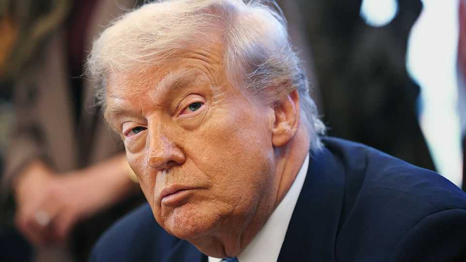
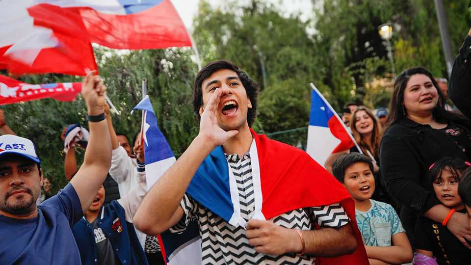

The world this week
Politics
November 20th 2025

Donald Trump signed legislation instructing the Justice Department to release all files relating to Jeffrey Epstein, a deceased sex offender and politically connected financier, after Congress voted almost unanimously for it to do so. Republicans supported the bill amid intense pressure from their MAGA base to make the files public. For months Mr Trump had tried to stop the vote from happening, as speculation swirled about whether he knew about Epstein’s crimes before falling out with him around 2004 (Epstein was first convicted in 2008). Meanwhile, Larry Summers, a treasury secretary under Bill Clinton and a former president of Harvard, said he would step back from public life after it emerged that he had asked Epstein for advice about having an extramarital affair. He has stepped down from the board of OpenAI. Mr Summers used the codename “peril” in his messages to Epstein.

A court in El Paso issued a preliminary injunction to stop the Republicans’ map of congressional districts for Texas from coming into force, finding it had been “racially gerrymandered”. State Republicans have redrawn the boundaries in the hope it will give the party five more seats in Congress in next year’s midterms. Texas immediately lodged an appeal with the federal Supreme Court.

Muhammad bin Salman, the de facto ruler of Saudi Arabia, visited the White House, his first trip to Washington in seven years. Mr Trump said that America would sell F-35 fighter jets to the Saudis and announced that Saudi Arabia would be formally designated as a major non-NATO ally. The president also insisted that Prince Muhammad “knew nothing” about the murder in 2018 of Jamal Khashoggi, a journalist. In 2021 an American intelligence report said that the prince authorised the killing. He has always denied this.

The UN Security Council voted in favour of Mr Trump’s peace plan for Gaza, which includes establishing an international stabilisation force there. Hamas rejected the resolution. Binyamin Netanyahu, Israel’s prime minister, called for Hamas to be expelled from Gaza, which would go beyond Mr Trump’s plan. Meanwhile, Germany resumed arms exports to Israel, saying the ceasefire had stabilised the situation in Gaza. Germany, the second- largest exporter of weapons to Israel, suspended its shipments in August.

The UN registered more than 260 attacks by Israeli settlers in the West Bank that led to Palestinian casualties or damage to property in October, the highest monthly count since its records began in 2006.

At least 13 people were killed in an Israeli strike near a Palestinian refugee camp in Lebanon, according to the country’s health ministry. Israel claimed it was targeting Hamas. Hamas denied it had any “military installations” in the area.

Delegates arrived in South Africa ahead of the first-ever G20 summit to be held in an African country. Donald Trump is not attending the gathering in Johannesburg; he accuses South Africa of killing white Afrikaners and stealing their land (there is no such policy). Mr Trump said the country

shouldn’t be in the G20. America has reportedly warned South Africa not to issue a formal statement at the end of the summit.

Reports emerged that America and Russia have drawn up a 28-point peace proposal for Ukraine. Firm details of the plan were scant, but it appears to include many of Russia’s longstanding demands. Ukraine has yet to comment on it. Earlier, Volodymyr Zelensky met Emmanuel Macron in Paris and signed a letter of intent to buy up to 100 French-made Rafale fighter jets over the next decade. There was no let-up in Russia’s barrage of drone and missile attacks. At least 26 people were killed when blocks of flats were struck in Ternopil, a city in western Ukraine.

Poland’s prime minister, Donald Tusk, said that two Ukrainians working for Russian intelligence had carried out acts of sabotage on the Warsaw-Lublin railway line. Both suspects had crossed into Poland from Belarus and had returned there, Mr Tusk said. Their goal had been to cause a “rail catastrophe”.

The first round of Chile’s presidential election saw Jeannette Jara, a Communist Party member of the governing coalition, take 27% of the vote, just ahead of José Antonio Kast, an ultraconservative former congressman, who took 24%. Mr Kast is widely expected to win the run-off on December

14th. Crime and immigration have shot to the front of the electorate’s concerns in this election, a far cry from the progressive wave that carried Gabriel Boric, the youthful current president, to power in 2021 (Chilean presidents cannot run for two consecutive terms).

Voters in Ecuador overwhelmingly rejected a referendum proposal to allow foreign military bases in the country. They also voted against a measure that would have rewritten the constitution. The losses are a blow to Daniel Noboa, the president, who had backed both. He has impressed Donald Trump with his crackdown on drug gangs.

At least 100 police officers and 20 civilians were injured in Mexico City during protests against President Claudia Sheinbaum’s handling of crime and corruption. Demonstrations took place across Mexico and were organised by Generation Z Mexico, the latest in a series of self-styled Gen Z protests that have occurred across the world in countries that are as divergent as Madagascar, Nepal and Peru.

In the Philippines more than 600,000 people attended rallies over three days in Manila to protest against the corruption that led to the construction of below standard flood-prevention facilities that failed during the typhoon season. The rallies were organised by a religious group.

Bangladesh’s war-crimes court found Sheikh Hasina, the country’s former autocratic prime minister, guilty of ordering the security forces to crack down on student protests that ultimately forced her from office last year. Around 1,400 people were killed during the crackdown. The court sentenced her to death. Sheikh Hasina, who fled to India after she was ousted from power, described the court as “rigged”. Bangladesh has asked India for her extradition.

Relations between China and Japan sank to their lowest point in years following recent remarks by Takaichi Sanae, the new Japanese prime minister, that any attack on Taiwan would also be a threat to Japan. The Chinese government has called on Ms Takaichi to retract the comments and state media have published angry articles denouncing her. Amid the heightened tensions China told its citizens not to travel to Japan. Japan warned its citizens in China to be vigilant when out in public.

The domestic-intelligence agency in Britain, MI5, warned that China was trying to spy on Parliament by posing as headhunters or companies to MPs. The government said it was “a covert and calculated attempt” to meddle in the legislative process. A final decision on whether to allow China to build a huge new mega-embassy in London has been delayed until December 10th amid concerns it will become a hub of Chinese espionage.

Britain’s Labour government announced a significant toughening of immigration policy. Shabana Mahmood, the home secretary, said the surge in migration had “destabilised communities” and left taxpayers “footing the bill” for a failed system. Illegal immigration has been a thorny subject in British politics for years, giving rise to the populist-right Reform UK. Its leader, Nigel Farage, said Ms Mahmood sounded like a Reform supporter.

This article was downloaded by zlibrary from [https://www.economist.com//the-world-this-week/2025/11/20/politics](https://www.economist.com//the-world-this-week/2025/11/20/politics)