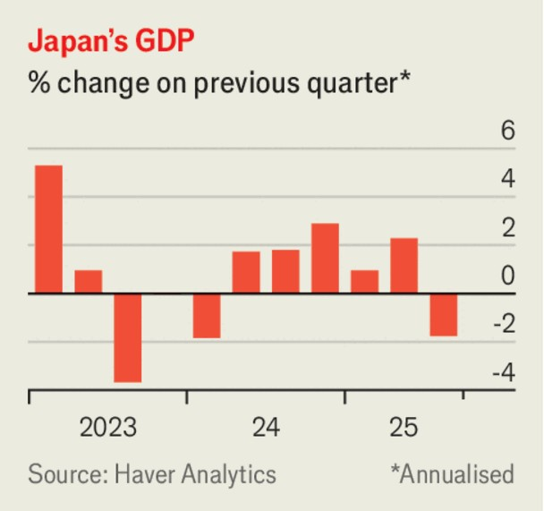

The world this week
Business
November 20th 2025

Nvidia’s latest quarterly earnings provided some relief for investors amid the recent drop in tech stocks. The maker of artificial-intelligence chips reported a 62% rise in revenue, year on year, to $57bn, and net profit of $31.9bn, up by 65%. Its share price surged initially in response; the stock has registered tepid growth over the past month. Nvidia’s market capitalisation is around $4.5trn, down from $5trn at the end of October. Stockmarkets have struggled amid worries about share prices being overvalued for companies that are riding the AI boom. Oracle has shed about 30% of its value since September, which was when it reported a surge in contracts for its cloud services and announced a big deal to supply OpenAI with data-centre capacity. The stocks of tech giants such as Amazon, Meta and Palantir have all fallen since the start of November.

Cryptocurrencies have also been plunging amid a sell-off in speculative assets. The price of bitcoin reached a record $126,000 in October but was trading around $92,000 this week. Around $1.2trn has been knocked off the value of crypto assets over six weeks.

Investors were also nervously assessing earnings from America’s big retailers. Home Depot reduced its forecast of annual profit for the year, blaming economic uncertainty among consumers that is dampening demand for home-improvement supplies. Target also lowered its guidance, as sales at the troubled retailer stagnated.

A federal judge in Washington ruled that Meta’s acquisitions of Instagram and WhatsApp did not contravene antitrust law, a blow to the Federal Trade Commission, which launched the case five years ago. The judge found that whether or not Meta enjoyed a monopoly in the past, the government had failed to prove that it did so today. During the trial earlier this year Meta had called witnesses from other social-media companies, including TikTok, to describe the fierce competition in the industry.

The rising cost of memory chips will push up the prices that consumers pay for smartphones, warned Xiaomi. Memory-chip costs are increasing in part because of the huge demand for their use in AI servers. The Chinese tech company reported a 22% year-on-year jump in revenue for the latest quarter, and a 150% surge in operating profit. Sales at its electric-vehicle business were up by 198%.

Japan’s economy shrank by 1.8% on an annualised basis in the third quarter, the first contraction since early 2024. A drop in exports, notably car parts that have been hit by America’s tariffs, dragged down growth, but household consumption remains weak amid rising prices.

The Trump administration reached a framework trade agreement with Switzerland that will reduce tariffs on Swiss imports from 39% to 15%. Swiss companies are to invest $200bn in America, including $50bn from Roche and $23bn from Novartis. Jamieson Greer, the US trade representative, said the deal would help America reduce its “deficit in pharmaceuticals and other key sectors”. Guy Parmelin, the Swiss economy minister, rejected criticism at home about the deal. “We haven’t sold our soul to the devil”, he insisted.

BHP said it would appeal against a ruling from the High Court in London that found it liable for the failure of a dam in Brazil in 2015 that killed 19 people and affected hundreds of thousands of others whose communities were destroyed or contaminated by the cascading sludge. The ruling means hearings can begin into what compensation the mining firm might pay. BHP points out that it has already entered a remediation and compensation agreement in Brazil along with Vale, its joint partner in the Fundão dam, and that the action taken in the English courts duplicates that effort.

Britain’s annual inflation rate fell to 3.6% in October from the 3.8% it had held steady at for the previous three months. Services inflation, of which the Bank of England takes particular note in its deliberations on interest rates, dropped to 4.5% from 4.7% in September. Although inflation remains well above the bank’s 2% target, markets now expect it to cut rates in December.

The British government said it would outlaw the resale of tickets for live events at prices that have been massively inflated over their face value. The stock of StubHub, a website for resellers in America, branded as Viagogo elsewhere, slumped. Trading in such tickets for acts like Oasis has caused a furore, as touts use bots to snap them up for resale. No surprise that tickets for this week’s Radiohead concert in London, priced at £85 ($112), were reselling at £682.

This article was downloaded by zlibrary from [https://www.economist.com//the-world-this-week/2025/11/20/business](https://www.economist.com//the-world-this-week/2025/11/20/business)